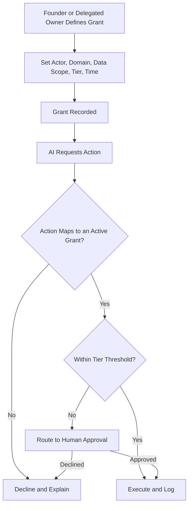

# Volume 03 - Permission Model

| Field | Value |
|---|---|
| Document ID | WORLD-VOL03-051 |
| Title | Permission Model |
| Version | 1.0 |
| Status | Approved |
| Classification | Internal |
| Founder | Mahesh Choudhary |

## Purpose
Define how the AI Business Partner acquires, holds, and exercises authority to act. The permission model translates the governance principle of least privilege into a concrete structure of permission tiers, scopes, and grants. It ensures the AI can only do what it has been explicitly authorized to do, on behalf of a specific person, over a specific set of data and actions.

## Scope
This chapter specifies the permission model functionally: what a permission is, the tiers of action, the dimensions that scope a permission, and how grants are made and revoked. It does not cover authentication or the enforcement runtime, which belong to the implementation volumes, nor the approval workflow for consequential actions, which is detailed in the Human Approval Rules chapter.

## What a Permission Is
A permission is an explicit, revocable grant that authorizes the AI to perform a defined class of action, over a defined scope of data, on behalf of a defined person. Every AI action must map to a permission. If no permission covers the action, the AI declines and explains why. Permissions are granted, never assumed, and default to the most restrictive setting.

## Why the Model Matters
A capable AI without a permission model would act on the union of everything it can technically reach, which is the opposite of least privilege. By binding each action to an explicit grant, the model contains the blast radius of any error, misunderstanding, or misuse. It also makes authority legible: at any moment the founder can see exactly what the AI is permitted to do and withdraw any part of it instantly.

## Permission Tiers
Actions are classified into tiers by their potential consequence. Higher tiers require stronger authorization and, above a threshold, human approval.

| Tier | Class of Action | Authorization Required |
|---|---|---|
| T0 | Read and analyze in-scope information | Standing grant |
| T1 | Draft and recommend for review | Standing grant |
| T2 | Reversible internal action (e.g. schedule, tag, update draft) | Explicit grant |
| T3 | External or hard-to-reverse action (e.g. send, publish) | Explicit grant + human approval |
| T4 | Consequential or binding action (e.g. commit funds, contract, personnel change) | Founder or delegated-owner approval, always |

## Scoping Dimensions
A grant is not a blanket power; it is scoped along several dimensions so that authority is narrow by construction.

| Dimension | Meaning | Example |
|---|---|---|
| Actor | On whose behalf the AI acts | The founder; a delegated owner |
| Domain | The business area covered | Finance, sales, HR |
| Data scope | The records the AI may touch | Only this quarter's receivables |
| Action tier | The highest tier permitted | Up to T2 |
| Time | Validity window | Standing, or expiring after a task |

## Grant and Revocation Flow

## Roles
The founder holds the root authority to grant and revoke any permission. A delegated owner may grant or approve within a domain the founder has assigned to them. The AI Business Partner is always a grantee, never a grantor; it cannot expand its own permissions or delegate them to another agent.

## Enterprise Example
The founder grants the AI a standing T1 permission across the finance domain and an explicit T2 grant scoped to the current quarter's accounts receivable for the duration of a collections initiative. The AI can analyze receivables and draft reminder communications freely, and it can update the internal collections tracker. When it proposes to send a formal demand letter to a client, that is a T3 external action, so it routes the draft to the founder for approval. Once the initiative ends, the time-bound T2 grant expires automatically and the AI's authority contracts back to read and draft only.

## Cross-References
- [AI Governance](/docs/blueprint/volume-03-ai-business-partner/section-g-safety-and-governance/50-ai-governance.md)
- [Human Approval Rules](/docs/blueprint/volume-03-ai-business-partner/section-g-safety-and-governance/57-human-approval-rules.md)
- [Security Boundaries](/docs/blueprint/volume-03-ai-business-partner/section-g-safety-and-governance/52-security-boundaries.md)
- [Guiding Principles](/docs/blueprint/volume-03-ai-business-partner/section-a-ai-foundation/05-guiding-principles.md)

## References
- [Volume 01 - Vision & Philosophy](/docs/blueprint/volume-01-vision-and-philosophy/README.md)
- [Document Standards](/docs/governance/document-standards.md)

## Change Log
| Version | Date | Author | Change |
|---|---|---|---|
| 1.0 | 2026-07-12 | Lead Software Engineer | Initial approved version. |
