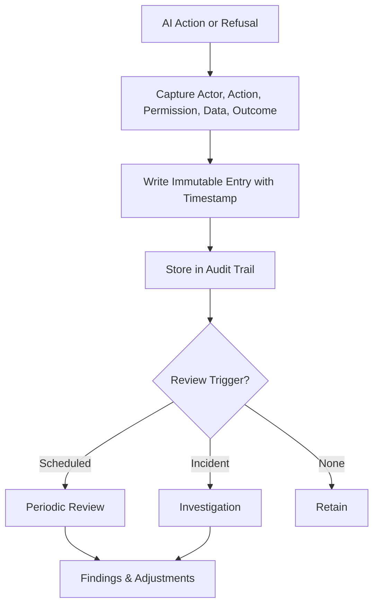

# Volume 03 - Auditability

| Field | Value |
|---|---|
| Document ID | WORLD-VOL03-054 |
| Title | Auditability |
| Version | 1.0 |
| Status | Approved |
| Classification | Internal |
| Founder | Mahesh Choudhary |

## Purpose
Define auditability for the AI Business Partner: the requirement that every governed action the AI takes, and every action it declines, is recorded in a way that can be reconstructed and reviewed after the fact. Auditability turns the abstract promise of accountability into concrete evidence. It is what allows the founder to trust the AI with authority, because that authority can always be verified.

## Scope
This chapter specifies auditability functionally: what an audit trail is, what must be recorded, the properties the record must hold, and how the trail is used. It does not specify log storage, retention infrastructure, or tamper-proofing mechanisms, which belong to the implementation volumes. What the AI is permitted to do is governed by the Permission Model; this chapter governs how those actions are recorded.

## What an Audit Trail Is
An audit trail is a complete, ordered, and durable record of the AI's governed activity. Each entry captures what happened, who authorized it, what data it touched, and what the outcome was. The trail is written as actions occur, not reconstructed later, so it reflects reality rather than intention. It records not only what the AI did but what it declined and why.

## Why Auditability Matters
Authority without accountability is dangerous. Auditability makes the AI's behaviour observable, which deters misuse, enables investigation, supports compliance, and builds trust. It is also the mechanism by which the organization learns: patterns in the audit trail reveal where the AI is helping, where it is being over-restricted, and where it repeatedly reaches a boundary. This directly serves the WORLD principle of transparency.

## What Must Be Recorded
| Element | Description |
|---|---|
| Actor | On whose authority the action was taken |
| Action | What the AI did or proposed |
| Permission | The grant that authorized it |
| Data scope | The information accessed or affected |
| Rationale | The reason or reasoning summary for the action |
| Approval | Any human approval or decline, with approver |
| Outcome | Success, refusal, or error |
| Timestamp | When the event occurred |

## Required Properties
- **Completeness.** Every governed action and refusal is captured; there are no silent actions.
- **Integrity.** Records cannot be altered or deleted by the AI after they are written.
- **Attribution.** Every entry ties to an actor and an authorizing grant.
- **Legibility.** Entries are understandable by a human reviewer, not only by a machine.
- **Timeliness.** Records are written at the moment of action.

## Audit Lifecycle

## Roles
The AI Business Partner writes to the audit trail but can never edit or erase it. The founder and designated reviewers read the trail, conduct periodic and incident reviews, and use findings to adjust permissions and boundaries. The governance layer guarantees the trail's integrity independently of the AI.

## Enterprise Example
After a quarter of operation, the founder reviews the audit trail and sees that the AI drafted 240 communications, sent 180 after approval, executed 60 reversible internal updates, and recorded 12 boundary refusals. One refusal shows an attempted data export triggered by a manipulated document, confirming the security boundary worked. Another pattern shows the AI repeatedly requesting approval for a low-risk, routine task, so the founder raises that task's permission tier to reduce friction. The audit trail both proved the AI acted correctly and informed a governance improvement.

## Cross-References
- [AI Governance](/docs/blueprint/volume-03-ai-business-partner/section-g-safety-and-governance/50-ai-governance.md)
- [Privacy Principles](/docs/blueprint/volume-03-ai-business-partner/section-g-safety-and-governance/53-privacy-principles.md)
- [Error Handling](/docs/blueprint/volume-03-ai-business-partner/section-g-safety-and-governance/55-error-handling.md)
- [Explainability](/docs/blueprint/volume-03-ai-business-partner/section-b-ai-personality/14-explainability.md)

## References
- [Volume 01 - Vision & Philosophy](/docs/blueprint/volume-01-vision-and-philosophy/README.md)
- [Document Standards](/docs/governance/document-standards.md)

## Change Log
| Version | Date | Author | Change |
|---|---|---|---|
| 1.0 | 2026-07-12 | Lead Software Engineer | Initial approved version. |
