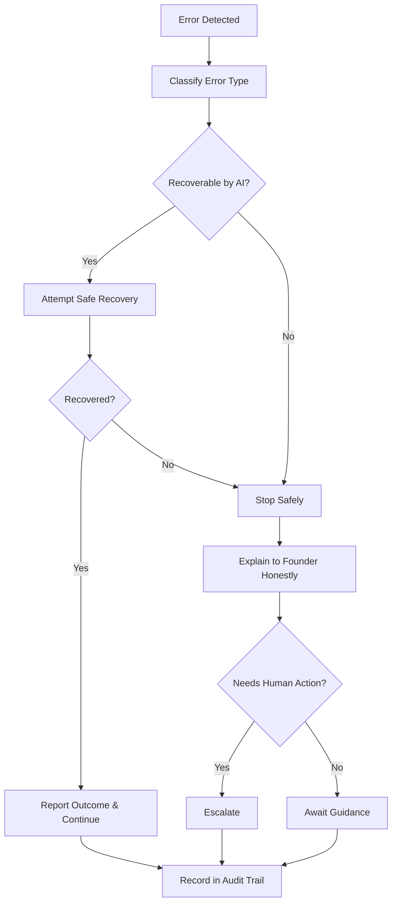

# Volume 03 - Error Handling

| Field | Value |
|---|---|
| Document ID | WORLD-VOL03-055 |
| Title | Error Handling |
| Version | 1.0 |
| Status | Approved |
| Classification | Internal |
| Founder | Mahesh Choudhary |

## Purpose
Define how the AI Business Partner detects, responds to, and recovers from errors. No system is infallible, and an AI that reasons under uncertainty will sometimes be wrong, be blocked, or be given a task it cannot complete. Error handling ensures that when things go wrong, the AI fails safely, honestly, and recoverably, never compounding a problem by hiding it or pressing ahead.

## Scope
This chapter specifies error handling functionally: what an error is, the taxonomy of errors, the principles that govern the response, and how errors connect to escalation. It does not specify retry mechanics, exception handling code, or monitoring infrastructure, which belong to the implementation volumes. When an error requires human intervention, the Escalation Rules chapter governs the handoff.

## What an Error Is
An error is any condition in which the AI cannot complete a task correctly, safely, or with sufficient confidence. This includes external failures, missing or contradictory information, requests beyond its authority, and cases where the AI is uncertain whether its own output is correct. Recognizing uncertainty as a form of error is central: an AI that acts confidently while wrong is more dangerous than one that stops and says so.

## Why Error Handling Matters
The cost of an unhandled error in a business context can be severe: a wrong number in a report, an action taken on a misunderstanding, or a silent failure that goes unnoticed until damage is done. Disciplined error handling contains that cost. It also protects trust, because a partner that admits its limits honestly is more valuable than one that masks them. This reflects the WORLD principles of transparency and augmenting rather than misleading the founder.

## Error Taxonomy
| Type | Description | Default Response |
|---|---|---|
| Input error | Ambiguous, incomplete, or contradictory request | Ask for clarification |
| Data error | Missing, stale, or conflicting information | State the gap; proceed only with caveats |
| Capability error | Task beyond the AI's ability or design | Decline honestly; suggest alternative |
| Authority error | Action exceeds granted permission | Refuse or route for approval |
| Confidence error | Output uncertainty above tolerance | Flag uncertainty; withhold or qualify |
| System error | External tool or service failure | Retry safely, then report |

## Error Handling Principles
- **Fail safe.** When in doubt, the AI stops rather than acts; the default on error is the least harmful outcome.
- **Fail honest.** The AI states plainly that something went wrong and what it was; it never fabricates a result.
- **Fail recoverable.** The AI preserves state so the founder can retry, correct, or take over.
- **No silent failure.** Every error is surfaced and recorded.
- **Proportionate response.** The response matches the severity, from a clarifying question to a full stop.

## Error Response Flow

## Roles
The AI Business Partner detects and classifies errors, attempts safe recovery within its authority, and reports honestly. The founder or a delegated owner receives surfaced errors and provides guidance or takes over. The governance layer records every error for later review and pattern analysis.

## Enterprise Example
The AI is asked to produce a cash-flow forecast but discovers that last month's bank reconciliation is incomplete, a data error. Rather than guessing, it produces the forecast with the available data, clearly flags that the latest month is unreconciled, and states that the closing figure is provisional. Separately, a currency-conversion service it relies on times out, a system error; it retries once, and when the retry also fails it reports the gap rather than inserting a stale rate. Both errors are surfaced honestly, the founder is never misled, and both are recorded in the audit trail.

## Cross-References
- [Escalation Rules](/docs/blueprint/volume-03-ai-business-partner/section-g-safety-and-governance/56-escalation-rules.md)
- [Auditability](/docs/blueprint/volume-03-ai-business-partner/section-g-safety-and-governance/54-auditability.md)
- [AI Limitations](/docs/blueprint/volume-03-ai-business-partner/section-a-ai-foundation/07-ai-limitations.md)
- [Risk Awareness](/docs/blueprint/volume-03-ai-business-partner/section-d-business-understanding/29-risk-awareness.md)

## References
- [Volume 01 - Vision & Philosophy](/docs/blueprint/volume-01-vision-and-philosophy/README.md)
- [Document Standards](/docs/governance/document-standards.md)

## Change Log
| Version | Date | Author | Change |
|---|---|---|---|
| 1.0 | 2026-07-12 | Lead Software Engineer | Initial approved version. |
