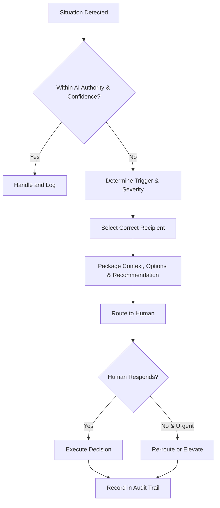

# Volume 03 - Escalation Rules

| Field | Value |
|---|---|
| Document ID | WORLD-VOL03-056 |
| Title | Escalation Rules |
| Version | 1.0 |
| Status | Approved |
| Classification | Internal |
| Founder | Mahesh Choudhary |

## Purpose
Define when and how the AI Business Partner hands a situation over to a human. Escalation is the disciplined transfer of a decision or action from the AI to the appropriate person when the situation exceeds the AI's authority, confidence, or mandate. It ensures the AI knows the limits of its own competence and always brings a human in at the right moment, neither too early nor too late.

## Scope
This chapter specifies escalation functionally: what escalation is, the triggers that require it, who receives an escalation, and how the handoff is conducted. It does not specify notification channels or on-call tooling, which belong to the implementation volumes. The specific case of routine consequential actions requiring sign-off is detailed in the Human Approval Rules chapter; escalation covers the broader set of situations that demand human judgment.

## What Escalation Is
Escalation is the act of pausing autonomous progress and routing a matter to a human with the context needed to decide. It is distinct from approval: approval is a planned checkpoint for known consequential actions, while escalation is the AI's response to a situation it recognizes it should not resolve alone. A well-designed AI escalates readily on judgment-heavy matters and handles routine matters itself.

## Why Escalation Matters
An AI that never escalates will eventually overreach; an AI that escalates everything is useless. The value of the AI Business Partner lies in handling the routine confidently while reliably surfacing the exceptional. Escalation rules encode that boundary, protecting the organization from AI overreach while protecting the founder's attention from noise. This embodies the WORLD principle that the AI augments the founder and defers on matters of consequence and judgment.

## Escalation Triggers
| Trigger | Example | Escalate To |
|---|---|---|
| Authority exceeded | Action above the granted permission tier | Founder or delegated owner |
| Consequential decision | Material financial, legal, or personnel impact | Founder |
| Low confidence | Output uncertainty above tolerance | Relevant domain owner |
| Conflicting guidance | Instructions or data that contradict each other | Founder |
| Ethical or reputational risk | Action with fairness, safety, or reputation stakes | Founder |
| Boundary or security event | Attempted manipulation or repeated refusal | Security owner |
| Unresolvable error | Failure the AI cannot safely recover from | Domain owner |

## Escalation Severity
| Level | Meaning | Response Expectation |
|---|---|---|
| Informational | Awareness, no action needed now | Reviewed in normal course |
| Standard | Human decision required to proceed | Timely response |
| Urgent | Time-sensitive risk or blockage | Prompt response |
| Critical | Security or major-impact event | Immediate response |

## Escalation Flow

## Roles
The AI Business Partner recognizes triggers, assigns severity, selects the correct recipient, and packages the situation with context, options, and a recommendation so the human can decide quickly. The founder and delegated or domain owners receive escalations according to trigger type and act on them. The governance layer records every escalation and its resolution.

## Enterprise Example
While reconciling accounts, the AI finds a payment that appears to duplicate an earlier one to the same vendor. This is a consequential financial matter with real uncertainty, so it does not reverse anything on its own. It escalates to the founder at standard severity with a clear package: the two transactions, the evidence they may be duplicates, the possible explanations, and a recommended next step of confirming with the vendor before any reversal. The founder decides, the AI executes the chosen action, and the escalation and its resolution are recorded in the audit trail.

## Cross-References
- [Human Approval Rules](/docs/blueprint/volume-03-ai-business-partner/section-g-safety-and-governance/57-human-approval-rules.md)
- [Error Handling](/docs/blueprint/volume-03-ai-business-partner/section-g-safety-and-governance/55-error-handling.md)
- [AI Governance](/docs/blueprint/volume-03-ai-business-partner/section-g-safety-and-governance/50-ai-governance.md)
- [Human-in-the-Loop Philosophy](/docs/blueprint/volume-03-ai-business-partner/section-a-ai-foundation/08-human-in-the-loop-philosophy.md)

## References
- [Volume 01 - Vision & Philosophy](/docs/blueprint/volume-01-vision-and-philosophy/README.md)
- [Document Standards](/docs/governance/document-standards.md)

## Change Log
| Version | Date | Author | Change |
|---|---|---|---|
| 1.0 | 2026-07-12 | Lead Software Engineer | Initial approved version. |
