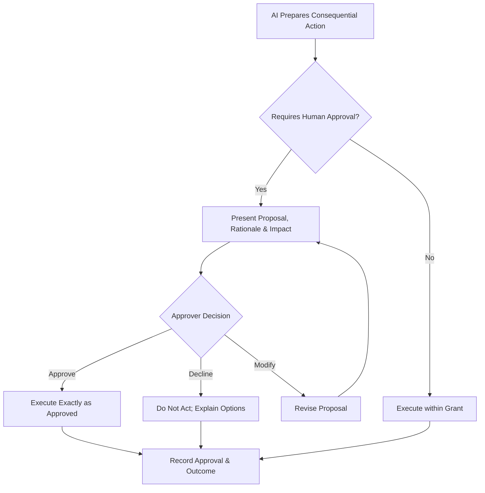

# Volume 03 - Human Approval Rules

| Field | Value |
|---|---|
| Document ID | WORLD-VOL03-057 |
| Title | Human Approval Rules |
| Version | 1.0 |
| Status | Approved |
| Classification | Internal |
| Founder | Mahesh Choudhary |

## Purpose
Define when the AI Business Partner must obtain explicit human approval before acting, and how that approval is requested, granted, and recorded. Human approval is the deliberate checkpoint at which a person authorizes a specific consequential action before it takes effect. It is the operational guarantee that the AI augments the founder and never commits the organization to a material outcome on its own authority.

## Scope
This chapter specifies human approval functionally: what approval is, which actions require it, the thresholds that trigger it, and how the approval workflow operates. It does not specify user-interface design or notification systems, which belong to the implementation volumes. Approval is the planned counterpart to escalation, defined in the Escalation Rules chapter, and it operates on the consequential tiers defined in the Permission Model.

## What Human Approval Is
Human approval is prior, explicit, and specific authorization from an entitled person for a defined action. Prior means it precedes the action; explicit means silence is never consent; specific means the approval covers the exact action proposed, not a general class of actions. Until approval is given, the AI holds the action in a proposed state and does nothing irreversible.

## Why Approval Matters
Some actions cannot be undone and some carry consequences the AI is not positioned to own: spending money, committing to contracts, changing someone's employment, or communicating externally in the organization's name. For these, speed matters less than correctness and accountability. Requiring human approval ensures a person with authority and context stands behind every consequential act, directly upholding the WORLD principle that the AI never overrides the founder.

## Approval Thresholds
| Action Class | Approval Required | Approver |
|---|---|---|
| Read, analyze, recommend | None | Standing authority |
| Reversible internal action | None within grant | Standing authority |
| External communication in the org's name | Always | Founder or delegated owner |
| Financial commitment above threshold | Always | Founder or finance owner |
| Contractual or legal commitment | Always | Founder |
| Personnel or compensation change | Always | Founder or HR owner |
| Irreversible or high-impact action | Always | Founder |

## Properties of Valid Approval
- **Prior.** Granted before the action executes.
- **Explicit.** An affirmative act by the approver; defaults and timeouts never approve.
- **Specific.** Tied to the exact proposed action and its details.
- **Attributable.** Recorded against the named approver.
- **Revocable before execution.** Can be withdrawn until the action takes effect.

## Approval Workflow

## Roles
The AI Business Partner prepares the proposal, presents the rationale and impact, and executes only what was approved, exactly as approved. The founder and delegated or functional owners review proposals and approve, modify, or decline. The governance layer records the approver, the decision, and the outcome so accountability is unambiguous.

## Enterprise Example
The AI recommends offering a retention bonus to a key employee at risk of leaving. This is a personnel and compensation change, so approval is always required. The AI presents the proposal to the founder with rationale, cost, and expected impact rather than acting. The founder modifies the amount and approves the revised offer. The AI then prepares the offer exactly as approved and, because the communication goes out in the organization's name, confirms the final message before it is sent. Every step, including the modification and the named approval, is recorded in the audit trail. At no point did the AI commit the organization on its own authority.

## Cross-References
- [Escalation Rules](/docs/blueprint/volume-03-ai-business-partner/section-g-safety-and-governance/56-escalation-rules.md)
- [Permission Model](/docs/blueprint/volume-03-ai-business-partner/section-g-safety-and-governance/51-permission-model.md)
- [AI Governance](/docs/blueprint/volume-03-ai-business-partner/section-g-safety-and-governance/50-ai-governance.md)
- [Human-in-the-Loop Philosophy](/docs/blueprint/volume-03-ai-business-partner/section-a-ai-foundation/08-human-in-the-loop-philosophy.md)

## References
- [Volume 01 - Vision & Philosophy](/docs/blueprint/volume-01-vision-and-philosophy/README.md)
- [Document Standards](/docs/governance/document-standards.md)

## Change Log
| Version | Date | Author | Change |
|---|---|---|---|
| 1.0 | 2026-07-12 | Lead Software Engineer | Initial approved version. |
