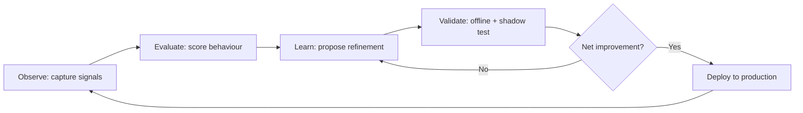

# Volume 03 - Continuous Improvement

| Field | Value |
|---|---|
| Document ID | WORLD-VOL03-058 |
| Title | Continuous Improvement |
| Version | 1.0 |
| Status | Approved |
| Classification | Internal |
| Founder | Mahesh Choudhary |

## Purpose

This chapter specifies how the WORLD AI Business Partner becomes measurably better over time. It defines continuous improvement as a governed, closed-loop discipline of the intelligence layer, not an incidental side effect of usage. The specification establishes the feedback sources, the improvement loop, the maturity stages, and the guardrails that ensure improvement is safe, attributable, and aligned with each customer's business.

## Scope

Continuous improvement covers the refinement of the AI Business Partner's reasoning, recommendations, language understanding, and workflow execution based on signals gathered during operation. It applies to model behaviour, retrieval quality, decision heuristics, and the knowledge the AI holds about a specific enterprise. It does not cover the addition of entirely new competencies, which is the subject of Chapter 59 (Capability Expansion), nor the coordination of several agents, covered in Chapter 60.

## Definition and First Principles

A business partner earns trust by learning. A human advisor who repeats the same mistake, or who never absorbs the operating context of the company they serve, is quickly discarded. The same standard applies to an AI Business Partner. Continuous improvement is therefore the mechanism by which WORLD converts operational experience into higher-quality intelligence.

From first principles, improvement requires four ingredients: a **signal** that current behaviour was good or bad, a **learning process** that generalises from the signal, a **validation gate** that confirms the change is a net improvement, and a **deployment path** that releases the change without disrupting live operations. Absent any one of these, improvement is either impossible, unsafe, or unmeasurable.

### Feedback Sources

The AI draws on several classes of signal:

- **Explicit feedback** - user acceptance, edits, rejections, and ratings of recommendations.
- **Implicit feedback** - whether a suggested action was executed, reversed, or ignored.
- **Outcome feedback** - downstream business results (revenue, cost, cycle time) linked to prior AI decisions.
- **Correction feedback** - human overrides captured through the governance layer.

## The Improvement Loop

The loop is continuous but gated. No proposed refinement reaches production without passing offline evaluation and a shadow-mode comparison against the incumbent behaviour on live traffic.

## Maturity Model

| Stage | Name | Characteristic | Improvement Cadence |
|---|---|---|---|
| 1 | Reactive | Improvements are manual and issue-driven | Ad hoc |
| 2 | Instrumented | Signals are captured systematically | Weekly review |
| 3 | Looped | Automated evaluation and shadow testing | Continuous, gated |
| 4 | Self-Optimising | AI proposes and prioritises its own refinements | Continuous |
| 5 | Autonomous | AI improves within policy without human release steps for low-risk changes | Real-time |

WORLD targets Stage 3 at general availability and Stage 4 for mature deployments, with Stage 5 reserved for narrow, low-risk decision classes under strict policy.

## Guardrails

Improvement must never degrade safety, fairness, or determinism where determinism is required. Every refinement is versioned, attributable to its originating signals, and reversible. Regression suites protect previously correct behaviour. Changes affecting regulated decisions require human release approval regardless of maturity stage.

## Enterprise Example

A mid-market distributor uses the AI Business Partner to recommend purchase-order quantities. Over two quarters, buyers frequently reduce the AI's suggested quantities for one seasonal category. The implicit and correction signals are captured (Observe), scored against realised stockouts and carrying cost (Evaluate), and used to propose a seasonality adjustment (Learn). The adjustment is shadow-tested against three months of live orders (Validate) and shown to cut carrying cost by 11 percent with no stockout increase. It is deployed, and the loop resumes. No engineer wrote new code; the intelligence layer refined its own heuristic within policy.

## Cross-References

- [Volume 03 - Capability Expansion](/docs/blueprint/volume-03-ai-business-partner/section-h-future-evolution/59-capability-expansion.md)
- [Volume 03 - Multi-Agent Collaboration](/docs/blueprint/volume-03-ai-business-partner/section-h-future-evolution/60-multi-agent-collaboration.md)
- [Volume 02 - Product Architecture](/docs/blueprint/volume-02-product-architecture/README.md)

## References

- [Volume 01 - Vision and Philosophy](/docs/blueprint/volume-01-vision-and-philosophy/README.md)
- [Document Standards](/docs/governance/document-standards.md)

## Change Log

| Version | Date | Author | Notes |
|---|---|---|---|
| 1.0 | 2026-07-12 | Lead Software Engineer | Initial approved version. |
