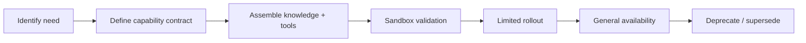

# Volume 03 - Capability Expansion

| Field | Value |
|---|---|
| Document ID | WORLD-VOL03-059 |
| Title | Capability Expansion |
| Version | 1.0 |
| Status | Approved |
| Classification | Internal |
| Founder | Mahesh Choudhary |

## Purpose

This chapter specifies how the WORLD AI Business Partner acquires new competencies over time - new business domains, new skills, and new integrations - without destabilising existing behaviour. Where Chapter 58 governs getting better at what the AI already does, this chapter governs doing new things.

## Scope

Capability expansion covers the definition, packaging, validation, and rollout of new skills for the intelligence layer. It addresses horizontal expansion (new business functions such as treasury or hiring), vertical expansion (deeper mastery within a function), and connective expansion (new systems the AI can read from and act upon). It excludes runtime coordination of multiple agents (Chapter 60) and infrastructure-level readiness (Chapter 61).

## Definition and First Principles

A business partner grows in usefulness by broadening the range of problems it can own. A capability, in WORLD, is a bounded unit of business competence: a defined objective, the knowledge and tools required to pursue it, the actions it may take, and the guardrails that constrain it. Expansion is the disciplined process of adding such units.

From first principles, safe expansion depends on **modularity** and **isolation**. If a new capability can be added without rewiring existing ones, and if it can be tested in isolation before it touches production, then the system can grow without accumulating fragility. WORLD therefore treats each capability as a versioned, independently deployable module registered against a shared capability catalog.

### Dimensions of Expansion

- **Domain breadth** - the number of business functions the AI can serve.
- **Task depth** - the sophistication of tasks within a function.
- **Autonomy** - how much of a task the AI can complete without human steps.
- **Connectivity** - the range of external systems the AI can sense and actuate.

## Capability Lifecycle

Each stage has explicit exit criteria. A capability may not enter limited rollout until it satisfies its contract in the sandbox, and may not reach general availability until limited rollout demonstrates its safety and value.

## Expansion Maturity Model

| Level | Name | New Capability Delivery | Risk Posture |
|---|---|---|---|
| 1 | Fixed | Capabilities are hard-wired at build time | High change cost |
| 2 | Configurable | Capabilities toggled by configuration | Medium |
| 3 | Modular | Capabilities packaged and deployed independently | Contained |
| 4 | Catalog-Driven | Capabilities discovered and composed from a catalog | Low, governed |
| 5 | Self-Extending | AI proposes new capabilities from observed gaps | Governed, policy-bound |

WORLD ships at Level 3, targets Level 4 for enterprise deployments, and treats Level 5 as an assisted process where the AI drafts capability contracts for human approval.

## Guardrails

Every capability declares its permissions, data access, and reversible-action boundaries before activation. New capabilities inherit the enterprise's governance and audit policies automatically. A capability that cannot be safely reversed defaults to advisory mode until human approval is explicitly granted.

## Enterprise Example

A services firm running WORLD for finance and sales requests a hiring capability. The need is identified and a capability contract is defined: objective (fill open roles faster), knowledge (job requisitions, headcount plan), tools (applicant-tracking integration), and guardrails (no offer without human sign-off). The capability is validated in a sandbox against historical requisitions, rolled out to one department, and - after demonstrating a 30 percent reduction in time-to-shortlist - promoted to general availability. Existing finance and sales capabilities are untouched throughout, because each is an isolated module in the catalog.

## Cross-References

- [Volume 03 - Continuous Improvement](/docs/blueprint/volume-03-ai-business-partner/section-h-future-evolution/58-continuous-improvement.md)
- [Volume 03 - Multi-Agent Collaboration](/docs/blueprint/volume-03-ai-business-partner/section-h-future-evolution/60-multi-agent-collaboration.md)
- [Volume 02 - Product Architecture](/docs/blueprint/volume-02-product-architecture/README.md)

## References

- [Volume 01 - Vision and Philosophy](/docs/blueprint/volume-01-vision-and-philosophy/README.md)
- [Document Standards](/docs/governance/document-standards.md)

## Change Log

| Version | Date | Author | Notes |
|---|---|---|---|
| 1.0 | 2026-07-12 | Lead Software Engineer | Initial approved version. |
