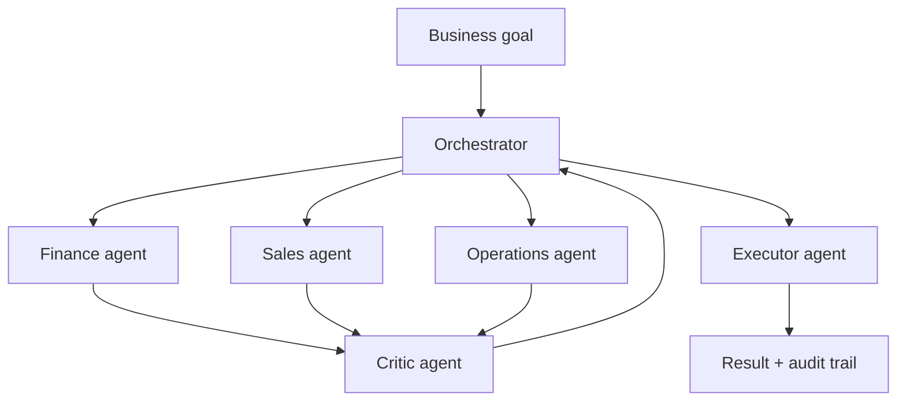

# Volume 03 - Multi-Agent Collaboration

| Field | Value |
|---|---|
| Document ID | WORLD-VOL03-060 |
| Title | Multi-Agent Collaboration |
| Version | 1.0 |
| Status | Approved |
| Classification | Internal |
| Founder | Mahesh Choudhary |

## Purpose

This chapter specifies how the WORLD AI Business Partner evolves from a single reasoning agent into a coordinated system of specialised agents that collaborate to run business functions. It defines the roles, orchestration pattern, communication contract, and governance that make multi-agent operation coherent and safe.

## Scope

The chapter covers agent specialisation, orchestration, inter-agent communication, conflict resolution, and shared memory. It builds on the capabilities defined in Chapter 59 and the improvement discipline of Chapter 58. It excludes the enterprise-scale operational requirements of Chapter 61 and the long-range vision of Chapter 62.

## Definition and First Principles

As the range of business functions the AI owns grows, a single monolithic agent becomes a bottleneck: it must hold every domain's context at once and reason about unrelated problems in one thread. Human organisations solved this long ago through **division of labour** and **coordination**. WORLD mirrors that solution.

A multi-agent system is a set of specialised agents, each an expert in a bounded domain, coordinated toward shared business goals. From first principles, it requires three things: **clear roles** so responsibilities do not collide, a **shared communication contract** so agents can exchange intent and results, and an **orchestrator** that decomposes goals, routes work, and reconciles conflicts.

### Agent Roles

- **Orchestrator** - decomposes objectives, assigns tasks, and integrates results.
- **Specialist agents** - domain experts (finance, sales, operations, hiring).
- **Critic / reviewer agent** - challenges recommendations before action.
- **Executor agent** - performs approved, reversible actions in external systems.

## Orchestration Model

The orchestrator holds the goal and the plan; specialists contribute domain reasoning; the critic guards quality; the executor is the single accountable point for external action. All exchanges are logged for audit.

## Collaboration Maturity Model

| Level | Name | Pattern | Coordination |
|---|---|---|---|
| 1 | Single Agent | One agent, all tasks | None |
| 2 | Delegated | Agent calls fixed sub-routines | Static |
| 3 | Orchestrated | Orchestrator routes to specialists | Dynamic, planned |
| 4 | Negotiated | Agents resolve conflicts via protocol | Peer negotiation |
| 5 | Emergent | Agents form teams dynamically per goal | Self-organising, governed |

WORLD delivers Level 3 at general availability and targets Level 4, where specialist agents negotiate trade-offs (for example, cash preservation versus growth spend) under an arbitration policy.

## Communication and Conflict Resolution

Agents exchange structured messages carrying intent, evidence, and confidence. When specialists disagree - the finance agent recommends restraint while the sales agent recommends investment - the orchestrator applies a documented arbitration policy and, above a defined materiality threshold, escalates to a human owner. Shared memory gives all agents a consistent view of enterprise state, preventing contradictory action.

## Guardrails

Only the executor agent may act on external systems, and only on approved, reversible actions. Every agent operates within the permissions of the capability it serves. The critic agent is mandatory for any recommendation that triggers an action. Complete traces of who proposed, who challenged, and who approved are retained.

## Enterprise Example

A retailer sets a goal: improve Q4 margin without stockouts. The orchestrator decomposes it and engages the finance, sales, and operations specialists. Finance proposes tighter discounting; sales warns of volume loss; operations flags inventory risk on two SKUs. The critic agent stress-tests the combined plan; the orchestrator arbitrates using the margin-versus-volume policy, escalating one high-value trade-off to the category manager. Once approved, the executor agent updates pricing and replenishment in the connected systems, leaving a full audit trail.

## Cross-References

- [Volume 03 - Capability Expansion](/docs/blueprint/volume-03-ai-business-partner/section-h-future-evolution/59-capability-expansion.md)
- [Volume 03 - Enterprise Readiness](/docs/blueprint/volume-03-ai-business-partner/section-h-future-evolution/61-enterprise-readiness.md)
- [Volume 02 - Product Architecture](/docs/blueprint/volume-02-product-architecture/README.md)

## References

- [Volume 01 - Vision and Philosophy](/docs/blueprint/volume-01-vision-and-philosophy/README.md)
- [Document Standards](/docs/governance/document-standards.md)

## Change Log

| Version | Date | Author | Notes |
|---|---|---|---|
| 1.0 | 2026-07-12 | Lead Software Engineer | Initial approved version. |
