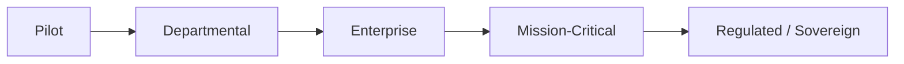

# Volume 03 - Enterprise Readiness

| Field | Value |
|---|---|
| Document ID | WORLD-VOL03-061 |
| Title | Enterprise Readiness |
| Version | 1.0 |
| Status | Approved |
| Classification | Internal |
| Founder | Mahesh Choudhary |

## Purpose

This chapter specifies what it means for the WORLD AI Business Partner to be ready for large-scale enterprise deployment. It defines the readiness dimensions, a graded readiness model, and the criteria an intelligence-layer deployment must satisfy before it can be trusted to operate mission-critical business functions at scale.

## Scope

Enterprise readiness covers reliability, security, compliance, scalability, observability, and supportability of the AI Business Partner as an operational system. It frames these as functional requirements of the intelligence layer, not as an infrastructure build guide. It complements the improvement, expansion, and collaboration capabilities of Chapters 58 to 60 and precedes the long-term vision of Chapter 62.

## Definition and First Principles

A capable advisor is not the same as a dependable one. An enterprise entrusts core operations - cash, customers, compliance - to WORLD only if the AI behaves predictably under load, protects sensitive data, respects regulation, and can be observed and supported like any other critical system.

From first principles, readiness is the property that an enterprise can **depend on** the AI: it does what is expected, when expected, safely, and its behaviour can be **verified** after the fact. Dependability plus verifiability is the foundation of enterprise trust.

### Readiness Dimensions

- **Reliability** - consistent, correct behaviour and graceful degradation.
- **Security** - protection of data, identities, and actions from misuse.
- **Compliance** - adherence to legal, regulatory, and internal policy.
- **Scalability** - stable performance as users, data, and actions grow.
- **Observability** - full visibility into decisions, actions, and health.
- **Supportability** - clear operations, incident response, and recovery.

## Readiness Model

Each stage raises the bar across every dimension. A deployment progresses only when it meets the criteria of the next stage, ensuring readiness grows in step with the responsibility placed on the AI.

## Readiness Levels

| Level | Name | Availability Target | Governance | Typical Use |
|---|---|---|---|---|
| 1 | Pilot | Best effort | Manual oversight | Evaluation |
| 2 | Departmental | 99.5% | Role-based access | Single function |
| 3 | Enterprise | 99.9% | Full audit + SSO | Cross-function |
| 4 | Mission-Critical | 99.95% | Change control + DR | Core operations |
| 5 | Regulated / Sovereign | 99.99% | Data residency + attestations | Regulated industries |

WORLD certifies deployments against these levels. Advancing a level requires evidence across all six readiness dimensions, not merely an uptime figure.

## Guardrails

No deployment operates above the readiness level it has been certified for. Security and compliance controls are non-negotiable prerequisites at every level from 2 upward. Every AI action against enterprise systems is authenticated, authorised, logged, and reversible where policy demands. Disaster recovery and rollback procedures are validated before Mission-Critical certification.

## Enterprise Example

A regional bank begins with a Pilot of the AI Business Partner for internal financial analysis. To promote it to Enterprise level for treasury operations, the deployment must demonstrate single sign-on integration, complete audit trails of every recommendation and action, 99.9 percent availability across a quarter, and evidence that access controls prevent the AI from acting outside approved limits. Only after an independent review confirms all six dimensions does the bank certify the deployment at Level 3 and extend it to live cash management, with Level 5 controls staged for later regulated use.

## Cross-References

- [Volume 03 - Multi-Agent Collaboration](/docs/blueprint/volume-03-ai-business-partner/section-h-future-evolution/60-multi-agent-collaboration.md)
- [Volume 03 - Long-Term AI Vision](/docs/blueprint/volume-03-ai-business-partner/section-h-future-evolution/62-long-term-ai-vision.md)
- [Volume 02 - Product Architecture](/docs/blueprint/volume-02-product-architecture/README.md)

## References

- [Volume 01 - Vision and Philosophy](/docs/blueprint/volume-01-vision-and-philosophy/README.md)
- [Document Standards](/docs/governance/document-standards.md)

## Change Log

| Version | Date | Author | Notes |
|---|---|---|---|
| 1.0 | 2026-07-12 | Lead Software Engineer | Initial approved version. |
