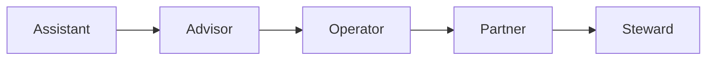

# Volume 03 - Long-Term AI Vision

| Field | Value |
|---|---|
| Document ID | WORLD-VOL03-062 |
| Title | Long-Term AI Vision |
| Version | 1.0 |
| Status | Approved |
| Classification | Internal |
| Founder | Mahesh Choudhary |

## Purpose

This chapter sets the long-term direction for the WORLD intelligence layer. It articulates, from first principles, what the AI Business Partner is evolving toward over a multi-year horizon and defines the trajectory that the preceding chapters of Section H collectively serve. It is the anchor against which future functional decisions are judged.

## Scope

The chapter describes the long-term aspiration, the evolutionary stages from assistant to autonomous business partner, the enduring principles that constrain that evolution, and an illustration of the mature end state. It is directional rather than prescriptive of implementation, and it presumes the improvement, expansion, collaboration, and readiness disciplines defined in Chapters 58 to 61.

## Definition and First Principles

WORLD exists to give every business a genuine AI Business Partner - an intelligence that understands the enterprise, shares responsibility for its outcomes, and grows alongside it. The long-term vision is the fullest expression of that mission: an AI that does not merely answer questions or execute tasks but participates in running the business.

From first principles, a partner is defined by three properties: **understanding** (it grasps the goals and context of the enterprise), **agency** (it can act toward those goals), and **accountability** (it is answerable for what it does). The long-term arc of WORLD is the steady deepening of all three, always bounded by human authority over intent and values.

### Enduring Principles

- **Human primacy** - humans set goals and values; the AI serves them.
- **Transparency** - every decision remains explainable and auditable.
- **Alignment** - the AI optimises the enterprise's true objectives, not proxies.
- **Reversibility** - consequential actions can be understood and undone.

## Evolutionary Stages

The AI progresses from answering (Assistant), to recommending (Advisor), to executing approved work (Operator), to sharing ownership of outcomes (Partner), and finally to responsibly stewarding entire functions within human-set bounds (Steward).

## Vision Horizon Model

| Horizon | Role | Human Involvement | Business Impact |
|---|---|---|---|
| Near | Assistant / Advisor | Human decides, AI informs | Faster, better decisions |
| Mid | Operator | Human approves, AI executes | Automated execution |
| Long | Partner | Human directs, AI co-owns outcomes | Compounding leverage |
| Ultimate | Steward | Human sets values and goals | Self-running functions |

Each horizon transfers more execution to the AI while concentrating human effort on intent, judgement, and values - never removing human authority.

## Guardrails

Advancement along the stages is always gated by demonstrated readiness (Chapter 61) and governed by the enduring principles above. No horizon removes human control over goals and values. Autonomy is granted per decision class, is revocable, and is never a blanket status. The AI's authority can only ever be as broad as its transparency and reversibility allow.

## Enterprise Example

Consider a manufacturer over five years of WORLD adoption. In year one the AI is an Advisor, surfacing demand-planning insights. By year two it is an Operator, executing approved replenishment. By year four it is a Partner, co-owning the working-capital target: it plans procurement, coordinates finance and operations agents, and reports outcomes against the goal the CFO set. It never chooses the goal - the CFO does - but it carries responsibility for pursuing it, explains every material decision, and can reverse course on command. This is the mature end state Section H is built to reach.

## Cross-References

- [Volume 03 - Continuous Improvement](/docs/blueprint/volume-03-ai-business-partner/section-h-future-evolution/58-continuous-improvement.md)
- [Volume 03 - Enterprise Readiness](/docs/blueprint/volume-03-ai-business-partner/section-h-future-evolution/61-enterprise-readiness.md)
- [Volume 01 - Vision and Philosophy](/docs/blueprint/volume-01-vision-and-philosophy/README.md)

## References

- [Volume 01 - Vision and Philosophy](/docs/blueprint/volume-01-vision-and-philosophy/README.md)
- [Document Standards](/docs/governance/document-standards.md)

## Change Log

| Version | Date | Author | Notes |
|---|---|---|---|
| 1.0 | 2026-07-12 | Lead Software Engineer | Initial approved version. |
