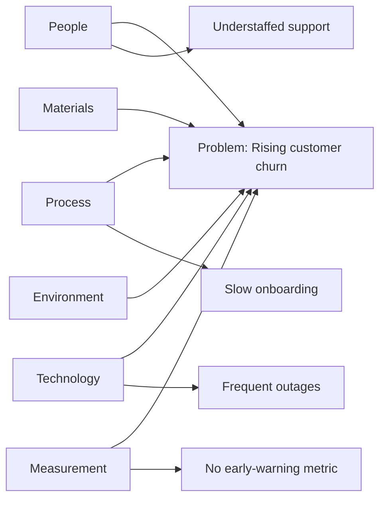

# Volume 04 - Root Cause Templates

| Field | Value |
|---|---|
| Document ID | WORLD-VOL04-A5 |
| Title | Root Cause Templates |
| Version | 1.0 |
| Status | Approved |
| Classification | Internal |
| Founder | Mahesh Choudhary |

## Purpose

This appendix provides structured templates for root-cause analysis (RCA) so that problems are diagnosed rigorously rather than treated at the symptom level. These templates support the diagnostic-analytics workflows in Volume 04.

## Scope

Covers the problem statement template, the 5 Whys worksheet, the Ishikawa (fishbone) template with a validated Mermaid example, and the Corrective and Preventive Action (CAPA) form. Use them together: state the problem, find the cause, then close it out with CAPA.

## 1. Problem Statement Template

| Field | Content |
|---|---|
| Problem title | `<short name>` |
| What is happening | Observable symptom, stated factually. |
| Where | Location / system / process affected. |
| When | First observed, frequency, pattern. |
| Magnitude | Quantified impact (units, cost, customers, time). |
| Who is affected | Stakeholders / segments impacted. |
| What is NOT the problem | Scope boundaries to prevent drift. |
| Desired state | What "resolved" looks like, measurably. |

## 2. 5 Whys Worksheet

| Step | Question | Answer |
|---|---|---|
| Problem | State the problem | `<problem>` |
| Why 1 | Why is this happening? | `<answer>` |
| Why 2 | Why is that? | `<answer>` |
| Why 3 | Why is that? | `<answer>` |
| Why 4 | Why is that? | `<answer>` |
| Why 5 | Why is that? | `<answer>` |
| Root cause | Underlying cause identified | `<root cause>` |
| Corrective action | Action addressing the root cause | `<action, owner, date>` |

Note: five iterations is a guideline, not a rule; stop when a controllable root cause is reached.

## 3. Ishikawa (Fishbone) Template

List candidate causes under each category, then investigate the most probable. Standard categories (the 6Ms adapted): People, Process, Technology, Materials, Environment, Measurement.

| Category | Candidate causes |
|---|---|
| People | `<...>` |
| Process | `<...>` |
| Technology | `<...>` |
| Materials | `<...>` |
| Environment | `<...>` |
| Measurement | `<...>` |

### Mermaid example

## 4. Corrective and Preventive Action (CAPA) Form

| Field | Content |
|---|---|
| CAPA ID | `<VOL04-CAPA-YYYYMMDD-NN>` |
| Linked problem / RCA | `<reference>` |
| Root cause(s) | `<from 5 Whys / Ishikawa>` |
| Corrective action | Action to fix the current occurrence. |
| Preventive action | Action to stop recurrence (systemic fix). |
| Owner | `<name>` |
| Target date | `<date>` |
| Verification method | How effectiveness will be confirmed. |
| Effectiveness check date | `<date>` |
| Status | Open / In progress / Verified / Closed |

## Cross-References

- [Diagnostic Analytics](/docs/blueprint/volume-04-business-intelligence-and-decision-science/README.md)
- [Analytical Models](/docs/blueprint/volume-04-business-intelligence-and-decision-science/appendices/analytical-models.md)
- [Executive Review Templates](/docs/blueprint/volume-04-business-intelligence-and-decision-science/appendices/executive-review-templates.md)

## References

- [Volume 01 - Vision and Philosophy](/docs/blueprint/volume-01-vision-and-philosophy/README.md)
- [Document Standards](/docs/governance/document-standards.md)

## Change Log

| Version | Date | Author | Notes |
|---|---|---|---|
| 1.0 | 2026-07-12 | Lead Software Engineer | Initial approved version. |
