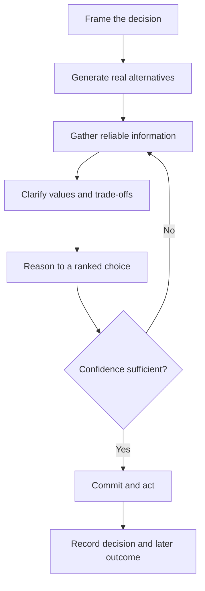

# Volume 04 - Decision Science Fundamentals

| Field | Value |
|---|---|
| Document ID | WORLD-VOL04-002 |
| Title | Decision Science Fundamentals |
| Version | 1.0 |
| Status | Approved |
| Classification | Internal |
| Founder | Mahesh Choudhary |

## Purpose
This chapter defines the scientific basis for how WORLD makes and evaluates decisions. It separates the *quality of a decision* from the *quality of its outcome*, and establishes the anatomy of a decision so that every choice can be reasoned about, improved, and audited.

## Scope
Fundamentals of decision science as a discipline. It underpins the frameworks in [Decision Quality Framework](/docs/blueprint/volume-04-business-intelligence-and-decision-science/section-a-intelligence-foundation/07-decision-quality-framework.md) and [Decision Confidence Model](/docs/blueprint/volume-04-business-intelligence-and-decision-science/section-a-intelligence-foundation/08-decision-confidence-model.md), and does not itself prescribe operational procedures.

## First-Principles Framing
A decision is an irreversible commitment of resources under uncertainty in pursuit of an objective. The central insight of decision science is that a good decision and a good outcome are not the same thing. Because outcomes are influenced by chance, a well-reasoned decision can produce a bad result, and a reckless one can get lucky. Judging decisions by outcomes alone rewards luck and punishes rigor. WORLD therefore evaluates the *process* of deciding, holding it to a standard independent of the roll of the dice.

Every decision decomposes into six elements: a **frame** (what is being decided and why), **alternatives** (the real options), **information** (relevant, reliable knowledge), **values** (what we are trying to maximize), **reasoning** (how information and values combine to rank alternatives), and **commitment** (the will to act). Weakness in any one element degrades the whole.

## Why This Concept Exists
Without decision science, organizations conflate luck with skill and cannot learn systematically. They repeat well-reasoned processes that happened to fail and abandon sound ones after a single bad break. A formal discipline exists to make decisions inspectable, repeatable, and improvable - so the organization compounds judgement over time rather than restarting from intuition each time.

| Element | Question It Answers | Common Failure |
|---|---|---|
| Frame | What are we really deciding? | Solving the wrong problem |
| Alternatives | What are our real options? | False binary choices |
| Information | What do we reliably know? | Acting on stale or biased data |
| Values | What matters, and how much? | Optimizing the wrong metric |
| Reasoning | How do options rank? | Untraceable logic |
| Commitment | Will we actually act? | Decisions that never execute |

## Where It Is Used
Decision science applies wherever a choice consumes resources: pricing, hiring, capital allocation, market entry, supplier selection, and risk acceptance. It scales from repeatable operational choices to singular strategic bets, described further in [Levels of Decision Making](/docs/blueprint/volume-04-business-intelligence-and-decision-science/section-a-intelligence-foundation/06-levels-of-decision-making.md).

## How WORLD Implements It
WORLD structures every non-trivial decision around the six elements and separates decision quality from outcome tracking. Each recommendation records its frame, the alternatives considered, the information relied upon, the values weighed, and the reasoning chain - producing an auditable decision record.

## Relationship with the AI Business Partner
The AI Business Partner operationalizes decision science. It frames problems explicitly, generates genuine alternatives rather than rubber-stamping one, exposes its reasoning, and states calibrated confidence. Crucially, it defers commitment on consequential or irreversible choices to the human, consistent with the [Human-in-the-Loop Philosophy](/docs/blueprint/volume-03-ai-business-partner/section-a-ai-foundation/08-human-in-the-loop-philosophy.md).

## Relationship with ERP
ERP supplies the factual inputs decision science depends on - the *information* element - and later executes the committed choice as transactions. Decision science governs the reasoning between those two points. ERP records that an order was placed; decision science governs whether placing it was the right, well-reasoned choice.

## Relationship with Business Foundation
[Volume 02 - Business Foundation](/docs/blueprint/volume-02-business-foundation/README.md) defines the objectives and value structures that supply the *values* element of every decision. Decision science borrows its notion of what to maximize from the business model foundation defines, ensuring choices serve the business as designed rather than a local proxy.

## Enterprise Example
A founder must decide whether to accept a large order at a discounted price. An outcome-first view asks only whether it turns a profit. Decision science reframes it: the *frame* is protecting long-term margin discipline, not one order; *alternatives* include a smaller committed volume; *information* reveals the customer historically negotiates every renewal down; *values* weigh cash now against precedent. The reasoning recommends a counter-offer at 76% confidence. Even if the customer walks, the decision was sound - and the recorded rationale makes the next similar choice faster.

## Cross-References
- [Business Intelligence Philosophy](/docs/blueprint/volume-04-business-intelligence-and-decision-science/section-a-intelligence-foundation/01-business-intelligence-philosophy.md)
- [Decision Quality Framework](/docs/blueprint/volume-04-business-intelligence-and-decision-science/section-a-intelligence-foundation/07-decision-quality-framework.md)
- [Decision Confidence Model](/docs/blueprint/volume-04-business-intelligence-and-decision-science/section-a-intelligence-foundation/08-decision-confidence-model.md)

## References
- [Volume 01 - Vision & Philosophy](/docs/blueprint/volume-01-vision-and-philosophy/README.md)
- [Document Standards](/docs/governance/document-standards.md)

## Change Log
| Version | Date | Author | Change |
|---|---|---|---|
| 1.0 | 2026-07-12 | Lead Software Engineer | Initial approved version. |
