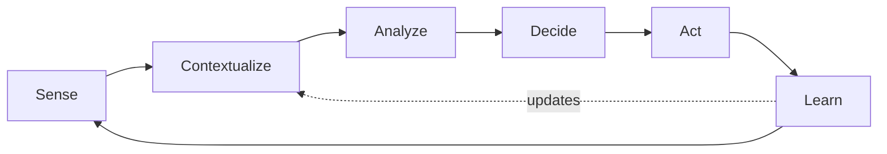

# Volume 04 - Intelligence Lifecycle

| Field | Value |
|---|---|
| Document ID | WORLD-VOL04-003 |
| Title | Intelligence Lifecycle |
| Version | 1.0 |
| Status | Approved |
| Classification | Internal |
| Founder | Mahesh Choudhary |

## Purpose
This chapter defines the repeatable lifecycle through which WORLD converts raw business signals into decisions and, ultimately, into learning. It gives intelligence a process shape so it can be governed, measured, and improved rather than performed ad hoc.

## Scope
The end-to-end process of intelligence. It builds on the [Business Intelligence Philosophy](/docs/blueprint/volume-04-business-intelligence-and-decision-science/section-a-intelligence-foundation/01-business-intelligence-philosophy.md) and complements the value ladder in [Data, Information, Knowledge, Insight, Decision](/docs/blueprint/volume-04-business-intelligence-and-decision-science/section-a-intelligence-foundation/04-data-information-knowledge-insight-decision.md).

## First-Principles Framing
Intelligence is not an event; it is a cycle. Reality generates signals continuously, decisions change reality, and those changes generate new signals. If intelligence is treated as a one-way pipeline that ends at a report, the organization never closes the loop between what it decided and what actually happened - so it cannot learn. WORLD models intelligence as a closed loop with six stages: **Sense, Contextualize, Analyze, Decide, Act, Learn**. The final stage feeds the first, turning every decision into future intelligence.

## Why This Concept Exists
Ad-hoc analysis produces inconsistent quality, hidden assumptions, and no institutional memory. A defined lifecycle exists to make intelligence reproducible and accountable: each stage has an owner, an input, an output, and a quality bar. Above all, the lifecycle exists to guarantee the *Learn* stage happens - the stage most organizations skip, and the one that compounds capability over time.

| Stage | Input | Output | Quality Bar |
|---|---|---|---|
| Sense | Raw signals and events | Captured, timestamped data | Completeness and reliability |
| Contextualize | Captured data | Data mapped to business meaning | Correct framing |
| Analyze | Contextualized data | Insight with confidence | Sound, visible reasoning |
| Decide | Insight | A committed choice | Meets decision-quality bar |
| Act | Decision | Executed change | Faithful execution |
| Learn | Outcome vs. expectation | Updated knowledge | Honest evaluation |

## Where It Is Used
The lifecycle is the backbone of every intelligence activity in WORLD - performance monitoring, forecasting, problem-solving, and strategic analysis. Fast operational loops may complete in seconds; strategic loops may span quarters. The stages are identical; only the cadence differs.

## How WORLD Implements It
WORLD runs the lifecycle as a continuous loop, with the *Learn* stage explicitly wired back into *Sense* and *Contextualize* so that expectations are updated after every consequential decision.

## Relationship with the AI Business Partner
The AI Business Partner is the engine that drives the lifecycle. It senses signals, contextualizes them against business knowledge, analyzes with stated confidence, and proposes decisions - while reserving commitment on high-stakes choices for the human. It is also the memory of the *Learn* stage, comparing predicted outcomes to actual results and updating its understanding accordingly.

## Relationship with ERP
ERP is the dominant source of the *Sense* stage and the executor of the *Act* stage. Transactions recorded in ERP are the raw signals intelligence senses; committed decisions become new ERP transactions when acted upon. The lifecycle therefore both consumes from and writes back to the operational layer, without depending on its internal specifics.

## Relationship with Business Foundation
[Volume 02 - Business Foundation](/docs/blueprint/volume-02-business-foundation/README.md) supplies the business meaning used in the *Contextualize* stage - the entities, processes, and objectives that give raw signals significance. Without foundation, a number has no referent; the lifecycle would sense data it could not interpret.

## Enterprise Example
A retailer's point-of-sale volume dips on a Tuesday (*Sense*). WORLD maps the dip to a specific store and product category (*Contextualize*), analyzes it against weather and a lapsed promotion, concluding the promotion expiry is the cause at 80% confidence (*Analyze*). It recommends re-enabling a targeted promotion (*Decide*), which the manager approves and the system schedules (*Act*). Two weeks later, WORLD compares actual recovery to the forecast, finds it slightly under-predicted, and refines its promotional-lift model (*Learn*) - improving the next cycle.

## Cross-References
- [Business Intelligence Philosophy](/docs/blueprint/volume-04-business-intelligence-and-decision-science/section-a-intelligence-foundation/01-business-intelligence-philosophy.md)
- [Data, Information, Knowledge, Insight, Decision](/docs/blueprint/volume-04-business-intelligence-and-decision-science/section-a-intelligence-foundation/04-data-information-knowledge-insight-decision.md)
- [Decision Quality Framework](/docs/blueprint/volume-04-business-intelligence-and-decision-science/section-a-intelligence-foundation/07-decision-quality-framework.md)

## References
- [Volume 01 - Vision & Philosophy](/docs/blueprint/volume-01-vision-and-philosophy/README.md)
- [Document Standards](/docs/governance/document-standards.md)

## Change Log
| Version | Date | Author | Change |
|---|---|---|---|
| 1.0 | 2026-07-12 | Lead Software Engineer | Initial approved version. |
