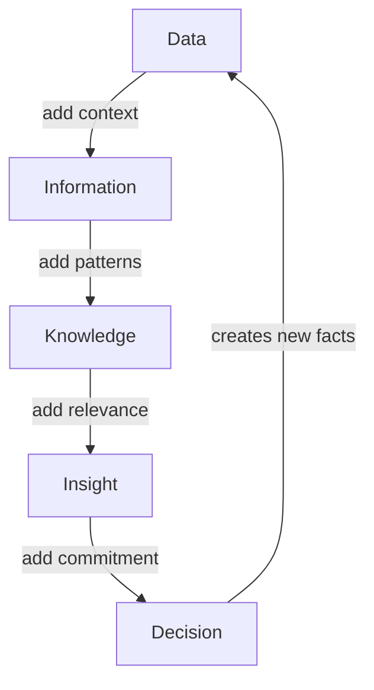

# Volume 04 - Data, Information, Knowledge, Insight, Decision

| Field | Value |
|---|---|
| Document ID | WORLD-VOL04-004 |
| Title | Data, Information, Knowledge, Insight, Decision |
| Version | 1.0 |
| Status | Approved |
| Classification | Internal |
| Founder | Mahesh Choudhary |

## Purpose
This chapter defines the value ladder that intelligence climbs: from raw data to committed decision. It gives WORLD a precise, shared vocabulary so that each transformation - and the value it adds - can be reasoned about explicitly.

## Scope
The conceptual hierarchy and the transitions between its levels. It refines the process defined in [Intelligence Lifecycle](/docs/blueprint/volume-04-business-intelligence-and-decision-science/section-a-intelligence-foundation/03-intelligence-lifecycle.md) by naming what actually moves up the ladder at each stage.

## First-Principles Framing
Value in intelligence comes from transformation, not accumulation. Five levels form a ladder, each adding a specific ingredient the one below lacks:

- **Data** - raw, uninterpreted facts ("units sold = 412").
- **Information** - data placed in context ("412 units, down 18% from last week").
- **Knowledge** - patterns and relationships learned over time ("this product always dips after a promotion ends").
- **Insight** - a non-obvious, decision-relevant realization ("the dip is accelerating faster than prior cycles, signaling demand erosion").
- **Decision** - a committed choice to act ("replace the promotion with a permanent price cut").

Each step is a distinct cognitive act. Skipping steps - jumping from data to decision - is where most bad judgement originates.

## Why This Concept Exists
Organizations routinely confuse these levels. They call a data dump a report, mistake information for insight, and act without knowledge. A precise ladder exists to expose exactly where value is being added or lost, and to prevent premature leaps. It also clarifies accountability: producing data is not the same job as producing insight, and both must be done well.

| Level | Adds | Question Answered | Example |
|---|---|---|---|
| Data | Raw fact | What is recorded? | 412 units |
| Information | Context | What does it mean now? | Down 18% week-on-week |
| Knowledge | Pattern | What is normally true? | Dips follow promo endings |
| Insight | Relevance | What is non-obvious and actionable? | Erosion faster than usual |
| Decision | Commitment | What will we do? | Permanent price cut |

## Where It Is Used
The ladder governs how WORLD structures every analytical output. Dashboards operate mostly at the information level; the AI Business Partner is expected to climb to insight and decision. It also frames data governance: knowing which assets are data versus knowledge shapes how they are stored and trusted.

## How WORLD Implements It
WORLD makes the climb explicit. An intelligence artifact is not considered complete at the information level; it must reach at least insight and connect to a decision, otherwise it is flagged as incomplete.

## Relationship with the AI Business Partner
The AI Business Partner's core value is climbing this ladder on the founder's behalf. Simple systems stop at information; WORLD's AI is designed to reach insight and frame a decision, while showing the reasoning at each transition so the founder can audit the climb rather than trust a leap.

## Relationship with ERP
ERP is the primary generator of the two lowest rungs. Its transactions are data, and its structured records are information in context. Intelligence takes these ERP-sourced rungs and climbs to knowledge, insight, and decision. When a decision is acted upon, it returns to ERP as new transactional data - restarting the ladder.

## Relationship with Business Foundation
[Volume 02 - Business Foundation](/docs/blueprint/volume-02-business-foundation/README.md) defines the entities and objectives that turn data into *information* - the context rung - and accumulates into *knowledge* about how the specific business behaves. The ladder is therefore only meaningful relative to the business model foundation describes.

## Enterprise Example
A logistics firm logs delivery times (data). Contextualized, average delivery is 2.3 days, up from 1.9 (information). Historical patterns show delays cluster with a single carrier (knowledge). The insight: that carrier's delays now correlate with a 12% rise in customer complaints and churn risk (insight). The decision: shift 40% of volume to an alternate carrier for a trial quarter (decision). Each rung is documented, so the founder sees not just the recommendation but the full ascent that justifies it.

## Cross-References
- [Business Intelligence Philosophy](/docs/blueprint/volume-04-business-intelligence-and-decision-science/section-a-intelligence-foundation/01-business-intelligence-philosophy.md)
- [Intelligence Lifecycle](/docs/blueprint/volume-04-business-intelligence-and-decision-science/section-a-intelligence-foundation/03-intelligence-lifecycle.md)
- [Decision Science Fundamentals](/docs/blueprint/volume-04-business-intelligence-and-decision-science/section-a-intelligence-foundation/02-decision-science-fundamentals.md)

## References
- [Volume 01 - Vision & Philosophy](/docs/blueprint/volume-01-vision-and-philosophy/README.md)
- [Document Standards](/docs/governance/document-standards.md)

## Change Log
| Version | Date | Author | Change |
|---|---|---|---|
| 1.0 | 2026-07-12 | Lead Software Engineer | Initial approved version. |
