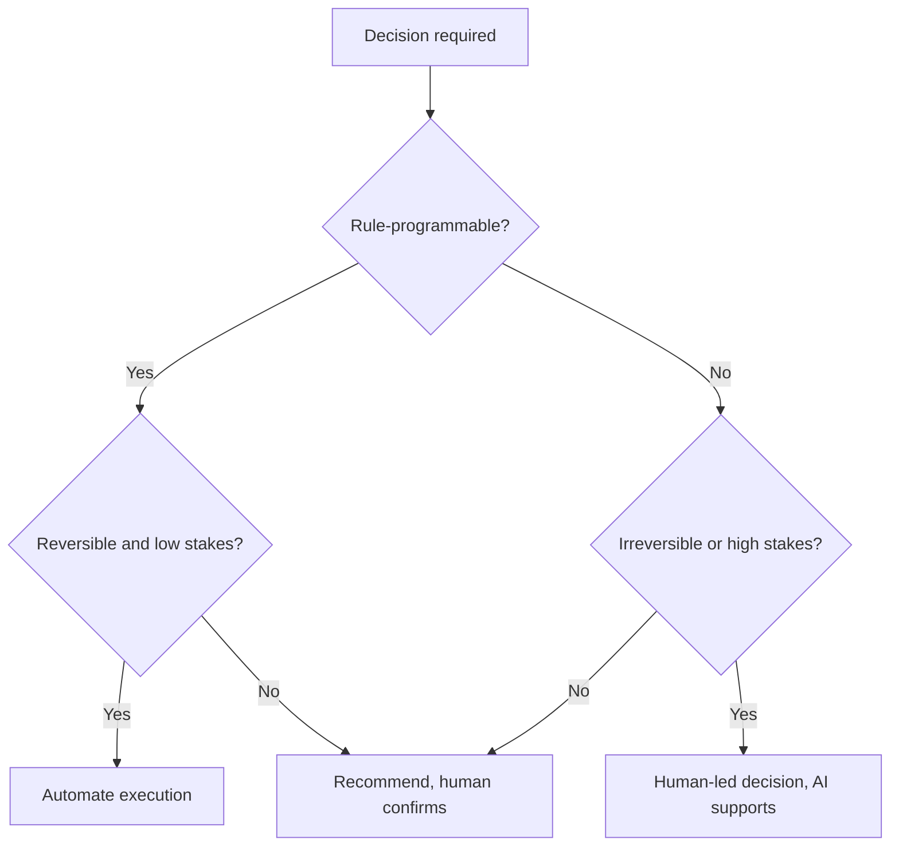

# Volume 04 - Types of Business Decisions

| Field | Value |
|---|---|
| Document ID | WORLD-VOL04-005 |
| Title | Types of Business Decisions |
| Version | 1.0 |
| Status | Approved |
| Classification | Internal |
| Founder | Mahesh Choudhary |

## Purpose
This chapter classifies the kinds of decisions a business makes so that each can be matched to the right intelligence, process, and level of human involvement. Not all decisions deserve the same rigor; misclassifying them wastes effort or invites disaster.

## Scope
A taxonomy of decision types by structure, reversibility, and frequency. It complements [Levels of Decision Making](/docs/blueprint/volume-04-business-intelligence-and-decision-science/section-a-intelligence-foundation/06-levels-of-decision-making.md), which classifies decisions by organizational altitude rather than by type.

## First-Principles Framing
Decisions differ along axes that determine how they should be handled. Three axes matter most. **Structure**: is the decision *programmable* (rules can decide it) or *non-programmable* (it needs judgement)? **Reversibility**: can the choice be cheaply undone, or is it a one-way door? **Frequency**: is it routine and recurring, or rare and singular? These axes combine to tell us how much intelligence to invest and who should decide.

A reversible, high-frequency, structured decision (reorder stock) should be fast and largely automated. An irreversible, rare, unstructured decision (enter a new market) demands deep analysis and human commitment. Treating them the same is the core error the taxonomy prevents.

## Why This Concept Exists
Without classification, organizations over-analyze trivial choices and under-analyze consequential ones. A taxonomy exists to allocate the scarcest resources - attention and judgement - proportionally to what is at stake, and to decide safely what can be delegated to automation versus what must reach a human.

| Decision Type | Structure | Reversibility | Typical Handling |
|---|---|---|---|
| Operational / routine | Programmable | Reversible | Automated, rule-driven |
| Tactical / adaptive | Semi-structured | Mostly reversible | AI-recommended, human-confirmed |
| Strategic / novel | Unstructured | Often irreversible | Human-led, AI-supported |
| Crisis / time-critical | Unstructured | Variable | Escalated, rapid human judgement |

## Where It Is Used
The taxonomy is used to route decisions to the correct process: which choices WORLD may execute automatically, which it recommends and waits on, and which it must escalate. It also shapes how much analytical depth an intelligence request warrants.

## How WORLD Implements It
WORLD classifies each incoming decision along the three axes and routes it accordingly, defaulting to greater human involvement as reversibility falls and stakes rise.

## Relationship with the AI Business Partner
The AI Business Partner uses the taxonomy to calibrate its own autonomy. For structured, reversible decisions it may act and report; for tactical ones it recommends and awaits confirmation; for strategic or irreversible ones it provides analysis but defers commitment to the human, consistent with the [Human-in-the-Loop Philosophy](/docs/blueprint/volume-03-ai-business-partner/section-a-ai-foundation/08-human-in-the-loop-philosophy.md).

## Relationship with ERP
Many operational, programmable decisions are executed directly as ERP transactions - reorders, credit approvals within limits, routine scheduling. ERP is thus the natural home of automated decision types, while WORLD's intelligence layer governs the semi-structured and strategic types that sit above routine transaction processing.

## Relationship with Business Foundation
[Volume 02 - Business Foundation](/docs/blueprint/volume-02-business-foundation/README.md) defines the processes and objectives that determine a decision's stakes and reversibility. What counts as "high stakes" is business-specific; foundation supplies the model that lets WORLD classify a given decision correctly.

## Enterprise Example
A wholesaler faces three decisions in one morning. Restocking a fast-moving SKU is programmable and reversible - WORLD executes it automatically and logs it. Approving a mid-size credit line extension is semi-structured - WORLD recommends approval with 71% confidence and awaits the founder's confirmation. Signing a two-year exclusive distribution contract is unstructured and irreversible - WORLD prepares a full analysis of alternatives and risks but explicitly leaves the commitment to the founder. Each was handled with proportionate rigor.

## Cross-References
- [Levels of Decision Making](/docs/blueprint/volume-04-business-intelligence-and-decision-science/section-a-intelligence-foundation/06-levels-of-decision-making.md)
- [Decision Science Fundamentals](/docs/blueprint/volume-04-business-intelligence-and-decision-science/section-a-intelligence-foundation/02-decision-science-fundamentals.md)
- [Decision Quality Framework](/docs/blueprint/volume-04-business-intelligence-and-decision-science/section-a-intelligence-foundation/07-decision-quality-framework.md)

## References
- [Volume 01 - Vision & Philosophy](/docs/blueprint/volume-01-vision-and-philosophy/README.md)
- [Document Standards](/docs/governance/document-standards.md)

## Change Log
| Version | Date | Author | Change |
|---|---|---|---|
| 1.0 | 2026-07-12 | Lead Software Engineer | Initial approved version. |
