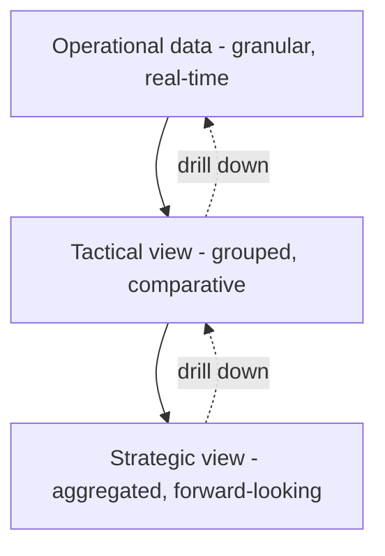

# Volume 04 - Levels of Decision Making

| Field | Value |
|---|---|
| Document ID | WORLD-VOL04-006 |
| Title | Levels of Decision Making |
| Version | 1.0 |
| Status | Approved |
| Classification | Internal |
| Founder | Mahesh Choudhary |

## Purpose
This chapter defines the altitudes at which decisions are made - strategic, tactical, and operational - and the distinct intelligence each level requires. It ensures the right question is answered at the right level, with the right time horizon and data granularity.

## Scope
A vertical classification of decisions by organizational altitude and time horizon. It complements the structural taxonomy in [Types of Business Decisions](/docs/blueprint/volume-04-business-intelligence-and-decision-science/section-a-intelligence-foundation/05-types-of-business-decisions.md), viewing the same decisions through the lens of scope and impact.

## First-Principles Framing
Decisions exist at different altitudes, and altitude changes everything about the intelligence needed. At the **strategic** level, decisions shape the direction and identity of the business over long horizons using aggregated, external, and forward-looking data. At the **tactical** level, decisions allocate resources within that direction over medium horizons. At the **operational** level, decisions execute day-to-day activity using granular, real-time, internal data.

The mistake to avoid is altitude confusion: using operational detail to make a strategic call (drowning direction in noise), or using strategic abstraction to run daily operations (guiding execution with unusable generality). Each level needs data at its own resolution.

## Why This Concept Exists
Different levels have different time horizons, tolerances for error, and data needs. A single undifferentiated "decision process" either overwhelms executives with detail or starves operators of specifics. The levels exist to match intelligence resolution, cadence, and ownership to the altitude of the choice.

| Level | Horizon | Data Granularity | Primary Owner | Example |
|---|---|---|---|---|
| Strategic | Years | Aggregated, external | Founder / executive | Enter a new market |
| Tactical | Quarters / months | Grouped, comparative | Managers | Reallocate marketing budget |
| Operational | Days / real-time | Granular, transactional | Operators / systems | Approve a shipment |

## Where It Is Used
The levels frame how WORLD tailors intelligence outputs. Executive summaries compress to strategic altitude; operational alerts expose transaction-level detail. The same underlying data is presented at different resolutions depending on the deciding level.

## How WORLD Implements It
WORLD routes and shapes intelligence by level, aggregating upward for strategy and drilling downward for operations, while preserving the ability to trace any strategic figure back to its operational source.

## Relationship with the AI Business Partner
The AI Business Partner adapts its voice and content to the decision level. To the founder it speaks strategically - direction, trade-offs, and long-horizon confidence. For tactical choices it compares options and resource allocations. For operational matters it surfaces precise, timely detail or acts within delegated bounds. It can also translate vertically, connecting an operational anomaly to its strategic implication.

## Relationship with ERP
ERP is the native habitat of operational-level decisions and data - the granular, real-time transactions that operations run on. WORLD aggregates this operational substrate upward into tactical and strategic intelligence. The levels model thus describes how value flows from ERP's transactional detail to executive direction, without depending on ERP's internal design.

## Relationship with Business Foundation
[Volume 02 - Business Foundation](/docs/blueprint/volume-02-business-foundation/README.md) defines the organizational structure and objectives that establish who decides at each level and what each level is accountable for. The altitude of a decision is meaningful only against the business structure foundation describes.

## Enterprise Example
A manufacturer confronts rising input costs. Operationally, the system flags each purchase order exceeding budgeted cost and lets buyers act within limits. Tactically, WORLD recommends shifting quarterly volume toward a cheaper supplier, comparing lead-time and quality trade-offs. Strategically, it frames whether to vertically integrate a component in-house over three years, presenting scenarios and a 63% confidence band for the founder's judgement. One cost pressure, three altitudes, three appropriately-scaled intelligence responses.

## Cross-References
- [Types of Business Decisions](/docs/blueprint/volume-04-business-intelligence-and-decision-science/section-a-intelligence-foundation/05-types-of-business-decisions.md)
- [Decision Science Fundamentals](/docs/blueprint/volume-04-business-intelligence-and-decision-science/section-a-intelligence-foundation/02-decision-science-fundamentals.md)
- [Business Intelligence Philosophy](/docs/blueprint/volume-04-business-intelligence-and-decision-science/section-a-intelligence-foundation/01-business-intelligence-philosophy.md)

## References
- [Volume 01 - Vision & Philosophy](/docs/blueprint/volume-01-vision-and-philosophy/README.md)
- [Document Standards](/docs/governance/document-standards.md)

## Change Log
| Version | Date | Author | Change |
|---|---|---|---|
| 1.0 | 2026-07-12 | Lead Software Engineer | Initial approved version. |
