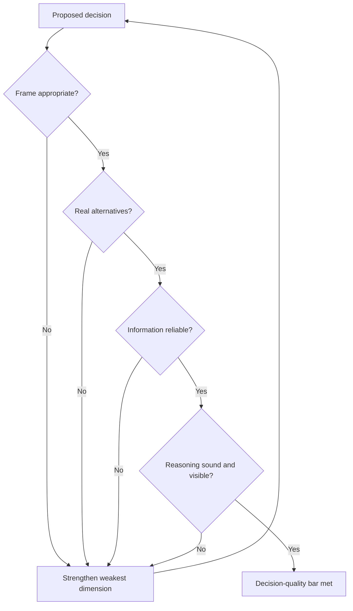

# Volume 04 - Decision Quality Framework

| Field | Value |
|---|---|
| Document ID | WORLD-VOL04-007 |
| Title | Decision Quality Framework |
| Version | 1.0 |
| Status | Approved |
| Classification | Internal |
| Founder | Mahesh Choudhary |

## Purpose
This chapter defines how WORLD measures the *quality of a decision* independent of its outcome. It provides a structured standard - a set of quality dimensions - that any consequential decision can be scored against, so that good decision-making can be recognized, taught, and improved.

## Scope
The framework for evaluating decision quality. It operationalizes the principle from [Decision Science Fundamentals](/docs/blueprint/volume-04-business-intelligence-and-decision-science/section-a-intelligence-foundation/02-decision-science-fundamentals.md) that decisions must be judged by process, and works alongside the [Decision Confidence Model](/docs/blueprint/volume-04-business-intelligence-and-decision-science/section-a-intelligence-foundation/08-decision-confidence-model.md).

## First-Principles Framing
If a decision cannot be evaluated except by waiting for its outcome, learning is slow and confounded by luck. Decision quality solves this by defining what a *good decision looks like at the moment it is made*. A high-quality decision is one built on six dimensions being adequately satisfied: an appropriate **frame**, meaningful **alternatives**, reliable **information**, clear **values**, sound **reasoning**, and genuine **commitment**. A decision is only as strong as its weakest dimension - a chain, not a sum.

## Why This Concept Exists
Organizations that judge only outcomes cannot separate skill from luck, so they cannot improve deliberately. The quality framework exists to make decision-making a learnable discipline: it gives a common language for critique, a checklist against silent gaps, and a basis for auditing decisions before results arrive. It also protects sound decisions that happened to fail from being wrongly discredited.

| Quality Dimension | Strong Signal | Weak Signal |
|---|---|---|
| Appropriate frame | Right problem, right scope | Solving a symptom |
| Meaningful alternatives | Real, distinct options | A single foregone conclusion |
| Reliable information | Relevant, current, sourced | Stale or unverified data |
| Clear values | Explicit priorities and trade-offs | Unstated or shifting goals |
| Sound reasoning | Logical, visible chain | Leap to conclusion |
| Genuine commitment | Resourced and executed | Decided but never acted |

## Where It Is Used
The framework is applied to any decision worth recording: strategic bets, capital allocation, major tactical shifts, and recurring high-value operational choices. It is used both prospectively (to strengthen a decision before commitment) and retrospectively (to review why a decision succeeded or failed on its merits).

## How WORLD Implements It
WORLD scores each consequential decision across the six dimensions and flags the weakest link, refusing to treat a decision as high-quality until every dimension clears a minimum bar. A low score on any single dimension triggers targeted improvement rather than a blanket rework.

## Relationship with the AI Business Partner
The AI Business Partner applies the framework to its own recommendations before presenting them, disclosing which dimensions are strong and which are uncertain. This makes its advice self-critical rather than merely confident, and lets the founder see where a recommendation is most vulnerable.

## Relationship with ERP
ERP provides the reliable, current information that underwrites the *information* dimension of quality, and later records the *commitment* dimension as executed transactions. The framework thus depends on ERP for two of its six dimensions, while governing the reasoning and judgement ERP does not itself perform.

## Relationship with Business Foundation
[Volume 02 - Business Foundation](/docs/blueprint/volume-02-business-foundation/README.md) defines the objectives and value structures that populate the *values* dimension - what a quality decision should be optimizing. Without foundation's stated goals, "clear values" would have no reference point to be judged against.

## Enterprise Example
A founder is about to sign a costly enterprise software contract. WORLD scores the decision: frame is sound, information is reliable, reasoning is clear - but only one alternative was seriously considered, and the values weighting silently ignored switching costs. The overall quality is capped by these two weak links. WORLD surfaces two additional vendors and makes the switching-cost trade-off explicit. The eventual choice is the same vendor, but the decision is now defensibly high-quality - and if it fails, the recorded rationale shows it failed on merit, not negligence.

## Cross-References
- [Decision Science Fundamentals](/docs/blueprint/volume-04-business-intelligence-and-decision-science/section-a-intelligence-foundation/02-decision-science-fundamentals.md)
- [Decision Confidence Model](/docs/blueprint/volume-04-business-intelligence-and-decision-science/section-a-intelligence-foundation/08-decision-confidence-model.md)
- [Types of Business Decisions](/docs/blueprint/volume-04-business-intelligence-and-decision-science/section-a-intelligence-foundation/05-types-of-business-decisions.md)

## References
- [Volume 01 - Vision & Philosophy](/docs/blueprint/volume-01-vision-and-philosophy/README.md)
- [Document Standards](/docs/governance/document-standards.md)

## Change Log
| Version | Date | Author | Change |
|---|---|---|---|
| 1.0 | 2026-07-12 | Lead Software Engineer | Initial approved version. |
