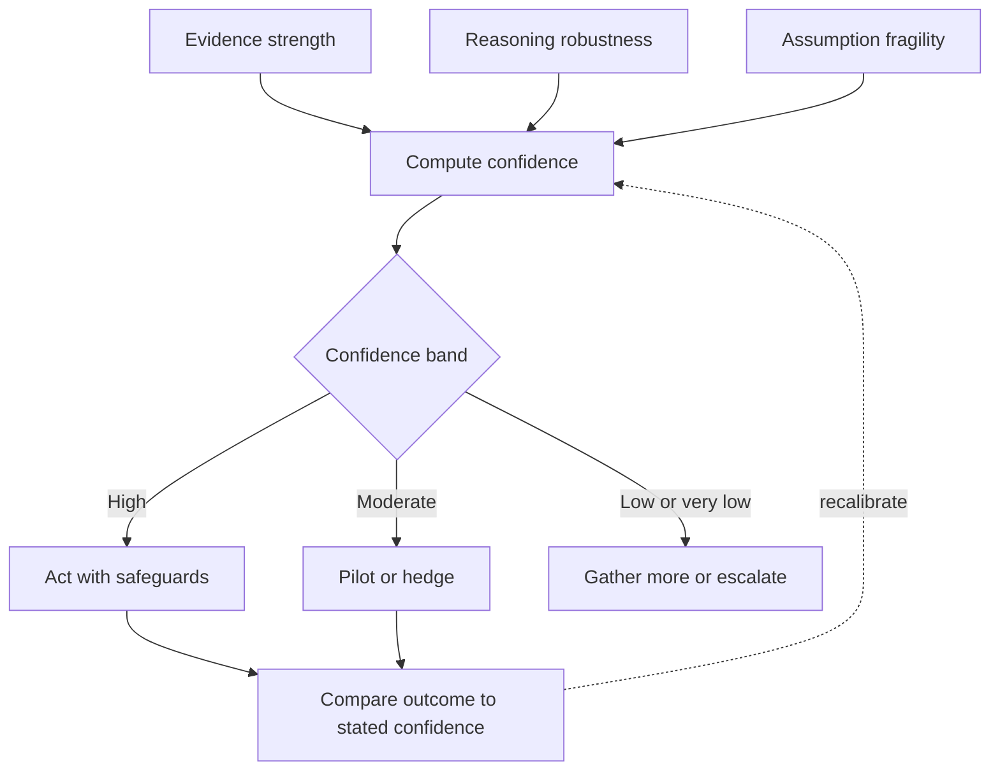

# Volume 04 - Decision Confidence Model

| Field | Value |
|---|---|
| Document ID | WORLD-VOL04-008 |
| Title | Decision Confidence Model |
| Version | 1.0 |
| Status | Approved |
| Classification | Internal |
| Founder | Mahesh Choudhary |

## Purpose
This chapter defines how WORLD expresses and calibrates confidence in its intelligence and decisions. Confidence is treated as a first-class, quantified property of every recommendation - not an afterthought - so that the founder always knows how much to trust a conclusion and how much to hedge.

## Scope
The model for representing, calibrating, and communicating decision confidence. It completes Section A by adding a trust dimension to the quality standard in [Decision Quality Framework](/docs/blueprint/volume-04-business-intelligence-and-decision-science/section-a-intelligence-foundation/07-decision-quality-framework.md).

## First-Principles Framing
Every conclusion drawn under uncertainty carries a probability of being wrong. Hiding that probability produces false certainty - the most dangerous failure mode in decision-making. Confidence is the honest expression of that probability. It rests on three inputs: **evidence strength** (how much reliable data supports the conclusion), **reasoning robustness** (how well the logic withstands scrutiny and alternative explanations), and **assumption fragility** (how sensitive the conclusion is to premises that could change). High confidence requires all three to be favorable; a single fragile assumption can justly collapse it.

Confidence must also be *calibrated*: when WORLD says 80% confident, it should be right about 80% of the time. Calibration, verified against outcomes over the [Intelligence Lifecycle](/docs/blueprint/volume-04-business-intelligence-and-decision-science/section-a-intelligence-foundation/03-intelligence-lifecycle.md), is what separates meaningful confidence from arbitrary numbers.

## Why This Concept Exists
Decisions of equal quality can warrant very different degrees of trust depending on the uncertainty around them. Without an explicit confidence model, everything is stated with the same implied certainty, and the founder cannot tell a near-sure recommendation from a guess. The model exists to make uncertainty visible, actionable, and improvable - enabling proportionate hedging, staging, and escalation.

| Confidence Band | Range | Meaning | Typical Response |
|---|---|---|---|
| High | 85-100% | Strong evidence, robust logic | Act with normal safeguards |
| Moderate | 60-84% | Reasonable support, some fragility | Act with a hedge or pilot |
| Low | 40-59% | Weak or conflicting evidence | Gather more before committing |
| Very low | Below 40% | Speculative | Do not rely; escalate or defer |

## Where It Is Used
Confidence is attached to every forecast, diagnosis, and recommendation WORLD produces, and it feeds directly into routing: low-confidence, high-stakes matters escalate to the human, while high-confidence, low-stakes matters may proceed automatically. It also shapes how a decision is executed - full commitment versus a reversible pilot.

## How WORLD Implements It
WORLD computes a confidence level from the three inputs, communicates it in plain terms alongside the reasoning, and later checks whether the outcome matched the stated confidence - feeding calibration back into the model.

## Relationship with the AI Business Partner
The Decision Confidence Model is central to how the AI Business Partner earns trust. It never presents a conclusion without a calibrated confidence level and the assumptions that could change it, and it would rather state "low confidence" than fabricate certainty. Over time, its calibration is measured, so its confidence figures become genuinely reliable to the founder.

## Relationship with ERP
The reliability, completeness, and freshness of ERP data directly drive the *evidence strength* input. Confidence in a conclusion cannot exceed confidence in the underlying transactional records. When ERP data is partial or stale, WORLD lowers confidence accordingly rather than masking the gap.

## Relationship with Business Foundation
[Volume 02 - Business Foundation](/docs/blueprint/volume-02-business-foundation/README.md) defines the business context that determines which assumptions are fragile and how much a given uncertainty actually matters. The same statistical confidence can warrant different responses depending on the stakes foundation assigns to the decision.

## Enterprise Example
WORLD forecasts next quarter's cash position and recommends deferring a capital purchase. It states 68% confidence, explicitly flagging that two large receivables are the fragile assumption - if either slips, the picture worsens materially. Because confidence is moderate rather than high, WORLD recommends a reversible step: delay the purchase 30 days and revisit once the receivables clear, rather than canceling outright. When the receivables arrive on schedule, the outcome confirms the forecast, and the model's calibration for cash-flow predictions is reinforced.

## Cross-References
- [Decision Quality Framework](/docs/blueprint/volume-04-business-intelligence-and-decision-science/section-a-intelligence-foundation/07-decision-quality-framework.md)
- [Decision Science Fundamentals](/docs/blueprint/volume-04-business-intelligence-and-decision-science/section-a-intelligence-foundation/02-decision-science-fundamentals.md)
- [Intelligence Lifecycle](/docs/blueprint/volume-04-business-intelligence-and-decision-science/section-a-intelligence-foundation/03-intelligence-lifecycle.md)

## References
- [Volume 01 - Vision & Philosophy](/docs/blueprint/volume-01-vision-and-philosophy/README.md)
- [Document Standards](/docs/governance/document-standards.md)

## Change Log
| Version | Date | Author | Change |
|---|---|---|---|
| 1.0 | 2026-07-12 | Lead Software Engineer | Initial approved version. |
