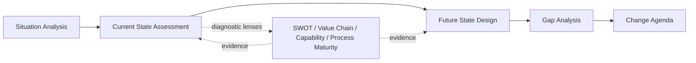

# Volume 04 - Business Analysis Framework

| Field | Value |
|---|---|
| Document ID | WORLD-VOL04-009 |
| Title | Business Analysis Framework |
| Version | 1.0 |
| Status | Approved |
| Classification | Internal |
| Founder | Mahesh Choudhary |

## Purpose
Define the master framework WORLD uses to analyze any business. Business analysis is the disciplined act of understanding what a business is, how it operates, where it stands, where it wants to go, and what stands between the two. This chapter establishes the shared vocabulary, sequence, and artifacts that every downstream analytical chapter in Section B specializes.

## Scope
Covers the end-to-end analysis pipeline - situation, current state, future state, gap, and the diagnostic lenses (SWOT, value chain, capability, process maturity). It defines concepts and how WORLD applies them; it does not define analytics technology, which belongs to Part C.

## First Principles
All business analysis reduces to four irreducible questions: *What is true now?* *What should be true?* *What is the difference?* *What must change to close it?* Every framework humans have invented - from SWOT to Porter's value chain to capability maturity models - is a specialized instrument answering one of these questions with more precision. WORLD treats them not as competing methodologies but as complementary lenses on a single object: the business as a system.

## Why This Concept Exists
Without a framework, analysis becomes opinion. Decisions made on unstructured observation are unrepeatable, unauditable, and biased toward whoever spoke last. A framework exists to make understanding systematic, comparable across time and business units, and explainable to those who must act on it. It converts scattered facts into a defensible line of reasoning.

## Where It Is Used
- Onboarding a new business into WORLD, where a baseline understanding must be built quickly.
- Periodic strategic reviews and planning cycles.
- Problem-solving (Section C) and opportunity discovery (Section D), which both consume the state models produced here.
- Investment, restructuring, and transformation decisions.

## How WORLD Implements It
WORLD implements business analysis as a repeatable pipeline that produces structured, versioned artifacts rather than prose reports. Each stage emits machine-readable models keyed to the Business Foundation, so analysis is always traceable to source facts.

| Stage | Question Answered | Primary Artifact | Chapter |
|---|---|---|---|
| Situation Analysis | What is the context? | Context model | 10 |
| Current State | What is true now? | Current-state baseline | 11 |
| Future State | What should be true? | Target-state model | 12 |
| Gap Analysis | What is the difference? | Gap register | 13 |
| Diagnostic Lenses | Why, and where? | SWOT, value chain, capability, maturity views | 14-17 |

**Example.** A mid-market distributor is onboarded. Situation analysis captures market and regulatory context; current-state assessment finds order-to-cash cycle time of 11 days and 68% on-time delivery; future-state design sets targets of 6 days and 95%; gap analysis quantifies the delta and links it to a capability gap in warehouse automation surfaced by the capability assessment. Each finding carries a source reference and confidence score.

## Relationship with the AI Business Partner
The framework is the reasoning backbone the AI Business Partner uses to *understand* a business before it advises. When a user asks "why are margins falling?", the Partner does not improvise; it walks this pipeline, retrieves the relevant state models, and grounds its explanation in the same artifacts a human analyst would cite. This makes AI recommendations explainable and auditable.

## Relationship with ERP
An ERP layer (defined conceptually here, detailed in a later volume) is the primary system of record supplying operational facts - transactions, inventory, ledgers, and process events. Business analysis consumes these as evidence for current-state assessment and validates future-state targets against ERP feasibility. Analysis produces the change agenda; ERP-governed execution enacts it.

## Relationship with Business Foundation
Volume 02 defines the business entities, functions, and processes that this framework analyzes. Business analysis is meaningless without that structural model: current state is measured against Foundation-defined processes, and capabilities are assessed against the Foundation capability map. Section B is the analytical mirror of the structural definitions in Volume 02.

## Cross-References
- [Situation Analysis](/docs/blueprint/volume-04-business-intelligence-and-decision-science/section-b-business-analysis/10-situation-analysis.md)
- [Gap Analysis](/docs/blueprint/volume-04-business-intelligence-and-decision-science/section-b-business-analysis/13-gap-analysis.md)
- [Volume 02 - Business Foundation](/docs/blueprint/volume-02-business-foundation/README.md)
- [Volume 03 - AI Business Partner](/docs/blueprint/volume-03-ai-business-partner/README.md)

## References
- [Volume 01 - Vision & Philosophy](/docs/blueprint/volume-01-vision-and-philosophy/README.md)
- [Document Standards](/docs/governance/document-standards.md)

## Change Log
| Version | Date | Author | Change |
|---|---|---|---|
| 1.0 | 2026-07-12 | Lead Software Engineer | Initial approved version. |
