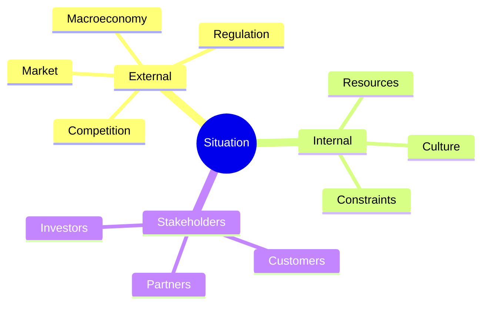

# Volume 04 - Situation Analysis

| Field | Value |
|---|---|
| Document ID | WORLD-VOL04-010 |
| Title | Situation Analysis |
| Version | 1.0 |
| Status | Approved |
| Classification | Internal |
| Founder | Mahesh Choudhary |

## Purpose
Define how WORLD establishes the *context* around a business before assessing it in detail. Situation analysis answers "what is the environment in which this business operates, and what forces act upon it?" It frames every subsequent analytical step so that conclusions are interpreted correctly.

## Scope
Covers internal and external context: market conditions, competitive landscape, regulatory environment, macroeconomic factors, stakeholder landscape, and the organization's own posture. It sets the frame; detailed current-state measurement is Chapter 11.

## First Principles
A fact means nothing without context. A 12% decline in revenue is a crisis in a growing market and a triumph in a contracting one. Situation analysis exists because the same internal number changes meaning depending on the forces surrounding it. From first principles, analysis must first establish the reference frame, then measure against it. WORLD separates *context* (this chapter) from *state* (Chapter 11) precisely so measurements are never misread.

## Why This Concept Exists
Decisions fail most often not from bad data but from misframed data. Situation analysis exists to prevent the classic error of optimizing a metric while missing the environmental shift that made the metric irrelevant. It provides the interpretive lens that keeps analysis honest.

## Where It Is Used
- At the start of any planning, strategy, or transformation cycle.
- As the framing layer for competitive analysis and market intelligence (Section D).
- When a sudden performance change requires the Partner to distinguish internal cause from external shift.
- During onboarding, to calibrate expectations for every metric that follows.

## How WORLD Implements It
WORLD builds a structured *context model* combining external environment scans with internal posture, each factor tagged by type, direction of impact, and confidence.

| Dimension | Example Factor | Impact | Source |
|---|---|---|---|
| Market | Demand growing 8% YoY | Positive | Market data feed |
| Competition | New low-cost entrant | Negative | Competitive intel |
| Regulation | Incoming compliance mandate | Constraint | Regulatory scan |
| Internal | High staff turnover | Negative | HR records |
| Macro | Rising interest rates | Negative | Economic indicators |

**Example.** A regional clinic chain shows flat patient volume. Situation analysis reveals the local population is shrinking while a competitor opened two sites nearby. Flat volume is therefore a *relative gain* in a declining market - a conclusion that reverses the naive reading and changes the strategic response from panic to selective consolidation.

## Relationship with the AI Business Partner
Situation analysis gives the Partner its interpretive intelligence. Before it presents any metric, the Partner overlays context so its narrative is accurate - "revenue is flat, but the market contracted 6%, so you gained share." This contextual framing is what separates an advisor from a dashboard.

## Relationship with ERP
An ERP layer supplies internal operational signals (volumes, costs, headcount) that feed the internal side of the context model, while external context is sourced from intelligence feeds outside the ERP. Situation analysis fuses both, then hands the framed context to state assessment.

## Relationship with Business Foundation
Volume 02 defines the business identity, markets served, and stakeholder map that situation analysis populates with live context. The Foundation says *who the business is*; situation analysis says *what is currently happening around it*.

## Cross-References
- [Business Analysis Framework](/docs/blueprint/volume-04-business-intelligence-and-decision-science/section-b-business-analysis/09-business-analysis-framework.md)
- [Current State Assessment](/docs/blueprint/volume-04-business-intelligence-and-decision-science/section-b-business-analysis/11-current-state-assessment.md)
- [SWOT Framework](/docs/blueprint/volume-04-business-intelligence-and-decision-science/section-b-business-analysis/14-swot-framework.md)

## References
- [Volume 01 - Vision & Philosophy](/docs/blueprint/volume-01-vision-and-philosophy/README.md)
- [Document Standards](/docs/governance/document-standards.md)

## Change Log
| Version | Date | Author | Change |
|---|---|---|---|
| 1.0 | 2026-07-12 | Lead Software Engineer | Initial approved version. |
