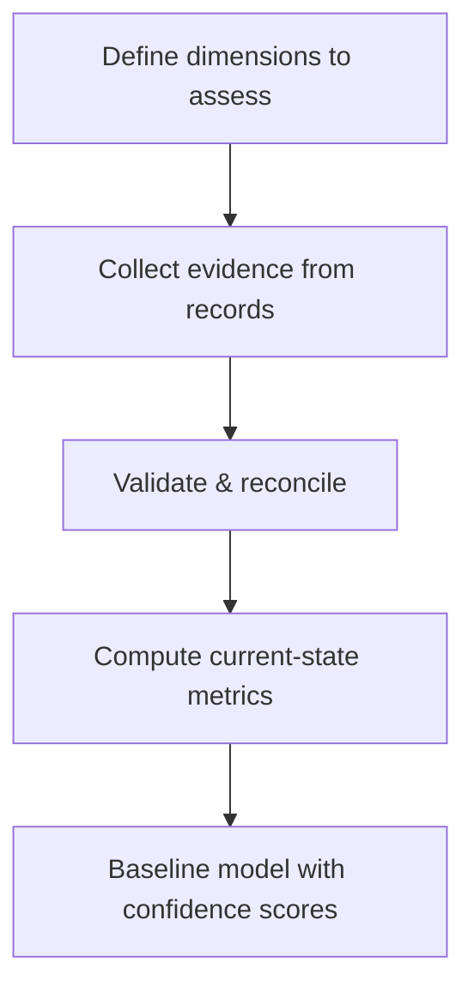

# Volume 04 - Current State Assessment

| Field | Value |
|---|---|
| Document ID | WORLD-VOL04-011 |
| Title | Current State Assessment |
| Version | 1.0 |
| Status | Approved |
| Classification | Internal |
| Founder | Mahesh Choudhary |

## Purpose
Define how WORLD builds an accurate, evidence-based picture of what is true about a business *right now*. Current state assessment is the factual baseline from which every gap, decision, and improvement is measured.

## Scope
Covers the measurement of processes, performance, resources, capabilities, and outcomes as they exist today. It is descriptive, not aspirational; the target picture is Chapter 12.

## First Principles
You cannot change what you have not measured, and you cannot measure what you have not defined. Current state assessment exists because improvement requires a truthful zero point. From first principles, the baseline must be *objective* (grounded in observed data, not perception), *complete* (covering the dimensions that matter), and *timestamped* (state is a snapshot, not a permanent fact).

## Why This Concept Exists
Organizations routinely act on assumed rather than measured reality. Leaders believe on-time delivery is "around 90%" when records show 68%. Current state assessment exists to replace belief with evidence, creating a baseline that is auditable and repeatable so progress can be proven, not claimed.

## Where It Is Used
- As the anchor for gap analysis (Chapter 13) and future-state design (Chapter 12).
- In performance intelligence (Section G), where variance is measured against this baseline.
- Before any transformation, to establish the "before" against which ROI is later proven.
- In problem-solving, to confirm a problem is real and quantify its magnitude.

## How WORLD Implements It
WORLD assembles a *current-state baseline model* across standard dimensions, each metric carrying its source, timestamp, and confidence.

| Dimension | Metric | Current Value | Confidence |
|---|---|---|---|
| Process | Order-to-cash cycle | 11 days | High |
| Performance | On-time delivery | 68% | High |
| Financial | Gross margin | 32% | High |
| Capability | Warehouse automation | Level 2 of 5 | Medium |
| Customer | Net retention | 91% | Medium |

**Example.** A SaaS company assumes churn is "low." Current state assessment computes 91% net retention with 14% gross logo churn concentrated in one segment. The baseline reveals the problem is not overall churn but a specific cohort - a finding invisible to intuition and decisive for where to act.

## Relationship with the AI Business Partner
The baseline is the Partner's memory of "how things stand." Every diagnostic answer, alert, and recommendation references it. When the Partner says a metric "improved," it is comparing live data against this versioned baseline, giving its claims verifiable grounding.

## Relationship with ERP
An ERP layer is the richest source of current-state evidence, holding the transactional and operational records that make the baseline factual rather than anecdotal. Current state assessment reads from these systems of record; it does not alter them.

## Relationship with Business Foundation
Volume 02 defines the processes, functions, and capabilities that current state assessment measures. The Foundation provides the *structure*; this chapter fills it with *present values*. Assessing a process not defined in the Foundation would produce ungoverned, non-comparable data.

## Cross-References
- [Situation Analysis](/docs/blueprint/volume-04-business-intelligence-and-decision-science/section-b-business-analysis/10-situation-analysis.md)
- [Future State Design](/docs/blueprint/volume-04-business-intelligence-and-decision-science/section-b-business-analysis/12-future-state-design.md)
- [Gap Analysis](/docs/blueprint/volume-04-business-intelligence-and-decision-science/section-b-business-analysis/13-gap-analysis.md)

## References
- [Volume 01 - Vision & Philosophy](/docs/blueprint/volume-01-vision-and-philosophy/README.md)
- [Document Standards](/docs/governance/document-standards.md)

## Change Log
| Version | Date | Author | Change |
|---|---|---|---|
| 1.0 | 2026-07-12 | Lead Software Engineer | Initial approved version. |
