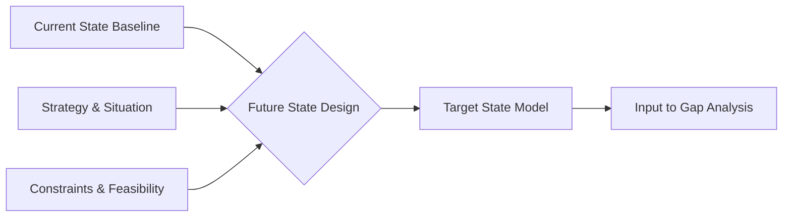

# Volume 04 - Future State Design

| Field | Value |
|---|---|
| Document ID | WORLD-VOL04-012 |
| Title | Future State Design |
| Version | 1.0 |
| Status | Approved |
| Classification | Internal |
| Founder | Mahesh Choudhary |

## Purpose
Define how WORLD designs the target picture of a business - what *should* be true - so that improvement has a clear, measurable destination. Future state design converts strategy and ambition into a concrete, testable target-state model.

## Scope
Covers target definition for processes, performance, capabilities, and outcomes, together with the design principles and constraints that keep targets realistic. It defines the destination; the path is derived through gap analysis (Chapter 13) and planning (Section E).

## First Principles
A target is only useful if it is specific, measurable, and reachable. Future state design exists because vague aspiration ("be more efficient") cannot be planned against. From first principles, a future state must be *anchored* to the current baseline, *bounded* by real constraints, and *expressed in the same units* as the current state so the two can be compared directly.

## Why This Concept Exists
Many transformations fail because "better" was never defined, so success could not be recognized or measured. Future state design exists to make the destination explicit and comparable, turning strategic intent into engineering-grade targets that planning and execution can pursue and verify.

## Where It Is Used
- Immediately after current state assessment, to set improvement targets.
- In strategic planning and goal planning (Section E).
- In business case development, where target outcomes justify investment.
- Whenever the Partner is asked "where should we be?" or "what good looks like."

## How WORLD Implements It
WORLD produces a *target-state model* mirroring the current-state baseline dimension-for-dimension, each target carrying a rationale and a feasibility rating.

| Dimension | Current | Target | Rationale | Feasibility |
|---|---|---|---|---|
| Order-to-cash cycle | 11 days | 6 days | Match top-quartile benchmark | High |
| On-time delivery | 68% | 95% | Customer SLA requirement | Medium |
| Warehouse automation | Level 2 | Level 4 | Enable scale | Medium |
| Gross margin | 32% | 38% | Restore competitiveness | Medium |

**Example.** A distributor sets a future state of 6-day order-to-cash and 95% on-time delivery, benchmarked against top-quartile peers. Each target is stress-tested for feasibility against constraints (capital, headcount, ERP capability) so the resulting gap is ambitious yet achievable rather than fantasy.

## Relationship with the AI Business Partner
The target-state model is the Partner's definition of success. It uses these targets to prioritize recommendations, measure progress, and explain trade-offs. When the Partner proposes an action, it can show precisely which target the action advances and by how much.

## Relationship with ERP
Future-state targets must be feasible within the operational reality an ERP layer represents. Design tests targets against ERP-supported process capacity and data, ensuring the destination is technically achievable rather than merely desirable. ERP later becomes the environment in which the target state is realized.

## Relationship with Business Foundation
Volume 02 defines the business model, strategy, and process structure that future-state targets must serve. A valid future state is a *better configuration of the Foundation*, not a departure from it - targets extend Foundation-defined processes and capabilities toward their intended purpose.

## Cross-References
- [Current State Assessment](/docs/blueprint/volume-04-business-intelligence-and-decision-science/section-b-business-analysis/11-current-state-assessment.md)
- [Gap Analysis](/docs/blueprint/volume-04-business-intelligence-and-decision-science/section-b-business-analysis/13-gap-analysis.md)
- [Business Capability Assessment](/docs/blueprint/volume-04-business-intelligence-and-decision-science/section-b-business-analysis/16-business-capability-assessment.md)

## References
- [Volume 01 - Vision & Philosophy](/docs/blueprint/volume-01-vision-and-philosophy/README.md)
- [Document Standards](/docs/governance/document-standards.md)

## Change Log
| Version | Date | Author | Change |
|---|---|---|---|
| 1.0 | 2026-07-12 | Lead Software Engineer | Initial approved version. |
