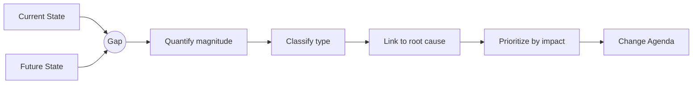

# Volume 04 - Gap Analysis

| Field | Value |
|---|---|
| Document ID | WORLD-VOL04-013 |
| Title | Gap Analysis |
| Version | 1.0 |
| Status | Approved |
| Classification | Internal |
| Founder | Mahesh Choudhary |

## Purpose
Define how WORLD quantifies and characterizes the difference between current state and future state. Gap analysis is the bridge between understanding and action - it names what must change, by how much, and why.

## Scope
Covers gap identification, quantification, classification, prioritization, and root linkage across every dimension of the state models. It produces the change agenda; execution planning belongs to Section E.

## First Principles
Action is only rational when the distance to the goal is known. Gap analysis exists because current state (Chapter 11) and future state (Chapter 12) are, by design, expressed in identical units - the gap is simply their difference, made explicit and prioritized. From first principles, a gap is a *quantified delta with a cause and a consequence*; without cause it cannot be closed, without consequence it cannot be prioritized.

## Why This Concept Exists
Organizations often chase many gaps at once with no sense of relative importance, spreading effort thin. Gap analysis exists to impose priority - to distinguish the gap that matters most from the gap that is merely visible, and to attach each gap to a cause so effort targets levers rather than symptoms.

## Where It Is Used
- Between analysis and planning, as the primary input to roadmaps and business cases.
- In problem-solving (Section C), where a performance gap triggers root cause analysis.
- In capability and maturity work (Chapters 16-17), where gaps are expressed as level shifts.
- Whenever the Partner recommends *what to do next*.

## How WORLD Implements It
WORLD compiles a *gap register* linking each gap to its dimension, magnitude, type, cause, and priority.

| Gap | Current | Target | Magnitude | Type | Priority |
|---|---|---|---|---|---|
| On-time delivery | 68% | 95% | 27 pts | Capability | High |
| Order-to-cash | 11 days | 6 days | 5 days | Process | High |
| Gross margin | 32% | 38% | 6 pts | Structural | Medium |
| Automation level | 2 | 4 | 2 levels | Capability | Medium |

**Example.** A distributor's gap register shows the on-time delivery gap (27 points) is driven mainly by the warehouse automation capability gap. Rather than launching four parallel initiatives, WORLD identifies automation as the shared root lever - closing it improves delivery, cycle time, and cost simultaneously, concentrating effort where leverage is highest.

## Relationship with the AI Business Partner
The gap register is the Partner's action queue. It reasons over gaps to recommend where to focus, sequences initiatives by leverage and dependency, and explains each recommendation in terms of the specific gap it closes and the value it unlocks.

## Relationship with ERP
Gaps in operational performance are measured from ERP-held data on one side and validated for feasibility against ERP capability on the other. The closure of process and transactional gaps ultimately manifests as changed behavior in an ERP-governed execution layer.

## Relationship with Business Foundation
Gaps are always expressed against Foundation-defined processes, capabilities, and goals. A gap is the measured distance between the Foundation as it operates today and the Foundation as it is intended to operate, keeping analysis anchored to the canonical business model.

## Cross-References
- [Current State Assessment](/docs/blueprint/volume-04-business-intelligence-and-decision-science/section-b-business-analysis/11-current-state-assessment.md)
- [Future State Design](/docs/blueprint/volume-04-business-intelligence-and-decision-science/section-b-business-analysis/12-future-state-design.md)
- [Business Capability Assessment](/docs/blueprint/volume-04-business-intelligence-and-decision-science/section-b-business-analysis/16-business-capability-assessment.md)

## References
- [Volume 01 - Vision & Philosophy](/docs/blueprint/volume-01-vision-and-philosophy/README.md)
- [Document Standards](/docs/governance/document-standards.md)

## Change Log
| Version | Date | Author | Change |
|---|---|---|---|
| 1.0 | 2026-07-12 | Lead Software Engineer | Initial approved version. |
