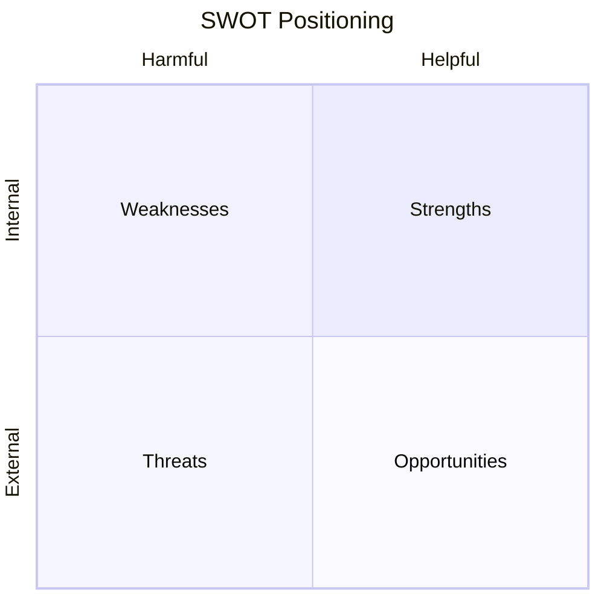

# Volume 04 - SWOT Framework

| Field | Value |
|---|---|
| Document ID | WORLD-VOL04-014 |
| Title | SWOT Framework |
| Version | 1.0 |
| Status | Approved |
| Classification | Internal |
| Founder | Mahesh Choudhary |

## Purpose
Define how WORLD applies the SWOT framework - Strengths, Weaknesses, Opportunities, Threats - as a disciplined, evidence-grounded diagnostic lens rather than a brainstorming exercise. SWOT synthesizes internal and external analysis into a strategic posture.

## Scope
Covers the construction, evidencing, and cross-linking of the four SWOT quadrants and their translation into strategic options (the TOWS pairing). It is a synthesis lens over the state and situation models, not a standalone method.

## First Principles
Strategic position is defined by two axes: internal versus external, and helpful versus harmful. SWOT exists because these two binary distinctions produce exactly four cells that together cover the strategic field. From first principles, a valid SWOT entry must be *evidenced* (traceable to a fact from situation or current-state analysis) and *actionable* (capable of pairing into a strategy). Unevidenced SWOTs are opinion, not analysis.

## Why This Concept Exists
Leaders need a compact way to see where they stand strategically before choosing where to move. SWOT exists to compress large volumes of analysis into a single, decision-ready view, and - through TOWS pairing - to convert that view into concrete strategies (use strengths to seize opportunities, shore up weaknesses against threats).

## Where It Is Used
- In strategic reviews and planning cycles as the bridge from analysis to strategy.
- In competitive and market intelligence (Section D) as a synthesis output.
- In business case framing, to justify direction.
- Whenever the Partner must summarize "where we stand" for an executive.

## How WORLD Implements It
WORLD builds SWOT as a *linked model*: each quadrant entry references its evidence source and pairs into TOWS strategies.

| Quadrant | Entry | Evidence Source | Paired Strategy |
|---|---|---|---|
| Strength | High customer retention | Current-state baseline | Expand within accounts |
| Weakness | Manual warehouse ops | Capability assessment | Automate to cut cost |
| Opportunity | Market growing 8% | Situation analysis | Invest in capacity |
| Threat | New low-cost entrant | Competitive intel | Differentiate on service |

**Example.** A distributor's SWOT pairs its retention strength with the growth opportunity to justify account expansion, while pairing the automation weakness against the low-cost-entrant threat to prioritize warehouse investment. The pairing turns a static grid into a ranked strategy set, each option traceable to evidence.

## Relationship with the AI Business Partner
SWOT gives the Partner a language for strategic conversation. It generates evidenced SWOT views on demand, defends each entry with its source, and proposes TOWS strategies - allowing an executive to interrogate not just *what* the position is but *why* the system believes it.

## Relationship with ERP
Internal quadrants (strengths, weaknesses) draw heavily on operational facts an ERP layer holds, while external quadrants (opportunities, threats) draw on intelligence beyond it. SWOT fuses both, ensuring internal claims are grounded in system-of-record data rather than sentiment.

## Relationship with Business Foundation
Strengths and weaknesses are assessed against Foundation-defined capabilities and processes, keeping the internal axis objective and comparable over time. The Foundation ensures the same capability is judged consistently rather than re-invented in each analysis.

## Cross-References
- [Situation Analysis](/docs/blueprint/volume-04-business-intelligence-and-decision-science/section-b-business-analysis/10-situation-analysis.md)
- [Value Chain Analysis](/docs/blueprint/volume-04-business-intelligence-and-decision-science/section-b-business-analysis/15-value-chain-analysis.md)
- [Business Capability Assessment](/docs/blueprint/volume-04-business-intelligence-and-decision-science/section-b-business-analysis/16-business-capability-assessment.md)

## References
- [Volume 01 - Vision & Philosophy](/docs/blueprint/volume-01-vision-and-philosophy/README.md)
- [Document Standards](/docs/governance/document-standards.md)

## Change Log
| Version | Date | Author | Change |
|---|---|---|---|
| 1.0 | 2026-07-12 | Lead Software Engineer | Initial approved version. |
