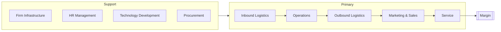

# Volume 04 - Value Chain Analysis

| Field | Value |
|---|---|
| Document ID | WORLD-VOL04-015 |
| Title | Value Chain Analysis |
| Version | 1.0 |
| Status | Approved |
| Classification | Internal |
| Founder | Mahesh Choudhary |

## Purpose
Define how WORLD applies value chain analysis - based on Porter's model - to understand where a business creates, adds, and loses value across its primary and support activities. It locates margin and cost with precision.

## Scope
Covers decomposition of the business into value-creating activities, measurement of cost and value contribution per activity, and identification of the activities that drive competitive advantage. It complements capability and process views (Chapters 16-17).

## First Principles
Profit is not created uniformly; it is created and consumed at specific steps in how a business transforms inputs into customer value. Value chain analysis exists because to improve margin you must know *where* value and cost actually occur. From first principles, a business is a sequence of activities, each with a cost and a contribution to what the customer will pay - and advantage lives in the activities where contribution most exceeds cost.

## Why This Concept Exists
Aggregate margin hides where money is made and lost. Value chain analysis exists to disaggregate the business so leaders can invest in the activities that differentiate, outsource or streamline those that do not, and see how support activities enable or drag on primary ones. It is the anatomy of competitive advantage.

## Where It Is Used
- In cost and margin optimization initiatives.
- In make-versus-buy and outsourcing decisions.
- In competitive analysis, to compare activity-level advantage against rivals.
- As evidence for SWOT strengths/weaknesses and for capability prioritization.

## How WORLD Implements It
WORLD models the business as a set of Porter-aligned activities, each scored for cost share, value contribution, and differentiation potential.

| Activity | Type | Cost Share | Value Contribution | Advantage |
|---|---|---|---|---|
| Operations | Primary | 34% | High | Moderate |
| Outbound Logistics | Primary | 18% | Medium | Low |
| Service | Primary | 9% | High | High |
| Technology Development | Support | 7% | High | High |
| Procurement | Support | 12% | Medium | Low |

**Example.** A distributor finds outbound logistics consumes 18% of cost but contributes little differentiation, while service consumes 9% and drives high customer value and advantage. The analysis directs investment toward service excellence and efficiency programs (or partnering) in logistics - a reallocation invisible at the aggregate-margin level.

## Relationship with the AI Business Partner
Value chain analysis lets the Partner reason about profitability structurally. When asked "how do we improve margin?", it can point to specific activities, quantify their cost and value, and recommend where reallocation yields the greatest return - explaining the *mechanism* of improvement, not just the target.

## Relationship with ERP
Activity-level cost and volume data originate largely in an ERP layer's cost, procurement, and operations records. Value chain analysis aggregates these into activity views; conversely, its findings guide where ERP-governed processes should be optimized or restructured.

## Relationship with Business Foundation
The value chain is a view over the Foundation's process and function definitions, grouped into value-creating activities. The Foundation supplies the canonical process map; value chain analysis overlays economics onto it to reveal where advantage is created.

## Cross-References
- [SWOT Framework](/docs/blueprint/volume-04-business-intelligence-and-decision-science/section-b-business-analysis/14-swot-framework.md)
- [Business Capability Assessment](/docs/blueprint/volume-04-business-intelligence-and-decision-science/section-b-business-analysis/16-business-capability-assessment.md)
- [Process Maturity Assessment](/docs/blueprint/volume-04-business-intelligence-and-decision-science/section-b-business-analysis/17-process-maturity-assessment.md)

## References
- [Volume 01 - Vision & Philosophy](/docs/blueprint/volume-01-vision-and-philosophy/README.md)
- [Document Standards](/docs/governance/document-standards.md)

## Change Log
| Version | Date | Author | Change |
|---|---|---|---|
| 1.0 | 2026-07-12 | Lead Software Engineer | Initial approved version. |
