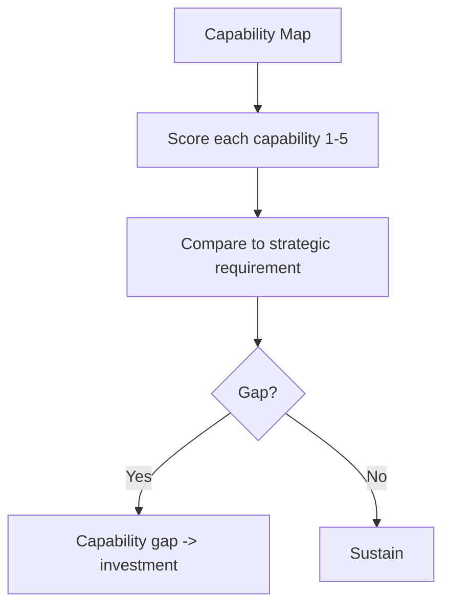

# Volume 04 - Business Capability Assessment

| Field | Value |
|---|---|
| Document ID | WORLD-VOL04-016 |
| Title | Business Capability Assessment |
| Version | 1.0 |
| Status | Approved |
| Classification | Internal |
| Founder | Mahesh Choudhary |

## Purpose
Define how WORLD assesses business capabilities - the stable abilities a business must have to deliver its model - independent of the processes, people, or technology that currently realize them. Capability assessment answers "what can this business do, and how well?"

## Scope
Covers capability mapping, maturity scoring, and gap identification against strategic need. It is distinct from process maturity (Chapter 17): capabilities describe *what* the business can do; processes describe *how* it does it.

## First Principles
Processes, teams, and tools change constantly, but the underlying *abilities* a business needs are stable. Capability assessment exists because planning against stable capabilities is more durable than planning against volatile process detail. From first principles, a capability is defined by outcome ("fulfill orders"), not implementation - so it can be scored on maturity and compared to what strategy requires, regardless of how it is currently delivered.

## Why This Concept Exists
Organizations reorganize processes and swap systems yet fail to improve because the underlying capability was never strengthened. Capability assessment exists to focus improvement on durable abilities, providing a stable planning frame that survives reorganizations and technology changes and links directly to strategic requirements.

## Where It Is Used
- In strategic planning, to identify which capabilities must be built to execute strategy.
- In future-state design and gap analysis, where capability gaps drive investment.
- In due diligence and transformation, to assess organizational readiness.
- As evidence for SWOT internal quadrants and value chain advantage.

## How WORLD Implements It
WORLD maintains a capability map with a five-level maturity score per capability, compared against the level strategy requires.

| Capability | Current Level | Required Level | Gap | Strategic Weight |
|---|---|---|---|---|
| Order Fulfillment | 2 | 4 | 2 | High |
| Customer Service | 3 | 4 | 1 | High |
| Demand Forecasting | 2 | 3 | 1 | Medium |
| Procurement | 3 | 3 | 0 | Low |

Maturity levels follow a capability maturity convention: 1 Initial, 2 Developing, 3 Defined, 4 Managed, 5 Optimized.

**Example.** A distributor's order-fulfillment capability scores Level 2 against a required Level 4, weighted High. This single capability gap explains multiple performance gaps (delivery, cycle time) identified earlier, confirming it as the highest-leverage investment target and unifying otherwise scattered findings.

## Relationship with the AI Business Partner
Capabilities give the Partner a stable model of "what the business can do," enabling durable strategic advice. It maps recommendations to the capabilities they strengthen and warns when a strategy demands a capability the business does not yet possess at the required level.

## Relationship with ERP
An ERP layer is one *means* by which capabilities are realized, not the capability itself. Capability assessment evaluates whether current systems, including ERP-supported processes, deliver the required maturity, and flags where ERP capability must advance to raise a business capability.

## Relationship with Business Foundation
The capability map is defined in the Business Foundation (Volume 02). This chapter assesses *maturity* against that canonical map, ensuring capabilities are named and scoped consistently across the enterprise rather than redefined per analysis.

## Cross-References
- [Future State Design](/docs/blueprint/volume-04-business-intelligence-and-decision-science/section-b-business-analysis/12-future-state-design.md)
- [Gap Analysis](/docs/blueprint/volume-04-business-intelligence-and-decision-science/section-b-business-analysis/13-gap-analysis.md)
- [Process Maturity Assessment](/docs/blueprint/volume-04-business-intelligence-and-decision-science/section-b-business-analysis/17-process-maturity-assessment.md)

## References
- [Volume 01 - Vision & Philosophy](/docs/blueprint/volume-01-vision-and-philosophy/README.md)
- [Document Standards](/docs/governance/document-standards.md)

## Change Log
| Version | Date | Author | Change |
|---|---|---|---|
| 1.0 | 2026-07-12 | Lead Software Engineer | Initial approved version. |
