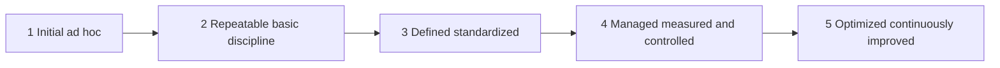

# Volume 04 - Process Maturity Assessment

| Field | Value |
|---|---|
| Document ID | WORLD-VOL04-017 |
| Title | Process Maturity Assessment |
| Version | 1.0 |
| Status | Approved |
| Classification | Internal |
| Founder | Mahesh Choudhary |

## Purpose
Define how WORLD assesses the maturity of business processes - how consistently, measurably, and controllably work is performed. Where capability assessment (Chapter 16) asks *what* a business can do, process maturity asks *how well the doing is governed*.

## Scope
Covers the maturity model, per-process scoring, and the link from maturity level to performance reliability. It applies the established capability maturity convention (Initial through Optimized) to operational processes.

## First Principles
A process that produces good results by luck is not the same as one that produces them by design. Process maturity assessment exists because *predictability* of outcomes depends on how well a process is defined, measured, and controlled. From first principles, maturity rises as a process moves from ad hoc, to defined, to measured, to continuously improved - and higher maturity means lower variance and greater reliability.

## Why This Concept Exists
Two businesses can perform the same process with wildly different reliability. Process maturity assessment exists to explain *why* performance is stable or erratic and to prescribe the specific governance improvement - standardization, measurement, control - that will make outcomes predictable. It converts "our results are inconsistent" into a diagnosable, fixable condition.

## Where It Is Used
- In operational improvement and quality programs.
- In diagnosing the *cause* of performance variance found in Section G.
- In gap analysis, where a maturity shortfall explains an outcome gap.
- Before automation, since automating an immature process scales its defects.

## How WORLD Implements It
WORLD scores each process on the five-level model and links the score to observed outcome variance.

| Process | Maturity Level | Outcome Variance | Target Level |
|---|---|---|---|
| Order Fulfillment | 2 Repeatable | High | 4 Managed |
| Invoicing | 3 Defined | Medium | 4 Managed |
| Procurement | 3 Defined | Low | 3 Defined |
| Returns Handling | 1 Initial | Very High | 3 Defined |

**Example.** A distributor's returns process scores Level 1 (Initial) with very high variance in resolution time. The assessment shows the erratic customer experience is not a staffing problem but a maturity problem: the process is undefined and unmeasured. The prescribed fix - standardize and measure to reach Level 3 - directly targets the cause, and flags that automating returns now would be premature.

## Relationship with the AI Business Partner
Process maturity gives the Partner a diagnostic lens for reliability. When performance is volatile, the Partner can attribute it to low process maturity and recommend the specific governance step to raise it, and it can warn against automating or scaling processes that are not yet mature enough to withstand it.

## Relationship with ERP
An ERP layer both enforces and evidences process maturity: standardized, ERP-governed processes tend toward higher maturity, and ERP event data supplies the variance measurements maturity scoring depends on. Assessment findings guide where ERP-governed processes need tighter definition or control.

## Relationship with Business Foundation
The processes assessed here are those defined in the Business Foundation (Volume 02). This chapter scores their *maturity*; the Foundation defines their *structure and purpose*, ensuring maturity is judged against a canonical, consistent process definition.

## Cross-References
- [Value Chain Analysis](/docs/blueprint/volume-04-business-intelligence-and-decision-science/section-b-business-analysis/15-value-chain-analysis.md)
- [Business Capability Assessment](/docs/blueprint/volume-04-business-intelligence-and-decision-science/section-b-business-analysis/16-business-capability-assessment.md)
- [Gap Analysis](/docs/blueprint/volume-04-business-intelligence-and-decision-science/section-b-business-analysis/13-gap-analysis.md)

## References
- [Volume 01 - Vision & Philosophy](/docs/blueprint/volume-01-vision-and-philosophy/README.md)
- [Document Standards](/docs/governance/document-standards.md)

## Change Log
| Version | Date | Author | Change |
|---|---|---|---|
| 1.0 | 2026-07-12 | Lead Software Engineer | Initial approved version. |
