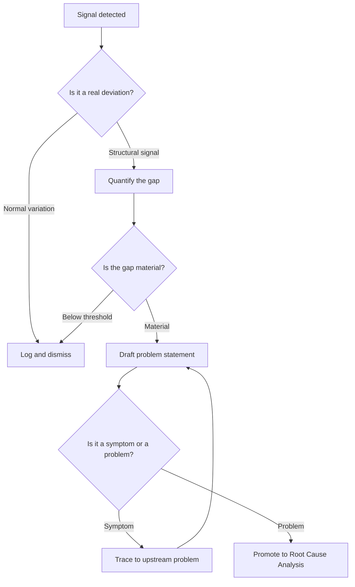

# Volume 04 - Problem Identification

| Field | Value |
|---|---|
| Document ID | WORLD-VOL04-018 |
| Title | Problem Identification |
| Version | 1.0 |
| Status | Approved |
| Classification | Internal |
| Founder | Mahesh Choudhary |

## Purpose

This chapter establishes how WORLD detects, frames, and articulates business problems before any analysis or corrective work begins. A problem that is misidentified cannot be solved; effort spent on the wrong problem is worse than no effort, because it consumes capacity and creates false confidence. The purpose here is to give the AI Business Partner a rigorous, first-principles method for converting raw signals into a well-formed problem statement.

## Scope

This chapter covers signal detection, problem framing, problem statement construction, and the boundary between a symptom and a problem. It does not cover diagnosis of causes (Chapter 19) or remediation (Chapters 24-25). It applies to operational, financial, customer, and strategic problem domains across the business.

## Why This Concept Exists

From first principles, a business is a system that converts inputs into value under constraints. A "problem" is any measurable gap between an expected state and an observed state that threatens value creation. This gap only becomes actionable once it is named precisely: what is deviating, by how much, since when, and why it matters. Without a disciplined identification step, organizations react to the loudest symptom rather than the most material gap, and they conflate noise (normal variation) with signal (structural deviation).

Problem identification exists to impose that discipline. It separates the act of *noticing* from the act of *explaining*, preventing premature commitment to a favored cause.

## Where It Is Used

Problem identification is the entry point to every decision loop in WORLD: performance reviews, exception handling, planning cycles, and continuous monitoring. It is invoked whenever a metric breaches a threshold, a target is missed, a customer escalates, or a forecast diverges from actuals.

| Trigger | Signal Source | Example Problem Statement |
|---|---|---|
| Threshold breach | KPI monitor | "On-time delivery fell from 96% to 88% over 3 weeks in the West region." |
| Target miss | Planning system | "Q2 gross margin came in at 31% against a 36% plan." |
| Customer escalation | Support signals | "Enterprise churn intent rose 2x among accounts onboarded in Q1." |
| Forecast divergence | Forecast vs. actual | "Cash conversion cycle lengthened by 11 days versus model." |

## How WORLD Implements It

WORLD treats problem identification as a structured pipeline that turns signals into a validated problem statement. Every candidate problem must pass a materiality and validity gate before it is promoted to analysis.

A well-formed WORLD problem statement always specifies: the affected entity, the expected value, the observed value, the magnitude of the gap, the time window, and the business impact. The AI Business Partner rejects statements that embed a presumed cause (e.g., "the problem is the new vendor") because that forecloses diagnosis.

## Relationship with the AI Business Partner

The AI Business Partner is the primary agent of problem identification. It continuously watches the business's metric surface, distinguishes signal from noise using historical baselines, and proactively surfaces material gaps to the operator with a drafted, structured problem statement. Rather than waiting to be asked, it frames the problem, states its confidence, and proposes it as the input to the next stage. This shifts the operator's role from *finding* problems to *validating and prioritizing* them.

## Relationship with ERP

An ERP system is a rich source of the transactional and operational signals that seed problem identification: orders, inventory positions, ledger entries, and production events. Conceptually, WORLD consumes these records as raw signals, then applies the identification discipline that transactional systems do not provide on their own. Where an ERP reports *what happened*, WORLD's identification layer determines *whether what happened constitutes a problem worth solving*. Specific ERP integration mechanics are defined in a later volume.

## Relationship with Business Foundation

Business Foundation (Volume 02) supplies the expected states against which deviations are measured: the objectives, targets, standards, and definitions of value that make a gap meaningful. Without Foundation, there is no "expected" to compare the "observed" against, and therefore no problem can be identified. Problem identification is the mechanism by which the business's declared intent is held accountable to reality.

## Cross-References

- [Root Cause Analysis](/docs/blueprint/volume-04-business-intelligence-and-decision-science/section-c-problem-solving/19-root-cause-analysis.md)
- [Corrective Actions](/docs/blueprint/volume-04-business-intelligence-and-decision-science/section-c-problem-solving/24-corrective-actions.md)
- [Volume 02 - Business Foundation](/docs/blueprint/volume-02-business-foundation/README.md)
- [Volume 03 - AI Business Partner](/docs/blueprint/volume-03-ai-business-partner/README.md)

## References

- [Volume 01 - Vision and Philosophy](/docs/blueprint/volume-01-vision-and-philosophy/README.md)
- [Document Standards](/docs/governance/document-standards.md)

## Change Log

| Version | Date | Author | Notes |
|---|---|---|---|
| 1.0 | 2026-07-12 | Lead Software Engineer | Initial approved version. |
