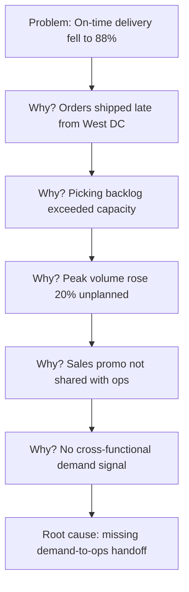

# Volume 04 - Root Cause Analysis

| Field | Value |
|---|---|
| Document ID | WORLD-VOL04-019 |
| Title | Root Cause Analysis |
| Version | 1.0 |
| Status | Approved |
| Classification | Internal |
| Founder | Mahesh Choudhary |

## Purpose

This chapter defines how WORLD moves from a well-formed problem statement to a validated root cause. Its purpose is to prevent the most common failure of business problem-solving: treating symptoms while the underlying driver persists and re-manifests. Root cause analysis (RCA) gives the AI Business Partner a repeatable method to reach the deepest actionable cause rather than the most visible one.

## Scope

This chapter covers causal tracing methods, evidence standards for confirming a cause, and the handoff to corrective action. It assumes a validated problem statement from Chapter 18 as input. The structured taxonomy of cause categories is elaborated in Chapter 20; constraint- and bottleneck-specific causes are covered in Chapters 21-22.

## Why This Concept Exists

From first principles, every observed deviation is an effect produced by a chain of causes. Intervening on a shallow cause changes the symptom temporarily but not the system, so the deviation returns. A root cause is the earliest point in the causal chain at which an intervention is both feasible and durable. RCA exists because human and organizational bias pushes toward the fastest explanation, not the truest one. A disciplined method counteracts this by demanding that each proposed cause survive a test: *if this were removed, would the problem disappear?*

## Where It Is Used

RCA is invoked after any material problem is identified, and especially after recurring problems, failures, or unexpected performance gaps. It is the standard second stage of the WORLD decision loop.

| Method | Best Suited For | Output |
|---|---|---|
| 5 Whys | Linear, single-thread problems | A causal chain to root |
| Ishikawa / Fishbone | Multi-factor problems | Categorized candidate causes |
| Fault tree | Failure and safety events | Logical failure paths |
| Statistical correlation | Data-rich, ambiguous drivers | Ranked probable causes |

## How WORLD Implements It

WORLD applies the 5 Whys as its default first-pass technique, escalating to fishbone or fault-tree analysis when the causal structure is not linear. The critical discipline is that each "why" must be supported by evidence, not assumption.

Each node carries a confidence score and supporting evidence reference. WORLD stops descending when it reaches a cause that is (a) within the organization's control and (b) whose removal is predicted to eliminate the problem. It then validates the chain by asking the reverse question at each link: *does this cause sufficiently explain the level above it?* Only a validated root cause is promoted to corrective action.

## Relationship with the AI Business Partner

The AI Business Partner conducts RCA as a guided reasoning process. It generates candidate causal chains, retrieves the evidence needed to confirm or reject each link, and quantifies its confidence. Where evidence is missing, it explicitly flags the gap rather than assuming. It presents the operator with a traceable chain from symptom to root, so the operator can interrogate the reasoning rather than accept a black-box conclusion. This makes causal reasoning auditable, which is essential for trust.

## Relationship with ERP

ERP systems hold much of the transactional evidence RCA depends on: timestamps, quantities, exceptions, and process states that let WORLD confirm or reject each causal link. Conceptually, the ERP is the evidence substrate; WORLD supplies the causal logic that the transactional record alone cannot express. An ERP can tell you an order shipped late, but not *why* in a durable, structural sense. Concrete ERP data-access patterns are defined in a later volume.

## Relationship with Business Foundation

Business Foundation defines the processes, roles, and standards whose breakdown often constitutes the root cause. A missing handoff, an undefined ownership boundary, or an unstated standard is only visible as a root cause because Foundation declared what *should* exist. RCA therefore frequently terminates at a gap in the business's foundational design, feeding improvements back into Volume 02.

## Cross-References

- [Problem Identification](/docs/blueprint/volume-04-business-intelligence-and-decision-science/section-c-problem-solving/18-problem-identification.md)
- [Cause-and-Effect Framework](/docs/blueprint/volume-04-business-intelligence-and-decision-science/section-c-problem-solving/20-cause-and-effect-framework.md)
- [Corrective Actions](/docs/blueprint/volume-04-business-intelligence-and-decision-science/section-c-problem-solving/24-corrective-actions.md)
- [Volume 02 - Business Foundation](/docs/blueprint/volume-02-business-foundation/README.md)

## References

- [Volume 01 - Vision and Philosophy](/docs/blueprint/volume-01-vision-and-philosophy/README.md)
- [Document Standards](/docs/governance/document-standards.md)

## Change Log

| Version | Date | Author | Notes |
|---|---|---|---|
| 1.0 | 2026-07-12 | Lead Software Engineer | Initial approved version. |
