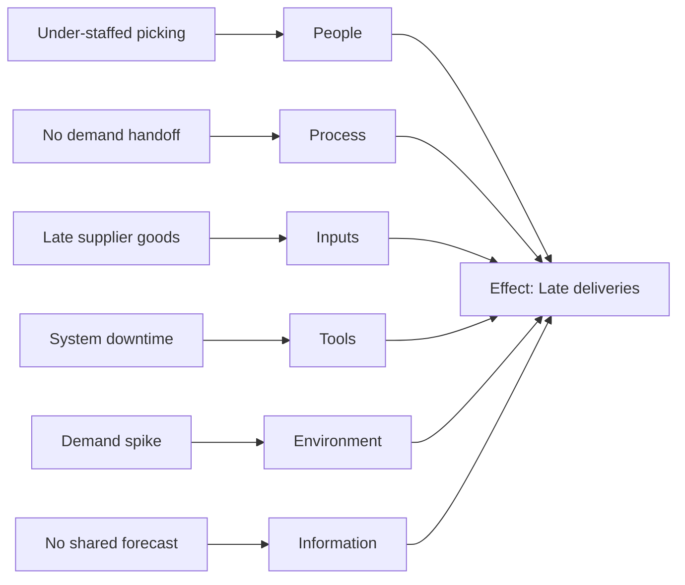

# Volume 04 - Cause-and-Effect Framework

| Field | Value |
|---|---|
| Document ID | WORLD-VOL04-020 |
| Title | Cause-and-Effect Framework |
| Version | 1.0 |
| Status | Approved |
| Classification | Internal |
| Founder | Mahesh Choudhary |

## Purpose

This chapter defines the structured framework WORLD uses to organize, categorize, and reason about the relationships between causes and effects. Where Chapter 19 provides the *method* of tracing causes, this chapter provides the *map* that keeps that tracing complete and unbiased, ensuring no major category of cause is overlooked.

## Scope

This chapter covers cause taxonomy (the Ishikawa categories adapted for a modern business), the distinction between necessary and sufficient causes, and the representation of causal relationships. It supports the RCA method of Chapter 19 and feeds constraint and failure analysis in Chapters 21-23.

## Why This Concept Exists

From first principles, causes cluster into categories that reflect the components of any productive system: people, process, inputs, tools, environment, and information. Human reasoning tends to over-index on whichever category is most recently salient, producing lopsided diagnoses. A cause-and-effect framework exists to force breadth before depth: it enumerates all plausible categories so that analysis is comprehensive rather than anecdotal. The Ishikawa (fishbone) diagram is the canonical expression of this idea.

## Where It Is Used

The framework is used whenever a problem is multi-factorial, when a first-pass 5 Whys stalls, or when several candidate causes compete. It structures brainstorming, evidence gathering, and the ranking of causes by likely contribution.

| Category | Modern Interpretation | Example Cause |
|---|---|---|
| People | Skills, roles, capacity | Under-staffed picking team |
| Process | Workflow, handoffs, standards | No demand-to-ops handoff |
| Inputs | Materials, data, supply | Late supplier deliveries |
| Tools | Systems, equipment, automation | Warehouse system downtime |
| Environment | Market, regulation, seasonality | Unplanned demand spike |
| Information | Signals, visibility, metrics | No shared forecast |

## How WORLD Implements It

WORLD constructs an Ishikawa structure for each material problem, populating each category with evidence-scored candidate causes. This guarantees that the causal search space is covered before the AI Business Partner narrows toward a root cause.

WORLD then classifies each candidate as a *necessary* cause (the effect cannot occur without it), a *sufficient* cause (it alone can produce the effect), or a *contributing* cause. This classification is decisive: removing a merely contributing cause reduces but does not eliminate the problem, whereas removing a necessary cause breaks the effect entirely. The framework thus directs corrective effort toward the highest-leverage causes.

## Relationship with the AI Business Partner

The AI Business Partner uses the framework as a reasoning scaffold. It automatically populates each category from available data, prompts for the categories where evidence is thin, and prevents the diagnostic tunnel vision that afflicts single-thread reasoning. By presenting the full fishbone with confidence-weighted causes, it lets the operator see the complete causal landscape and understand why the partner ranked one cause above another.

## Relationship with ERP

An ERP typically holds signals mapped to the Inputs, Process, and Tools categories: supply records, workflow states, and system events. WORLD maps these transactional records onto the cause-and-effect categories, filling the parts of the diagram that a transactional system can evidence, while supplying the People, Environment, and Information dimensions from broader context. The ERP is one contributor to a diagram WORLD assembles across many sources. Detailed ERP mappings belong to a later volume.

## Relationship with Business Foundation

The cause categories mirror the structural elements defined in Business Foundation: the organization's roles (People), operating model (Process), supply relationships (Inputs), and tooling standards (Tools). A robust Foundation makes categorization precise, because each category maps to a declared part of the business. When analysis repeatedly finds causes in one category, it signals a weakness in the corresponding Foundation element.

## Cross-References

- [Root Cause Analysis](/docs/blueprint/volume-04-business-intelligence-and-decision-science/section-c-problem-solving/19-root-cause-analysis.md)
- [Constraint Analysis](/docs/blueprint/volume-04-business-intelligence-and-decision-science/section-c-problem-solving/21-constraint-analysis.md)
- [Failure Analysis](/docs/blueprint/volume-04-business-intelligence-and-decision-science/section-c-problem-solving/23-failure-analysis.md)
- [Volume 02 - Business Foundation](/docs/blueprint/volume-02-business-foundation/README.md)

## References

- [Volume 01 - Vision and Philosophy](/docs/blueprint/volume-01-vision-and-philosophy/README.md)
- [Document Standards](/docs/governance/document-standards.md)

## Change Log

| Version | Date | Author | Notes |
|---|---|---|---|
| 1.0 | 2026-07-12 | Lead Software Engineer | Initial approved version. |
