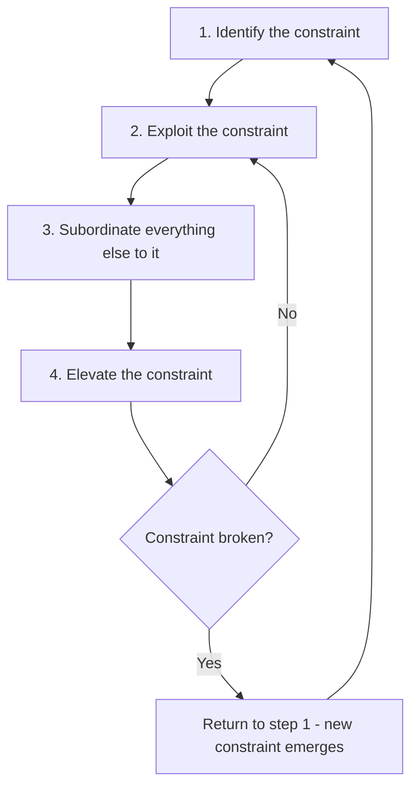

# Volume 04 - Constraint Analysis

| Field | Value |
|---|---|
| Document ID | WORLD-VOL04-021 |
| Title | Constraint Analysis |
| Version | 1.0 |
| Status | Approved |
| Classification | Internal |
| Founder | Mahesh Choudhary |

## Purpose

This chapter defines how WORLD identifies and reasons about the constraints that limit a business system's throughput. Rooted in the Theory of Constraints (TOC), it gives the AI Business Partner a method to find the single limiting factor whose improvement yields the greatest system-wide gain, rather than optimizing parts in isolation.

## Scope

This chapter covers constraint identification, the five focusing steps of TOC, and the distinction between constraints and ordinary problems. Physical flow bottlenecks are treated in depth in Chapter 22; this chapter addresses constraints generally, including policy, market, and capacity constraints.

## Why This Concept Exists

From first principles, the output of any chained system is governed by its weakest link. Improving a non-constraint does not increase system throughput; it only builds excess capacity or inventory ahead of the true limit. Constraint analysis exists because businesses routinely waste effort improving components that were never limiting the whole. The Theory of Constraints formalizes the insight that at any moment, one constraint dominates, and system performance is maximized by concentrating on it.

## Where It Is Used

Constraint analysis is used in capacity planning, throughput improvement, investment prioritization, and whenever a business asks "where should we focus to grow output?" It is the correct lens when a problem is about *limits to scale* rather than *defects in quality*.

| Constraint Type | Nature | Example |
|---|---|---|
| Physical | A resource at capacity | Single QA station |
| Policy | A rule that caps flow | Batch-only approvals |
| Market | Demand below capacity | Insufficient qualified leads |
| Capital | Funding limits investment | Cannot add a second line |

## How WORLD Implements It

WORLD applies the five focusing steps of TOC as an ordered cycle. It never proceeds to elevate a constraint before exploiting and subordinating to it, because premature investment wastes capital.

WORLD identifies the constraint by measuring where work accumulates and where throughput is capped. It first exploits the constraint by removing waste and idle time at that point, then subordinates upstream and downstream resources so they serve the constraint's pace rather than local efficiency. Only when exploitation is exhausted does it recommend elevation (adding capacity or capital). Critically, WORLD warns that breaking one constraint moves it elsewhere, so the cycle repeats.

**Example:** A services firm cannot deliver more projects. WORLD finds the constraint is a single senior reviewer through whom all deliverables pass. Exploiting means removing low-value tasks from that reviewer; subordinating means teams pace work to the reviewer's capacity; elevating means training a second reviewer. Adding more junior staff, the intuitive move, would have worsened the pile-up.

## Relationship with the AI Business Partner

The AI Business Partner performs constraint analysis continuously, tracking where throughput is limited and steering the operator away from local optimizations that do not move the system. It frames improvement opportunities in terms of their effect on the constraint, and it re-identifies the constraint after each intervention, since the limit migrates. This gives the operator a system-level view that resists the pull of departmental optimization.

## Relationship with ERP

ERP systems record the work-in-progress, queue depths, and resource utilization that reveal where a physical or policy constraint sits. Conceptually, WORLD reads these accumulation signals to locate the constraint, then applies TOC logic the ERP does not contain. An ERP shows *where inventory piles up*; WORLD interprets that as *the constraint to focus on*. Specific ERP telemetry is defined in a later volume.

## Relationship with Business Foundation

Many constraints are policy constraints created by Business Foundation itself: approval rules, ownership boundaries, and operating cadences. Constraint analysis often reveals that the limiting factor is a self-imposed policy rather than a physical limit, feeding a change back into Foundation. Foundation also defines the strategic objectives that determine which throughput matters, giving constraint analysis its direction.

## Cross-References

- [Bottleneck Identification](/docs/blueprint/volume-04-business-intelligence-and-decision-science/section-c-problem-solving/22-bottleneck-identification.md)
- [Root Cause Analysis](/docs/blueprint/volume-04-business-intelligence-and-decision-science/section-c-problem-solving/19-root-cause-analysis.md)
- [Corrective Actions](/docs/blueprint/volume-04-business-intelligence-and-decision-science/section-c-problem-solving/24-corrective-actions.md)
- [Volume 02 - Business Foundation](/docs/blueprint/volume-02-business-foundation/README.md)

## References

- [Volume 01 - Vision and Philosophy](/docs/blueprint/volume-01-vision-and-philosophy/README.md)
- [Document Standards](/docs/governance/document-standards.md)

## Change Log

| Version | Date | Author | Notes |
|---|---|---|---|
| 1.0 | 2026-07-12 | Lead Software Engineer | Initial approved version. |
