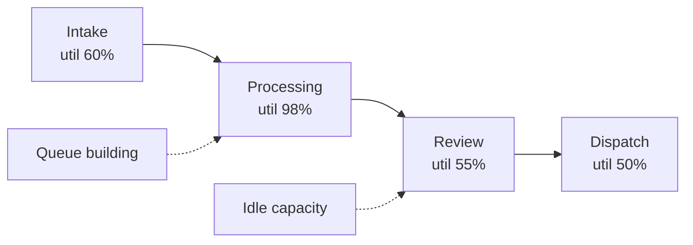

# Volume 04 - Bottleneck Identification

| Field | Value |
|---|---|
| Document ID | WORLD-VOL04-022 |
| Title | Bottleneck Identification |
| Version | 1.0 |
| Status | Approved |
| Classification | Internal |
| Founder | Mahesh Choudhary |

## Purpose

This chapter defines how WORLD locates bottlenecks: the specific points in a process flow where throughput is physically limited and work accumulates. It operationalizes the constraint concept of Chapter 21 at the level of concrete process steps, giving the AI Business Partner precise, measurable signals for where flow is choking.

## Scope

This chapter covers bottleneck detection signals, the distinction between a transient queue and a structural bottleneck, and the measurement of process flow. It complements Chapter 21 (which addresses constraints broadly) by focusing on flow-based, physical bottlenecks in operational processes.

## Why This Concept Exists

From first principles, any multi-step process moves at the pace of its slowest step. Work arriving faster than that step can handle forms a queue; work leaving it starves downstream steps. A bottleneck is therefore recognizable by two simultaneous signatures: a growing queue in front of it and idle capacity behind it. This concept exists because these signatures make bottlenecks empirically detectable, turning a vague sense of "things are slow" into a precise, located measurement.

## Where It Is Used

Bottleneck identification is used in operations, fulfillment, service delivery, and any pipeline where items flow through sequential stages. It is the diagnostic that precedes throughput improvement and capacity investment.

| Signal | Indicates | Measurement |
|---|---|---|
| Growing queue upstream | Step cannot keep pace | Work-in-progress trend |
| Idle time downstream | Step is starved | Utilization gap |
| High utilization at step | Step near capacity | Busy time / available time |
| Rising cycle time | Flow is choking | Time per unit through step |

## How WORLD Implements It

WORLD measures each process stage for queue length, utilization, and cycle time, then identifies the stage exhibiting the bottleneck signature. It distinguishes a *structural* bottleneck (persistent, capacity-based) from a *transient* queue (a temporary surge that will clear).

In this pattern, Processing at 98% utilization with a growing queue in front and idle capacity in Review behind is the structural bottleneck. WORLD confirms this by checking that the queue persists across time rather than clearing after a surge. It then quantifies the throughput ceiling the bottleneck imposes and estimates the system gain from relieving it, handing this to constraint analysis for the exploit-subordinate-elevate cycle.

**Example:** An e-commerce fulfillment line shows parcels piling up at packing while shipping stations sit idle. WORLD identifies packing as the bottleneck, quantifies that it caps daily throughput at 4,000 units, and shows that adding packing capacity, not shipping capacity, is the only move that raises total output.

## Relationship with the AI Business Partner

The AI Business Partner monitors process flow continuously and surfaces bottlenecks the moment their signature appears, before they cascade into missed commitments. It distinguishes noise from structural limits, quantifies the throughput at stake, and recommends where relief will actually raise output. This prevents the operator from spreading investment across stages that were never limiting.

## Relationship with ERP

ERP systems capture the stage-by-stage transactional events, timestamps, and work-in-progress counts from which bottleneck signatures are computed. Conceptually, the ERP provides the flow telemetry; WORLD provides the flow analysis that identifies which stage is the bottleneck and what it costs. An ERP logs each step's completion; WORLD reads the pattern across steps. Specific ERP flow-event integration is defined in a later volume.

## Relationship with Business Foundation

Business Foundation defines the process design, stage ownership, and service standards against which flow is judged. A bottleneck is meaningful only relative to the throughput the business intends to achieve, which Foundation declares. When a bottleneck reflects an under-provisioned stage in the designed process, the finding feeds back into Foundation's operating model.

## Cross-References

- [Constraint Analysis](/docs/blueprint/volume-04-business-intelligence-and-decision-science/section-c-problem-solving/21-constraint-analysis.md)
- [Cause-and-Effect Framework](/docs/blueprint/volume-04-business-intelligence-and-decision-science/section-c-problem-solving/20-cause-and-effect-framework.md)
- [Corrective Actions](/docs/blueprint/volume-04-business-intelligence-and-decision-science/section-c-problem-solving/24-corrective-actions.md)
- [Volume 02 - Business Foundation](/docs/blueprint/volume-02-business-foundation/README.md)

## References

- [Volume 01 - Vision and Philosophy](/docs/blueprint/volume-01-vision-and-philosophy/README.md)
- [Document Standards](/docs/governance/document-standards.md)

## Change Log

| Version | Date | Author | Notes |
|---|---|---|---|
| 1.0 | 2026-07-12 | Lead Software Engineer | Initial approved version. |
