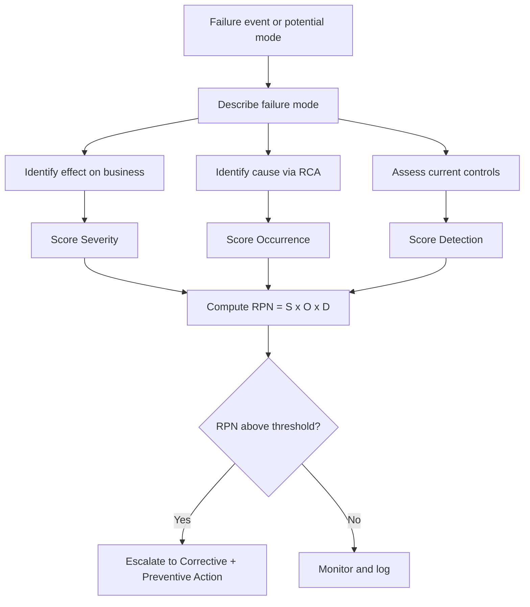

# Volume 04 - Failure Analysis

| Field | Value |
|---|---|
| Document ID | WORLD-VOL04-023 |
| Title | Failure Analysis |
| Version | 1.0 |
| Status | Approved |
| Classification | Internal |
| Founder | Mahesh Choudhary |

## Purpose

This chapter defines how WORLD analyzes failures: events where a process, product, or decision did not perform as required. It gives the AI Business Partner a disciplined method to characterize failures by their mode, effect, and severity, so that response is proportionate and learning is captured. It draws on Failure Mode and Effects Analysis (FMEA).

## Scope

This chapter covers failure modes, effects, detection, and prioritization via risk scoring. It addresses both reactive analysis (after a failure) and proactive analysis (anticipating potential failures). It feeds corrective actions (Chapter 24) and preventive actions (Chapter 25).

## Why This Concept Exists

From first principles, every capability has ways it can fail, each with a likelihood of occurring, a severity of consequence, and a likelihood of being detected before harm. Treating all failures identically wastes resources on trivial ones and under-responds to catastrophic ones. Failure analysis exists to make failure *comparable*: by scoring severity, occurrence, and detection, an organization can rank failures by risk and allocate response accordingly. FMEA is the established discipline that encodes this logic.

## Where It Is Used

Failure analysis is used after incidents, during design of new processes or products, and in periodic risk reviews. It is the correct lens when the question is "what went wrong, how bad is it, and what else could go wrong the same way?"

| FMEA Factor | Question | Scale |
|---|---|---|
| Severity (S) | How bad is the effect? | 1-10 |
| Occurrence (O) | How likely to happen? | 1-10 |
| Detection (D) | How likely to be caught first? | 1-10 (10 = hard to detect) |
| Risk Priority (RPN) | S x O x D | Ranks failures |

## How WORLD Implements It

WORLD builds a failure record for each mode, capturing the failure mode, its effect, its cause, existing controls, and the S/O/D scores that yield a Risk Priority Number (RPN). Failures are ranked by RPN so that response is proportionate to risk.

WORLD links each failure's cause to the root cause analysis of Chapter 19, so scoring is grounded in a confirmed cause rather than speculation. High-RPN failures are escalated into the CAPA loop; low-RPN failures are logged for trend monitoring, since accumulating low-severity failures can signal a rising systemic risk.

**Example:** A payment reconciliation step occasionally mismatches records. WORLD scores severity high (revenue misstatement), occurrence moderate, and detection poor (errors surface only at month-end). The resulting high RPN escalates it above a more frequent but low-severity formatting error, correctly directing effort to the reconciliation risk first.

## Relationship with the AI Business Partner

The AI Business Partner conducts failure analysis both reactively and proactively. After an incident it characterizes the failure and scores its risk; ahead of new initiatives it anticipates failure modes and their RPNs. It maintains the failure register, tracks RPN trends, and alerts the operator when accumulating minor failures indicate a growing systemic risk. This turns failures into structured, comparable, learnable events.

## Relationship with ERP

ERP systems record the operational failures, exceptions, and error events that seed reactive failure analysis, and they hold the historical frequency data that informs occurrence scoring. Conceptually, the ERP supplies failure incidence; WORLD supplies the severity/detection judgment and risk prioritization the transactional record cannot express. Specific ERP exception feeds are defined in a later volume.

## Relationship with Business Foundation

Business Foundation defines the required performance and controls against which a failure is measured; without a declared standard, there is no failure, only variation. Foundation also defines the risk tolerance that sets RPN thresholds. Recurrent high-RPN failures often expose a missing control in Foundation's design, feeding improvements back into Volume 02.

## Cross-References

- [Root Cause Analysis](/docs/blueprint/volume-04-business-intelligence-and-decision-science/section-c-problem-solving/19-root-cause-analysis.md)
- [Corrective Actions](/docs/blueprint/volume-04-business-intelligence-and-decision-science/section-c-problem-solving/24-corrective-actions.md)
- [Preventive Actions](/docs/blueprint/volume-04-business-intelligence-and-decision-science/section-c-problem-solving/25-preventive-actions.md)
- [Volume 02 - Business Foundation](/docs/blueprint/volume-02-business-foundation/README.md)

## References

- [Volume 01 - Vision and Philosophy](/docs/blueprint/volume-01-vision-and-philosophy/README.md)
- [Document Standards](/docs/governance/document-standards.md)

## Change Log

| Version | Date | Author | Notes |
|---|---|---|---|
| 1.0 | 2026-07-12 | Lead Software Engineer | Initial approved version. |
