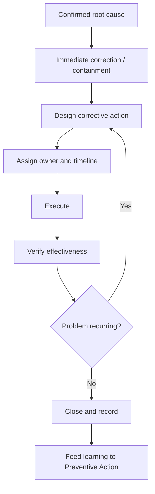

# Volume 04 - Corrective Actions

| Field | Value |
|---|---|
| Document ID | WORLD-VOL04-024 |
| Title | Corrective Actions |
| Version | 1.0 |
| Status | Approved |
| Classification | Internal |
| Founder | Mahesh Choudhary |

## Purpose

This chapter defines how WORLD designs, executes, and verifies corrective actions: the interventions that eliminate a confirmed root cause so that an existing problem does not recur. It is the action half of the CAPA (Corrective and Preventive Action) discipline, with prevention of *potential* problems addressed in Chapter 25.

## Scope

This chapter covers correction versus corrective action, action design, execution, and effectiveness verification. It takes a confirmed root cause (Chapter 19) or high-RPN failure (Chapter 23) as input and produces a verified, closed corrective action.

## Why This Concept Exists

From first principles, there is a decisive difference between *correction* (fixing the immediate symptom, e.g., reshipping a late order) and *corrective action* (removing the cause so no order ships late again). Correction restores the present; corrective action protects the future. This concept exists because organizations habitually stop at correction, mistaking a patched symptom for a solved problem. A corrective action is only complete when its effectiveness is verified, that is, when the problem is shown not to recur.

## Where It Is Used

Corrective action is invoked whenever root cause analysis or failure analysis confirms a cause worth eliminating. It is the standard bridge from diagnosis to durable resolution.

| Stage | Correction | Corrective Action |
|---|---|---|
| Focus | The symptom now | The root cause |
| Timing | Immediate | After diagnosis |
| Goal | Restore service | Prevent recurrence |
| Closure | Symptom resolved | Recurrence verified absent |

## How WORLD Implements It

WORLD runs a closed-loop corrective action process. It first applies any needed immediate correction to contain harm, then designs the corrective action against the confirmed root cause, executes it with a clear owner, and verifies effectiveness before closing.

The verification step is non-negotiable: WORLD monitors the original problem's metric after the action and only closes the loop when the deviation stays resolved over a defined observation window. If it recurs, the action is deemed ineffective and the cycle repeats, often revealing that the true root cause was deeper. Every closed corrective action is recorded and passed to preventive action so the lesson generalizes.

**Example:** After RCA finds that late deliveries stem from a missing demand-to-ops handoff, the correction is to expedite the current backlog; the corrective action is to establish a mandatory demand signal from sales to operations before every promotion. WORLD verifies by tracking on-time delivery across the next promotional cycle, closing only when it holds at target.

## Relationship with the AI Business Partner

The AI Business Partner designs corrective actions from the confirmed root cause, proposes owners and timelines, and drives execution to closure. Crucially, it owns the verification step, watching the original metric to confirm the fix worked rather than assuming it did. It distinguishes correction from corrective action explicitly, preventing the operator from closing a problem that has only been patched. It also captures each resolved case as reusable organizational learning.

## Relationship with ERP

Many corrective actions are executed as changes to processes and transactions that an ERP system carries out: updated workflows, revised approval rules, or new operational steps. Conceptually, the ERP is an execution surface for corrective actions, while WORLD supplies the design, the ownership logic, and the effectiveness verification the ERP does not perform. Specific ERP change-execution patterns are defined in a later volume.

## Relationship with Business Foundation

Durable corrective actions frequently amend Business Foundation itself, encoding a new standard, handoff, or control so the fix becomes permanent policy rather than a one-time effort. Foundation is therefore both a source of the standards a corrective action restores and the repository where lasting corrections are institutionalized.

## Cross-References

- [Root Cause Analysis](/docs/blueprint/volume-04-business-intelligence-and-decision-science/section-c-problem-solving/19-root-cause-analysis.md)
- [Failure Analysis](/docs/blueprint/volume-04-business-intelligence-and-decision-science/section-c-problem-solving/23-failure-analysis.md)
- [Preventive Actions](/docs/blueprint/volume-04-business-intelligence-and-decision-science/section-c-problem-solving/25-preventive-actions.md)
- [Volume 03 - AI Business Partner](/docs/blueprint/volume-03-ai-business-partner/README.md)

## References

- [Volume 01 - Vision and Philosophy](/docs/blueprint/volume-01-vision-and-philosophy/README.md)
- [Document Standards](/docs/governance/document-standards.md)

## Change Log

| Version | Date | Author | Notes |
|---|---|---|---|
| 1.0 | 2026-07-12 | Lead Software Engineer | Initial approved version. |
