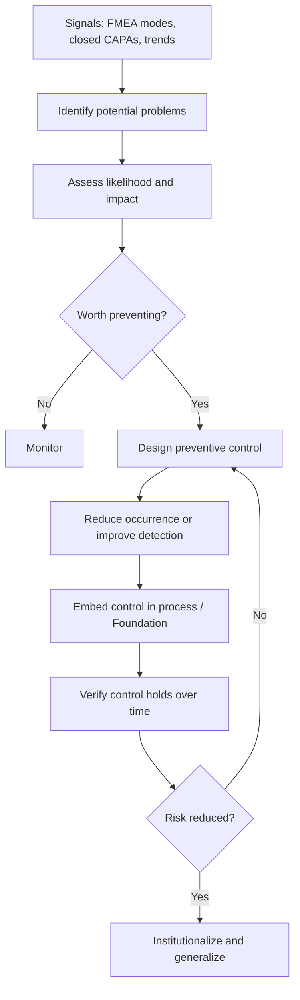

# Volume 04 - Preventive Actions

| Field | Value |
|---|---|
| Document ID | WORLD-VOL04-025 |
| Title | Preventive Actions |
| Version | 1.0 |
| Status | Approved |
| Classification | Internal |
| Founder | Mahesh Choudhary |

## Purpose

This chapter defines how WORLD anticipates and eliminates *potential* problems before they occur. It is the preventive half of the CAPA discipline: where corrective action removes the cause of a problem that has already happened, preventive action removes the conditions under which a problem could happen. It closes Section C by turning problem-solving from reactive to anticipatory.

## Scope

This chapter covers potential-problem identification, preventive control design, and the generalization of lessons from corrective actions across the business. It consumes signals from failure analysis (Chapter 23) and closed corrective actions (Chapter 24) and feeds durable controls into Business Foundation.

## Why This Concept Exists

From first principles, the cheapest problem to solve is the one that never occurs. Every problem carries a cost of occurrence plus a cost of response; prevention eliminates both by acting on the *conditions* for failure rather than its aftermath. This concept exists because reactive organizations pay repeatedly for the same class of problem in different guises, while anticipatory ones invest once to remove the underlying vulnerability. Preventive action operationalizes the shift from firefighting to system design.

## Where It Is Used

Preventive action is used in risk review, process and product design, and whenever a corrective action in one area reveals a vulnerability that likely exists elsewhere. It is the mechanism by which a single lesson protects the whole business.

| Trigger | Preventive Response |
|---|---|
| High-RPN mode not yet realized | Add detection or reduce occurrence |
| Corrective action closed | Generalize the fix to similar areas |
| New process or product | Design controls before launch |
| Trend of minor failures | Intervene before escalation |

## How WORLD Implements It

WORLD treats prevention as a forward-looking loop that pairs with the corrective loop of Chapter 24 to complete CAPA. It scans for latent risks, designs controls that reduce occurrence or improve detection, and generalizes lessons from resolved problems to analogous parts of the business.

The defining discipline of preventive action is generalization: when a corrective action fixes one root cause, WORLD asks where else that same vulnerability could exist and applies the control proactively there. Prevention is verified not by the absence of a specific incident but by measuring that the risk conditions themselves have been removed and remain removed over time.

**Example:** After a corrective action establishes a demand-to-ops handoff for one region's promotions, WORLD recognizes the same vulnerability exists across all regions and product lines. The preventive action embeds the handoff as a standard control everywhere, so the class of problem, not just its first instance, is eliminated before it recurs elsewhere.

## Relationship with the AI Business Partner

The AI Business Partner is inherently anticipatory: it continuously scans for latent risks, models where problems could emerge, and proposes preventive controls before incidents occur. It automatically generalizes each corrective action to similar contexts, turning localized fixes into systemic protection. By owning the verification that risk conditions stay removed, it shifts the business from reactive firefighting toward designed resilience, which is a central promise of an AI Business Partner.

## Relationship with ERP

Preventive controls are often realized as validations, automated checks, and enforced workflows that an ERP system executes at the point of transaction. Conceptually, the ERP is where many preventive controls live and act, while WORLD supplies the foresight to identify the risk and design the control. An ERP can enforce a rule; WORLD decides which rule prevents which future problem. Specific ERP control-embedding patterns are defined in a later volume.

## Relationship with Business Foundation

Preventive action is the primary feedback channel into Business Foundation: durable controls, standards, and guardrails discovered through prevention are institutionalized in Foundation so the business's design itself becomes more resilient over time. In this way, Section C closes the loop from problem back to a strengthened foundation, making the whole business progressively harder to break.

## Cross-References

- [Corrective Actions](/docs/blueprint/volume-04-business-intelligence-and-decision-science/section-c-problem-solving/24-corrective-actions.md)
- [Failure Analysis](/docs/blueprint/volume-04-business-intelligence-and-decision-science/section-c-problem-solving/23-failure-analysis.md)
- [Problem Identification](/docs/blueprint/volume-04-business-intelligence-and-decision-science/section-c-problem-solving/18-problem-identification.md)
- [Volume 02 - Business Foundation](/docs/blueprint/volume-02-business-foundation/README.md)

## References

- [Volume 01 - Vision and Philosophy](/docs/blueprint/volume-01-vision-and-philosophy/README.md)
- [Document Standards](/docs/governance/document-standards.md)

## Change Log

| Version | Date | Author | Notes |
|---|---|---|---|
| 1.0 | 2026-07-12 | Lead Software Engineer | Initial approved version. |
