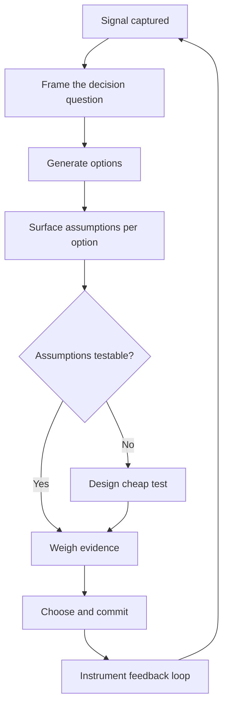

# Volume 04 - Strategic Thinking Framework

| Field | Value |
|---|---|
| Document ID | WORLD-VOL04-026 |
| Title | Strategic Thinking Framework |
| Version | 1.0 |
| Status | Approved |
| Classification | Internal |
| Founder | Mahesh Choudhary |

## Purpose

This chapter establishes the reasoning discipline that governs how WORLD converts business signals into strategic direction. It defines a repeatable framework for framing decisions, testing assumptions, and choosing where to compete and how to win, so that strategy in WORLD is a structured cognitive process rather than intuition.

## Scope

Covers the mental models, decision structure, and evaluation logic used across Section D. It does not prescribe specific strategies for a given enterprise; it defines the framework those strategies are produced through. It connects downstream to opportunity discovery (Chapter 27) and every intelligence domain that follows.

## Why This Concept Exists

From first principles, a business is a system that allocates finite resources under uncertainty toward a desired future state. Every allocation is a bet. Poor strategy is rarely a failure of effort; it is a failure of framing - asking the wrong question, optimizing a local metric, or mistaking activity for advantage. A strategic thinking framework exists to make the invisible logic of a decision explicit: what is the objective, what must be true for a choice to succeed, what evidence supports it, and what would falsify it.

WORLD treats strategy as a chain: Signal -> Insight -> Option -> Choice -> Commitment -> Feedback. Breaking this chain at any point produces waste. The framework enforces the full chain.

## Where It Is Used

The framework is invoked whenever a decision materially changes resource allocation or market position: entering a market, pricing a product, prioritizing a roadmap, responding to a competitor, or restructuring operations. It is the shared reasoning layer that the other eight chapters of Section D feed into.

| Strategic Lens | Core Question | Established Anchor |
|---|---|---|
| Where to play | Which arenas create durable value? | Playing to Win (Lafley/Martin) |
| How to win | What is our advantage in that arena? | Porter generic strategies |
| External forces | What shapes attractiveness? | Porter's Five Forces, PESTEL |
| Internal fit | Do capabilities support the choice? | Resource-Based View |
| Time horizon | Core, adjacent, or transformational? | Three Horizons |

## How WORLD Implements It

WORLD implements the framework as a decision pipeline with explicit artifacts at each stage. A decision is never a single event; it is a traceable object with a question, a set of options, the assumptions behind each, the evidence weighed, and the chosen commitment.

Each stage produces a durable record, so a decision can later be audited against how the world actually unfolded. This converts strategy into an evidence-generating loop rather than a one-time deliverable.

## Relationship with the AI Business Partner

The AI Business Partner is the primary operator of this framework. It frames the decision question, generates and stress-tests options, exposes hidden assumptions, and surfaces disconfirming evidence a human might avoid. It does not replace the founder's judgment; it enforces the discipline of the chain and keeps every commitment traceable, so the human owner always decides with a structured, defensible view.

## Relationship with ERP

ERP capability in WORLD is the transactional system of record that a later volume defines in detail. Conceptually, the strategic framework consumes structured operational and financial truth from that layer as evidence, and it emits prioritized commitments back to it as budgets, targets, and resource plans. The framework is the deliberative layer above the transactional layer.

## Relationship with Business Foundation

Business Foundation (Volume 02) supplies the invariants the framework reasons within: mission, values, operating principles, and the definition of what the business is. Strategy is bounded by foundation; the framework may choose among options, but never against the identity established in Volume 02.

## Example

A mid-market SaaS firm faces flattening growth. Rather than defaulting to "spend more on marketing," the framework reframes the question: "Where is durable value being lost - acquisition, activation, or retention?" Options are generated across all three, assumptions surfaced (e.g., "churn is price-driven"), and a cheap cohort test falsifies the pricing assumption, revealing an onboarding gap. The commitment shifts to activation, and the feedback loop confirms recovered net revenue retention.

## Cross-References

- [Opportunity Discovery](/docs/blueprint/volume-04-business-intelligence-and-decision-science/section-d-strategic-intelligence/27-opportunity-discovery.md)
- [Competitive Analysis](/docs/blueprint/volume-04-business-intelligence-and-decision-science/section-d-strategic-intelligence/28-competitive-analysis.md)
- [Business Foundation Overview](/docs/blueprint/volume-02-business-foundation/README.md)

## References

- [Volume 01 - Vision and Philosophy](/docs/blueprint/volume-01-vision-and-philosophy/README.md)
- [Document Standards](/docs/governance/document-standards.md)

## Change Log

| Version | Date | Author | Notes |
|---|---|---|---|
| 1.0 | 2026-07-12 | Lead Software Engineer | Initial approved version. |
