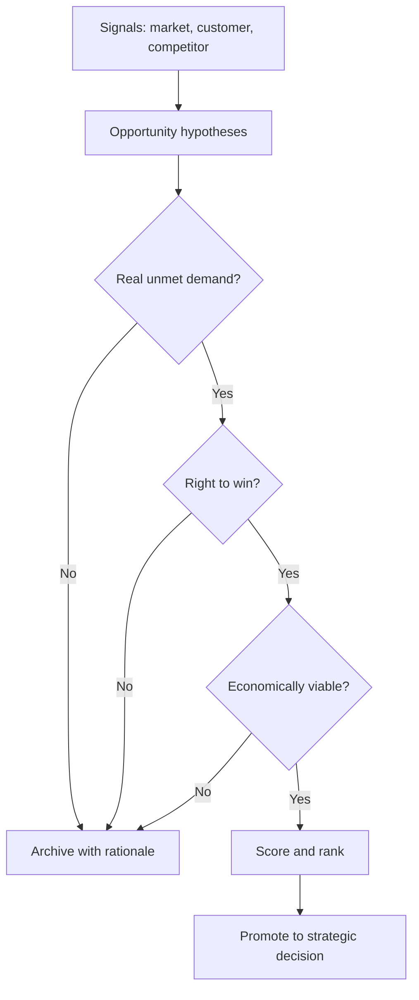

# Volume 04 - Opportunity Discovery

| Field | Value |
|---|---|
| Document ID | WORLD-VOL04-027 |
| Title | Opportunity Discovery |
| Version | 1.0 |
| Status | Approved |
| Classification | Internal |
| Founder | Mahesh Choudhary |

## Purpose

This chapter defines how WORLD systematically detects, qualifies, and prioritizes opportunities for growth and value creation. It turns the diffuse activity of "looking for ideas" into a disciplined discovery pipeline grounded in unmet demand and defensible advantage.

## Scope

Covers opportunity sensing, hypothesis formation, qualification, and prioritization. It excludes execution and portfolio delivery, which belong to operational domains. It applies the reasoning discipline of Chapter 26 to the specific task of finding where value can be created.

## Why This Concept Exists

From first principles, an opportunity is a gap between a desired outcome a customer cannot currently achieve and the means to deliver it profitably. Opportunities are abundant as ideas but scarce as validated, ownable propositions. Most fail not because the idea was absent, but because discovery was unstructured - founders fell in love with solutions before understanding the problem, or pursued markets without demand or without a right to win.

Opportunity discovery exists to impose a funnel: many signals in, few high-conviction bets out. It separates genuine demand from noise and forces evidence before commitment.

## Where It Is Used

Used in growth planning, product strategy, market entry, and adjacency expansion. It draws inputs from market, customer, and competitive intelligence and feeds prioritized opportunities into the strategic framework for commitment.

| Discovery Source | Signal Type | Example |
|---|---|---|
| Jobs to be Done | Unmet functional/emotional need | Customers hiring a workaround |
| Market shifts (PESTEL) | Structural change | New regulation opens a category |
| Competitive gaps | Underserved segment | Incumbents ignore SMB tier |
| Internal capability | Latent asset | Proprietary data reusable elsewhere |
| Value chain friction | Cost/latency in workflow | Manual step ripe for automation |

## How WORLD Implements It

WORLD implements discovery as a staged funnel where each opportunity is a scored object advancing only when evidence thresholds are met.

Scoring uses transparent, weighted criteria so prioritization is defensible and comparable across candidates.

| Criterion | Weight | Question |
|---|---|---|
| Demand intensity | 30% | How acute and frequent is the need? |
| Advantage | 25% | Can we win and defend? |
| Market size | 20% | Is the addressable value material? |
| Feasibility | 15% | Can we deliver with current or reachable capability? |
| Strategic fit | 10% | Does it reinforce foundation and portfolio? |

## Relationship with the AI Business Partner

The AI Business Partner runs the discovery funnel continuously, not as a periodic workshop. It scans intelligence streams for emerging gaps, drafts opportunity hypotheses, tests them against demand and advantage evidence, and presents a ranked, reasoned shortlist. It maintains the archive of rejected opportunities with rationale, so discovery compounds institutional learning instead of repeating dead ends.

## Relationship with ERP

Conceptually, ERP data - order patterns, margins, capacity utilization - is a rich source of internal opportunity signals and a reality check on feasibility. Discovery consumes this transactional truth to ground opportunities in what the business can actually deliver, while the specifics of the ERP layer are defined in a later volume.

## Relationship with Business Foundation

Business Foundation defines the arena of legitimate opportunity. An opportunity that contradicts the mission or values of Volume 02 is disqualified regardless of its economics. Foundation acts as the funnel's outermost filter.

## Example

A regional logistics firm notices repeated support tickets from small shippers frustrated by opaque delivery estimates - a Jobs-to-be-Done signal. The hypothesis: a predictive ETA service for SMB shippers. Demand is confirmed by ticket volume and willingness-to-pay interviews; right-to-win is established by proprietary route data; viability is validated by margin modeling. It scores highest against three alternatives and is promoted to a strategic commitment, while a competing "consumer app" idea is archived for weak advantage.

## Cross-References

- [Strategic Thinking Framework](/docs/blueprint/volume-04-business-intelligence-and-decision-science/section-d-strategic-intelligence/26-strategic-thinking-framework.md)
- [Market Intelligence](/docs/blueprint/volume-04-business-intelligence-and-decision-science/section-d-strategic-intelligence/29-market-intelligence.md)
- [Innovation Intelligence](/docs/blueprint/volume-04-business-intelligence-and-decision-science/section-d-strategic-intelligence/34-innovation-intelligence.md)

## References

- [Volume 01 - Vision and Philosophy](/docs/blueprint/volume-01-vision-and-philosophy/README.md)
- [Document Standards](/docs/governance/document-standards.md)

## Change Log

| Version | Date | Author | Notes |
|---|---|---|---|
| 1.0 | 2026-07-12 | Lead Software Engineer | Initial approved version. |
