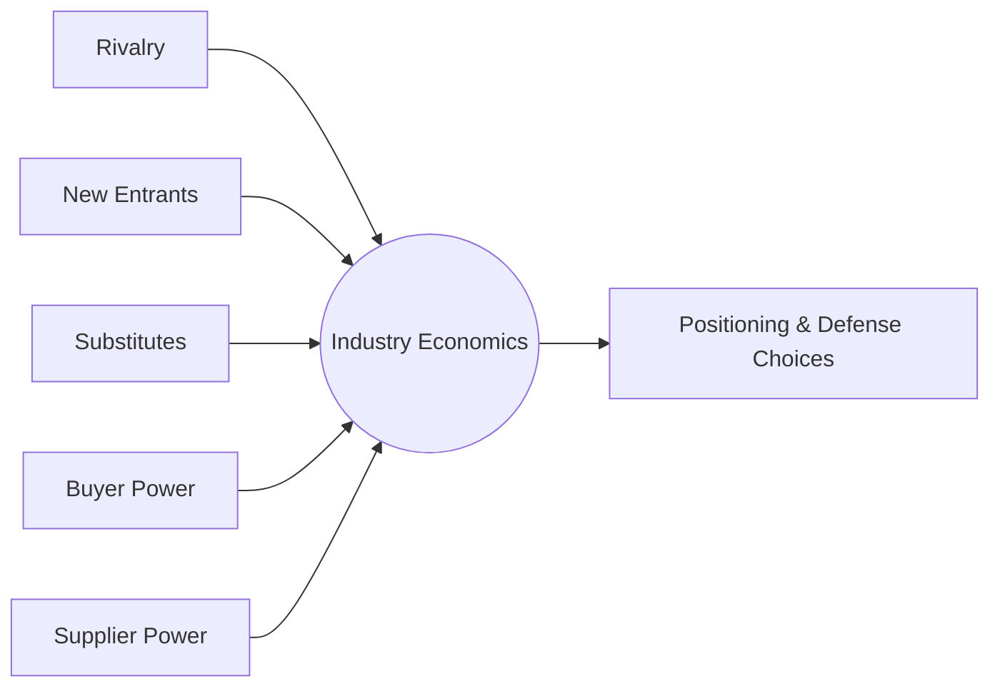

# Volume 04 - Competitive Analysis

| Field | Value |
|---|---|
| Document ID | WORLD-VOL04-028 |
| Title | Competitive Analysis |
| Version | 1.0 |
| Status | Approved |
| Classification | Internal |
| Founder | Mahesh Choudhary |

## Purpose

This chapter defines how WORLD understands the competitive environment - who competes for the same value, how they behave, and where durable advantage can be built or eroded. It converts scattered observations about rivals into a structured model that informs positioning and defense.

## Scope

Covers competitor identification, capability and positioning assessment, structural industry analysis, and competitive response modeling. It excludes broad market sizing (Chapter 29) and customer behavior (Chapter 30), which it consumes as inputs.

## Why This Concept Exists

From first principles, profit is competed away unless something protects it. Competitive analysis exists to answer two questions: what forces are compressing our economics, and what makes our position defensible against rivals who want the same customers? Without it, a firm optimizes in isolation and is surprised by moves it should have anticipated.

Competition is not only direct rivals. Porter's Five Forces frames it structurally: rivalry, new entrants, substitutes, buyer power, and supplier power all extract value. A firm that watches only its named competitors misses the substitute or the empowered buyer that quietly erodes margin.

## Where It Is Used

Used in positioning, pricing, roadmap defense, and go-to-market planning. It is invoked whenever a competitor acts, a new entrant appears, or the firm considers a move that rivals could counter.

## How WORLD Implements It

WORLD maintains living competitor profiles rather than static one-off decks. Each rival is an object tracking capabilities, positioning, cost structure signals, and observed strategic intent, refreshed as new evidence arrives.

| Competitor Dimension | What Is Tracked | Strategic Use |
|---|---|---|
| Positioning | Segment, value proposition, price tier | Find whitespace |
| Capabilities | Product, distribution, talent, data | Assess threat depth |
| Cost structure | Scale, unit economics signals | Predict pricing latitude |
| Momentum | Growth, funding, hiring, releases | Anticipate next moves |
| Vulnerabilities | Underserved segments, weak areas | Target attack points |

Against these profiles WORLD runs response modeling: for any contemplated move, it simulates the most likely competitor reactions and second-order effects before commitment.

## Relationship with the AI Business Partner

The AI Business Partner continuously assembles competitor intelligence from public and internal signals, keeps profiles current, and applies the Five Forces lens to flag shifts in industry economics. When the firm considers a move, it war-games probable competitive responses and surfaces the position most robust across those responses, keeping the human decision-maker ahead of rivals rather than reacting to them.

## Relationship with ERP

Conceptually, the ERP layer supplies internal cost and margin truth that calibrates competitive modeling - the firm cannot assess a rival's pricing latitude without honest knowledge of its own unit economics. WORLD uses that transactional grounding while the ERP specifics remain defined in a later volume.

## Relationship with Business Foundation

Business Foundation defines how the firm chooses to compete - its values may rule out certain tactics (e.g., predatory practices) even when they are competitively effective. Competitive analysis identifies options; foundation constrains which are legitimate.

## Example

A payments startup detects a well-funded entrant hiring aggressively in its core segment. WORLD models the entrant's likely play - undercut on price to buy share - and stress-tests two responses. Rather than matching price (which the entrant can sustain longer), the analysis identifies a defensible move: deepen integration switching costs with existing customers, neutralizing the price attack. The Five Forces lens confirms buyer power, not rivalry alone, is the real pressure, reframing the entire defense.

## Cross-References

- [Strategic Thinking Framework](/docs/blueprint/volume-04-business-intelligence-and-decision-science/section-d-strategic-intelligence/26-strategic-thinking-framework.md)
- [Market Intelligence](/docs/blueprint/volume-04-business-intelligence-and-decision-science/section-d-strategic-intelligence/29-market-intelligence.md)
- [Risk Intelligence](/docs/blueprint/volume-04-business-intelligence-and-decision-science/section-d-strategic-intelligence/33-risk-intelligence.md)

## References

- [Volume 01 - Vision and Philosophy](/docs/blueprint/volume-01-vision-and-philosophy/README.md)
- [Document Standards](/docs/governance/document-standards.md)

## Change Log

| Version | Date | Author | Notes |
|---|---|---|---|
| 1.0 | 2026-07-12 | Lead Software Engineer | Initial approved version. |
