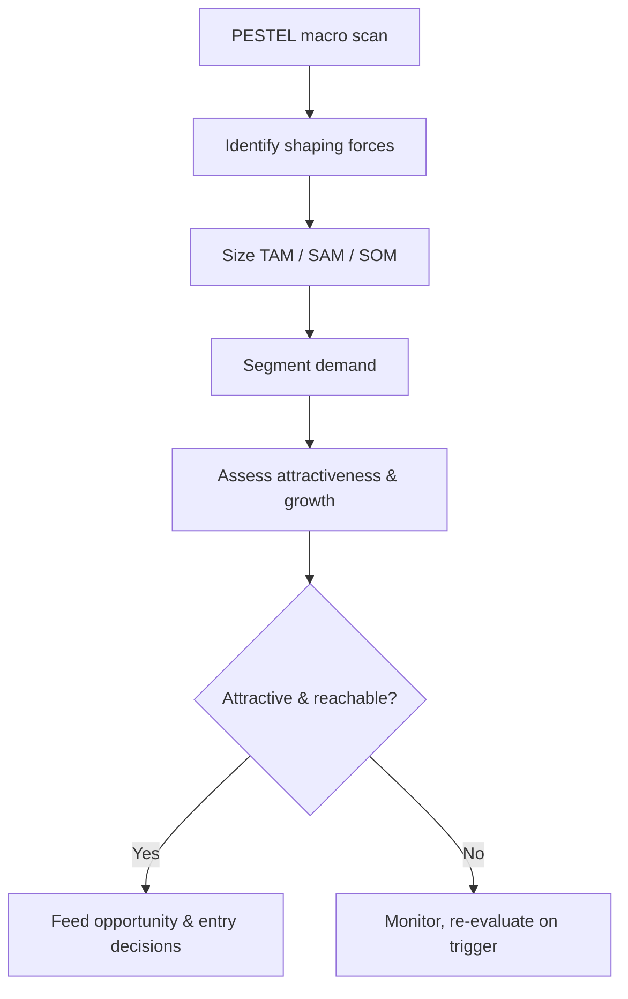

# Volume 04 - Market Intelligence

| Field | Value |
|---|---|
| Document ID | WORLD-VOL04-029 |
| Title | Market Intelligence |
| Version | 1.0 |
| Status | Approved |
| Classification | Internal |
| Founder | Mahesh Choudhary |

## Purpose

This chapter defines how WORLD understands the markets it operates in and could enter - their size, structure, growth, and the macro forces reshaping them. It provides the external context within which opportunities, competitors, and customers are interpreted.

## Scope

Covers market sizing, segmentation, trend and macro-force analysis, and market-attractiveness assessment. It excludes firm-specific competitive dynamics (Chapter 28) and individual customer behavior (Chapter 30), providing the environmental frame both operate within.

## Why This Concept Exists

From first principles, a business does not control demand; it participates in a market whose trajectory is shaped by forces larger than any single firm. Market intelligence exists to prevent the most expensive error in strategy: succeeding at execution inside a shrinking or misjudged market. Knowing whether a market is growing, consolidating, fragmenting, or being disrupted is prerequisite to any allocation of capital.

The PESTEL framework - political, economic, social, technological, environmental, legal - structures the macro forces that redraw market boundaries. These forces create and destroy markets faster than any competitor can.

## Where It Is Used

Used in market entry, portfolio allocation, sizing of opportunities, and long-range planning. It supplies the denominator (market size and growth) against which opportunity and competitive analysis are calibrated.

| Market Layer | Definition | Use |
|---|---|---|
| TAM | Total addressable market | Ceiling of ambition |
| SAM | Serviceable addressable market | Realistic reachable demand |
| SOM | Serviceable obtainable market | Near-term capture target |
| Segment | Homogeneous demand cluster | Targeting and positioning |

## How WORLD Implements It

WORLD maintains market models as living structures that combine sizing, segmentation, and macro-trend tracking, updated as new data arrives rather than rebuilt annually.

Attractiveness is scored across growth, size, accessibility, and structural health, producing comparable views across candidate markets.

## Relationship with the AI Business Partner

The AI Business Partner continuously scans macro signals through the PESTEL lens, updates market sizing and segmentation as evidence changes, and alerts the firm when a shaping force crosses a threshold that alters market attractiveness. It keeps the strategic picture current so decisions rest on today's market reality, not last year's assumptions, and it links market shifts directly to the opportunities and risks they create.

## Relationship with ERP

Conceptually, the ERP layer provides the firm's actual sales and demand history, which anchors top-down market estimates with bottom-up reality and improves the accuracy of SOM projections. Market intelligence blends external sizing with this internal transactional truth; the ERP layer itself is specified in a later volume.

## Relationship with Business Foundation

Business Foundation defines which markets are consistent with the firm's identity and purpose. A large, growing market that conflicts with the mission of Volume 02 is out of scope regardless of attractiveness, ensuring market pursuit reinforces rather than dilutes the business.

## Example

An industrial sensor manufacturer weighs expansion. Market intelligence sizes two candidate markets and applies PESTEL: the first, larger market faces tightening environmental regulation that will commoditize its offering; the second, smaller market is being expanded by the same regulation, which mandates monitoring the firm's sensors provide. Despite its smaller TAM, the second market scores higher on growth and structural health, redirecting the entry decision toward the regulation-driven tailwind.

## Cross-References

- [Opportunity Discovery](/docs/blueprint/volume-04-business-intelligence-and-decision-science/section-d-strategic-intelligence/27-opportunity-discovery.md)
- [Competitive Analysis](/docs/blueprint/volume-04-business-intelligence-and-decision-science/section-d-strategic-intelligence/28-competitive-analysis.md)
- [Customer Intelligence](/docs/blueprint/volume-04-business-intelligence-and-decision-science/section-d-strategic-intelligence/30-customer-intelligence.md)

## References

- [Volume 01 - Vision and Philosophy](/docs/blueprint/volume-01-vision-and-philosophy/README.md)
- [Document Standards](/docs/governance/document-standards.md)

## Change Log

| Version | Date | Author | Notes |
|---|---|---|---|
| 1.0 | 2026-07-12 | Lead Software Engineer | Initial approved version. |
