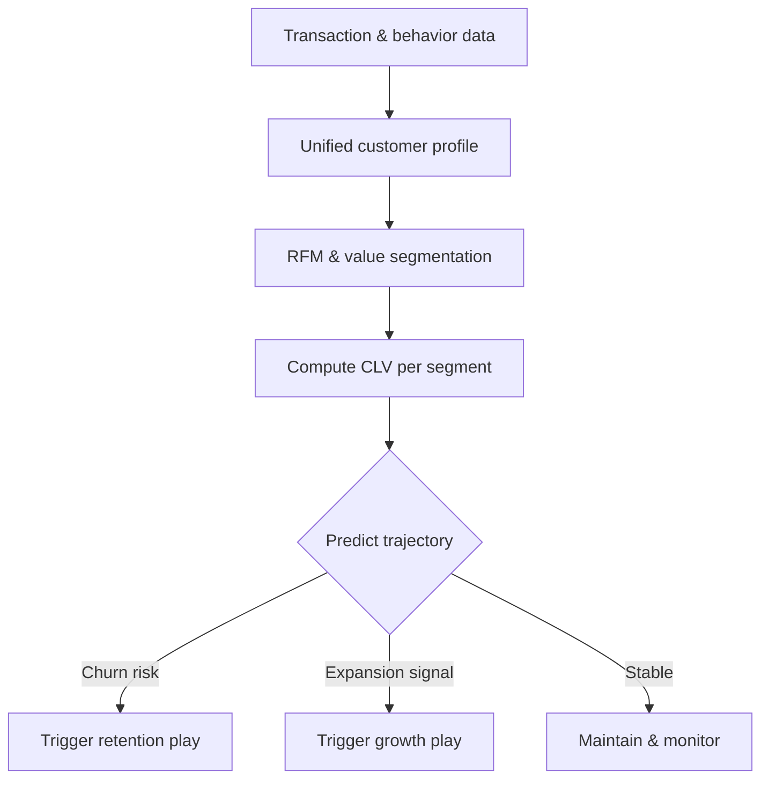

# Volume 04 - Customer Intelligence

| Field | Value |
|---|---|
| Document ID | WORLD-VOL04-030 |
| Title | Customer Intelligence |
| Version | 1.0 |
| Status | Approved |
| Classification | Internal |
| Founder | Mahesh Choudhary |

## Purpose

This chapter defines how WORLD understands customers as the source of all value - who they are, what they need, how they behave, and what they are worth over time. It turns transactional and behavioral data into segmentation, prediction, and prioritization.

## Scope

Covers customer segmentation, lifetime value, behavioral and needs analysis, and churn and expansion prediction. It excludes aggregate market sizing (Chapter 29) and operational fulfillment, focusing on understanding customers rather than serving them mechanically.

## Why This Concept Exists

From first principles, a business exists only because customers exchange value for what it offers. All revenue, and therefore all strategy, traces back to customer decisions. Customer intelligence exists because customers are not homogeneous: a small share often drives most value, needs differ sharply across segments, and behavior is predictive of future revenue. Treating all customers identically wastes resources on low-value relationships and under-invests in high-value ones.

Established tools - RFM (recency, frequency, monetary) segmentation, customer lifetime value, and Jobs-to-be-Done - give structure to this understanding.

## Where It Is Used

Used in targeting, product prioritization, retention strategy, pricing, and resource allocation across the customer base. It feeds opportunity discovery and market intelligence with ground-level demand truth.

| Technique | What It Answers | Decision Enabled |
|---|---|---|
| RFM segmentation | Who is most engaged and valuable now? | Targeting, retention focus |
| Customer Lifetime Value | What is a relationship worth over time? | Acquisition spend limits |
| Jobs to be Done | What outcome is the customer buying? | Product and messaging |
| Churn prediction | Who is at risk of leaving? | Proactive intervention |
| Expansion propensity | Who can grow? | Upsell prioritization |

## How WORLD Implements It

WORLD maintains a unified customer model that combines identity, behavior, and value into dynamic segments, continuously updated as customers act.

Segments are not static labels; customers move between them as behavior changes, and the strategy attached to each segment moves with them.

## Relationship with the AI Business Partner

The AI Business Partner maintains the living customer model, recomputes segments and lifetime value as behavior shifts, and predicts churn and expansion before they occur. It translates these predictions into recommended actions - which relationships to defend, grow, or deprioritize - and presents them to the human owner with the evidence and expected value behind each, making customer strategy proactive rather than reactive.

## Relationship with ERP

Conceptually, the ERP layer is the authoritative source of customer transactions, orders, and billing history that customer intelligence analyzes. Customer intelligence adds behavioral and predictive interpretation on top of that transactional record; the ERP layer itself is defined in a later volume without invented specifics here.

## Relationship with Business Foundation

Business Foundation defines who the firm exists to serve and the standards of that relationship. Customer intelligence operates within that definition - optimizing value from the right customers as Volume 02 defines them, never pursuing value in ways that violate the firm's commitments to those customers.

## Example

A subscription fitness platform applies RFM and CLV analysis and discovers that 18% of members generate 62% of lifetime value, while a large low-frequency segment drives disproportionate support cost. Churn prediction flags a decline in login recency among high-value members before cancellations occur. The AI Business Partner triggers a targeted re-engagement play for that at-risk high-value segment and shifts acquisition spend toward look-alikes of the profitable cohort, improving net revenue retention.

## Cross-References

- [Market Intelligence](/docs/blueprint/volume-04-business-intelligence-and-decision-science/section-d-strategic-intelligence/29-market-intelligence.md)
- [Opportunity Discovery](/docs/blueprint/volume-04-business-intelligence-and-decision-science/section-d-strategic-intelligence/27-opportunity-discovery.md)
- [Financial Intelligence](/docs/blueprint/volume-04-business-intelligence-and-decision-science/section-d-strategic-intelligence/31-financial-intelligence.md)

## References

- [Volume 01 - Vision and Philosophy](/docs/blueprint/volume-01-vision-and-philosophy/README.md)
- [Document Standards](/docs/governance/document-standards.md)

## Change Log

| Version | Date | Author | Notes |
|---|---|---|---|
| 1.0 | 2026-07-12 | Lead Software Engineer | Initial approved version. |
