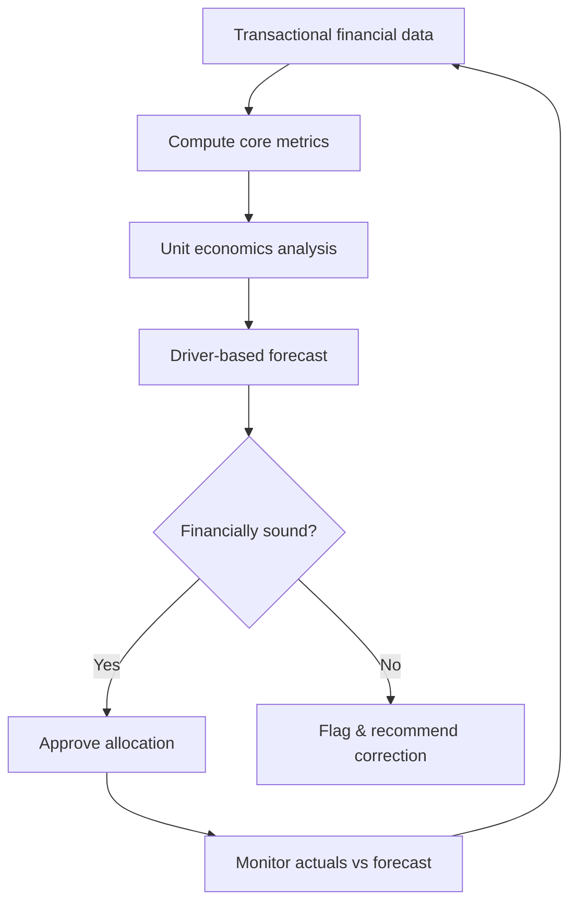

# Volume 04 - Financial Intelligence

| Field | Value |
|---|---|
| Document ID | WORLD-VOL04-031 |
| Title | Financial Intelligence |
| Version | 1.0 |
| Status | Approved |
| Classification | Internal |
| Founder | Mahesh Choudhary |

## Purpose

This chapter defines how WORLD understands the financial state and trajectory of the business - profitability, liquidity, unit economics, and the drivers behind them. It converts accounting records into forward-looking financial insight that informs strategic choice.

## Scope

Covers financial analysis, unit economics, forecasting, capital allocation logic, and financial health assessment. It excludes bookkeeping and transaction processing, which are ERP concerns, and focuses on interpretation and decision support.

## Why This Concept Exists

From first principles, money is the universal constraint and the universal scorecard of a business. Every strategy consumes cash and must eventually return more than it consumes. Financial intelligence exists to answer whether the business is creating value, whether it can survive its own growth, and where the next unit of capital earns the most. Accounting records the past; financial intelligence interprets it and projects the future.

Unit economics - contribution margin, customer acquisition cost, payback period, and lifetime-value-to-acquisition-cost ratio - reveal whether a business model works before scale amplifies the answer in either direction.

## Where It Is Used

Used in budgeting, pricing, investment decisions, fundraising, and any evaluation of whether a strategy is financially sound. It is the quantitative gate through which strategic commitments pass.

| Lens | Metric Examples | Question |
|---|---|---|
| Profitability | Gross margin, operating margin | Do we earn more than we spend? |
| Unit economics | CAC, LTV, payback, contribution | Does each unit create value? |
| Liquidity | Cash runway, burn, current ratio | Can we survive near-term? |
| Efficiency | ROIC, asset turnover | How well is capital used? |
| Growth quality | Net revenue retention, rule of 40 | Is growth durable and efficient? |

## How WORLD Implements It

WORLD maintains a continuously updated financial model that connects operational drivers to financial outcomes, so leaders see not just what happened but why and what will happen if a driver changes.

Forecasts are driver-based rather than trend-extrapolated, so a change in a customer or operational assumption flows through to the financial projection automatically.

## Relationship with the AI Business Partner

The AI Business Partner keeps the financial model live, recomputes unit economics and runway as conditions change, and stress-tests every major strategic option against its financial consequences before commitment. It alerts the founder when a metric crosses a threshold - runway shortening, margins compressing, payback lengthening - and explains the driver behind the change, turning finance from a rear-view report into a forward-looking advisor.

## Relationship with ERP

Conceptually, the ERP layer is the transactional system of record for financial data - invoices, payments, ledgers - that financial intelligence reads and interprets. Financial intelligence is the analytical layer above it, adding forecasting and decision logic; the ERP layer itself is specified in a later volume without invented detail here.

## Relationship with Business Foundation

Business Foundation defines the financial philosophy of the firm - its stance on profitability versus growth, acceptable leverage, and definition of long-term value. Financial intelligence operates within these principles, optimizing toward the value definition set in Volume 02 rather than a generic short-term maximum.

## Example

A direct-to-consumer brand shows strong revenue growth but the AI Business Partner flags deteriorating unit economics: acquisition cost has risen while contribution margin fell after a shipping cost increase, pushing payback beyond runway tolerance. Driver-based forecasting shows the current trajectory exhausts cash in nine months. The recommendation reprices the entry product and shifts spend to higher-LTV channels, restoring an LTV-to-CAC ratio above the firm's threshold before scaling resumes.

## Cross-References

- [Customer Intelligence](/docs/blueprint/volume-04-business-intelligence-and-decision-science/section-d-strategic-intelligence/30-customer-intelligence.md)
- [Operational Intelligence](/docs/blueprint/volume-04-business-intelligence-and-decision-science/section-d-strategic-intelligence/32-operational-intelligence.md)
- [Strategic Thinking Framework](/docs/blueprint/volume-04-business-intelligence-and-decision-science/section-d-strategic-intelligence/26-strategic-thinking-framework.md)

## References

- [Volume 01 - Vision and Philosophy](/docs/blueprint/volume-01-vision-and-philosophy/README.md)
- [Document Standards](/docs/governance/document-standards.md)

## Change Log

| Version | Date | Author | Notes |
|---|---|---|---|
| 1.0 | 2026-07-12 | Lead Software Engineer | Initial approved version. |
