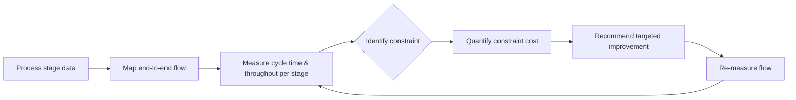

# Volume 04 - Operational Intelligence

| Field | Value |
|---|---|
| Document ID | WORLD-VOL04-032 |
| Title | Operational Intelligence |
| Version | 1.0 |
| Status | Approved |
| Classification | Internal |
| Founder | Mahesh Choudhary |

## Purpose

This chapter defines how WORLD understands how work actually flows through the business - processes, throughput, quality, and bottlenecks. It converts operational data into insight about efficiency, capacity, and the constraints limiting performance.

## Scope

Covers process and workflow analysis, throughput and cycle-time measurement, bottleneck and constraint identification, and quality and efficiency assessment. It excludes financial interpretation (Chapter 31) and customer analysis (Chapter 30), focusing on the mechanics of value delivery.

## Why This Concept Exists

From first principles, a business is a set of processes that transform inputs into value for customers. Strategy is only as good as the operation that delivers it. Operational intelligence exists because performance is limited by constraints - the Theory of Constraints shows that a system's throughput is governed by its bottleneck, and improving anything other than the bottleneck yields no gain. Without visibility into where work slows, stalls, or degrades, a business optimizes the wrong things and mistakes busyness for productivity.

Established lenses - Lean's focus on waste, Six Sigma's focus on variation, and cycle-time analysis - structure this understanding of operational health.

## Where It Is Used

Used in capacity planning, process improvement, service-level management, and scaling decisions. It reveals whether the operation can support a strategic commitment before that commitment is made.

| Dimension | Metric Examples | Reveals |
|---|---|---|
| Throughput | Units per period | Capacity |
| Cycle time | Time per unit of work | Speed and delay |
| Quality | Defect / rework rate | Reliability |
| Utilization | Resource load | Slack or overload |
| Constraint | Bottleneck location | Where to improve |

## How WORLD Implements It

WORLD models operations as flows with measured stages, making bottlenecks visible and quantifying the cost of each constraint rather than relying on anecdote.

Because the constraint moves once relieved, the loop is continuous: improvement re-measures and re-locates the new binding constraint.

## Relationship with the AI Business Partner

The AI Business Partner continuously monitors operational flows, locates the current constraint, and quantifies what relieving it is worth. It distinguishes genuine improvement opportunities from local optimizations that would not raise system throughput, and recommends where operational investment yields real capacity - ensuring the human owner improves the bottleneck, not merely the most visible or most complained-about step.

## Relationship with ERP

Conceptually, the ERP layer records the operational transactions - production, inventory, orders, fulfillment - that operational intelligence analyzes for flow and constraint. Operational intelligence is the interpretive layer that turns those transactional events into throughput and bottleneck insight; the ERP layer itself is defined in a later volume.

## Relationship with Business Foundation

Business Foundation defines the standards of quality and the operating principles the business holds itself to. Operational intelligence optimizes efficiency within those standards, never trading away the quality or values commitments established in Volume 02 for raw throughput.

## Example

A custom furniture maker struggles to meet delivery promises despite adding staff. Operational intelligence maps the flow and finds the constraint is a single finishing station, not assembly where labor was added. Cycle-time data shows work-in-progress piling before finishing. Relieving that one constraint - a second finishing station - is quantified to lift total throughput by 30%, far exceeding the value of the earlier assembly hires, which had simply grown the queue in front of the real bottleneck.

## Cross-References

- [Financial Intelligence](/docs/blueprint/volume-04-business-intelligence-and-decision-science/section-d-strategic-intelligence/31-financial-intelligence.md)
- [Risk Intelligence](/docs/blueprint/volume-04-business-intelligence-and-decision-science/section-d-strategic-intelligence/33-risk-intelligence.md)
- [Strategic Thinking Framework](/docs/blueprint/volume-04-business-intelligence-and-decision-science/section-d-strategic-intelligence/26-strategic-thinking-framework.md)

## References

- [Volume 01 - Vision and Philosophy](/docs/blueprint/volume-01-vision-and-philosophy/README.md)
- [Document Standards](/docs/governance/document-standards.md)

## Change Log

| Version | Date | Author | Notes |
|---|---|---|---|
| 1.0 | 2026-07-12 | Lead Software Engineer | Initial approved version. |
