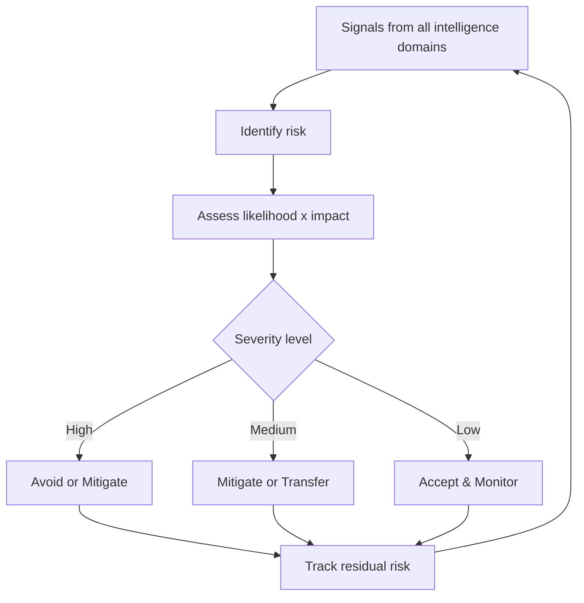

# Volume 04 - Risk Intelligence

| Field | Value |
|---|---|
| Document ID | WORLD-VOL04-033 |
| Title | Risk Intelligence |
| Version | 1.0 |
| Status | Approved |
| Classification | Internal |
| Founder | Mahesh Choudhary |

## Purpose

This chapter defines how WORLD identifies, assesses, and manages the uncertainties that threaten the business - and the exposures that accompany opportunity. It converts scattered concerns into a structured risk model that informs resilient decision-making.

## Scope

Covers risk identification, assessment (likelihood and impact), mitigation strategy, and continuous monitoring. It spans strategic, operational, financial, and external risk. It excludes detailed control implementation, focusing on understanding and prioritizing exposure.

## Why This Concept Exists

From first principles, every decision is made under uncertainty, and uncertainty cuts both ways - it creates opportunity and threatens survival. Risk intelligence exists because unmanaged downside can end a business regardless of how well it performs elsewhere; a single catastrophic exposure can erase years of gains. The discipline is not to avoid all risk - that forfeits return - but to take risk knowingly, price it, and ensure no single failure is fatal.

Established practice frames risk on two axes, likelihood and impact, and distinguishes risks that can be mitigated, transferred, accepted, or avoided.

## Where It Is Used

Used in strategic planning, investment decisions, operational continuity, and compliance. Every strategic commitment carries a risk assessment, and every intelligence domain feeds risk signals into this layer.

| Response | When Appropriate | Example |
|---|---|---|
| Avoid | High likelihood, high impact | Exit an unstable market |
| Mitigate | Reducible exposure | Add redundancy to supply |
| Transfer | Insurable / shiftable | Insurance, hedging, contracts |
| Accept | Low impact or unavoidable | Minor operational variance |

## How WORLD Implements It

WORLD maintains a living risk register where each risk is an object scored by likelihood and impact, mapped to a response, and monitored for changes in its status.

Risks are prioritized by severity so attention concentrates on exposures that are both likely and consequential, while trivial concerns do not crowd out judgment.

## Relationship with the AI Business Partner

The AI Business Partner continuously scans every intelligence domain for emerging risk, scores exposures on likelihood and impact, and maintains the risk register in real time. It stress-tests strategic options for their downside and ensures no recommended commitment carries an un-surfaced catastrophic exposure. It alerts the founder when a risk changes severity, converting risk management from a periodic audit into constant vigilance that protects the business without paralyzing it.

## Relationship with ERP

Conceptually, the ERP layer surfaces operational and financial risk signals - concentration in a single customer or supplier, liquidity strain, inventory exposure - that risk intelligence interprets. Risk intelligence is the analytical layer that turns those transactional patterns into assessed, prioritized exposure; the ERP layer itself is defined in a later volume.

## Relationship with Business Foundation

Business Foundation defines the firm's risk appetite - how much uncertainty it is willing to bear in pursuit of its mission. Risk intelligence assesses exposures against that appetite from Volume 02, ensuring the business neither recklessly exceeds nor timidly falls short of the risk posture its identity implies.

## Example

A specialty food producer discovers through risk assessment that 70% of a key ingredient comes from a single region exposed to drought - a high-impact, rising-likelihood risk. Rather than accept it, the response is to mitigate through a qualified second supplier and transfer residual exposure via a supply contract with price protection. When a drought later disrupts the primary source, the diversified supply keeps production running while competitors dependent on the single region face shortages.

## Cross-References

- [Competitive Analysis](/docs/blueprint/volume-04-business-intelligence-and-decision-science/section-d-strategic-intelligence/28-competitive-analysis.md)
- [Operational Intelligence](/docs/blueprint/volume-04-business-intelligence-and-decision-science/section-d-strategic-intelligence/32-operational-intelligence.md)
- [Financial Intelligence](/docs/blueprint/volume-04-business-intelligence-and-decision-science/section-d-strategic-intelligence/31-financial-intelligence.md)

## References

- [Volume 01 - Vision and Philosophy](/docs/blueprint/volume-01-vision-and-philosophy/README.md)
- [Document Standards](/docs/governance/document-standards.md)

## Change Log

| Version | Date | Author | Notes |
|---|---|---|---|
| 1.0 | 2026-07-12 | Lead Software Engineer | Initial approved version. |
