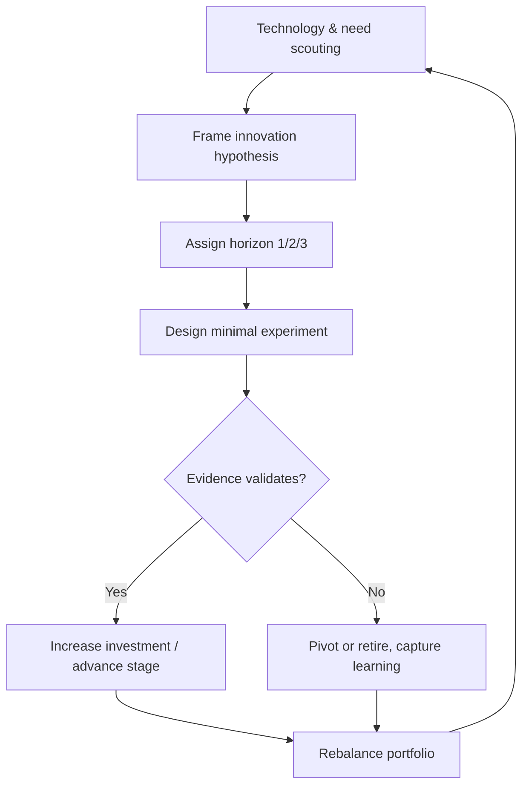

# Volume 04 - Innovation Intelligence

| Field | Value |
|---|---|
| Document ID | WORLD-VOL04-034 |
| Title | Innovation Intelligence |
| Version | 1.0 |
| Status | Approved |
| Classification | Internal |
| Founder | Mahesh Choudhary |

## Purpose

This chapter defines how WORLD understands and directs innovation - the deliberate creation of new value through better products, models, and capabilities. It converts emerging technology and unmet need into a managed portfolio of innovation bets balanced against the core business.

## Scope

Covers innovation portfolio management, technology and trend scouting, experimentation and validation, and the balance between sustaining and disruptive innovation. It excludes routine product delivery, focusing on how the firm renews its sources of advantage over time.

## Why This Concept Exists

From first principles, every advantage decays. Markets shift, technologies advance, and customer needs evolve, so a business that only optimizes its present model eventually becomes obsolete. Innovation intelligence exists to ensure the firm renews itself faster than its advantages erode. It addresses the innovator's dilemma: the same discipline that makes a core business efficient tends to starve the disruptive bets that secure its future.

Established frameworks structure this: the Three Horizons model balances today's core, tomorrow's adjacencies, and future transformation, while the distinction between sustaining and disruptive innovation clarifies the type of bet being made.

## Where It Is Used

Used in R&D allocation, product roadmap balancing, business-model experimentation, and long-term strategic renewal. It ensures a portion of resources is always invested in the firm's future, not only its present.

| Horizon | Focus | Risk / Return | Resource Posture |
|---|---|---|---|
| Horizon 1 | Core business | Low risk, defend margin | Majority of resources |
| Horizon 2 | Emerging adjacencies | Medium risk, build growth | Meaningful minority |
| Horizon 3 | Transformational bets | High risk, option value | Small, protected pool |

## How WORLD Implements It

WORLD manages innovation as a portfolio of hypotheses tested through cheap, staged experiments, where funding is released as evidence accumulates rather than committed up front.

This staged-funding model treats each innovation as a real option: small early bets buy the right, not the obligation, to invest more as uncertainty resolves.

## Relationship with the AI Business Partner

The AI Business Partner scouts emerging technologies and shifting needs, frames innovation hypotheses, and maintains balance across the three horizons so the firm never over-invests in the present at the expense of its future. It designs and evaluates cheap experiments, releasing or withholding further investment based on evidence, and captures learning from retired bets - making innovation a disciplined, compounding portfolio rather than sporadic inspiration.

## Relationship with ERP

Conceptually, the ERP layer grounds innovation in the economics of the core business - showing which products and processes generate the margin that funds Horizon 2 and 3 bets, and providing the baseline against which innovation impact is measured. Innovation intelligence draws on that transactional truth while the ERP layer itself is defined in a later volume.

## Relationship with Business Foundation

Business Foundation defines the firm's purpose and the direction its renewal should serve. Innovation intelligence pursues new value within that purpose from Volume 02, ensuring transformation strengthens the firm's identity rather than scattering it across unrelated ventures chasing novelty for its own sake.

## Example

A legacy accounting-software firm sees its core desktop product mature (Horizon 1). Innovation intelligence scouts the shift to AI-assisted bookkeeping and frames a Horizon 2 adjacency - an intelligent reconciliation service - plus a Horizon 3 bet on autonomous financial operations. Small experiments validate strong demand for the reconciliation service, which receives expanded funding, while the autonomous bet remains a small protected option. The firm renews its growth engine before the desktop core declines, avoiding the innovator's dilemma.

## Cross-References

- [Opportunity Discovery](/docs/blueprint/volume-04-business-intelligence-and-decision-science/section-d-strategic-intelligence/27-opportunity-discovery.md)
- [Market Intelligence](/docs/blueprint/volume-04-business-intelligence-and-decision-science/section-d-strategic-intelligence/29-market-intelligence.md)
- [Strategic Thinking Framework](/docs/blueprint/volume-04-business-intelligence-and-decision-science/section-d-strategic-intelligence/26-strategic-thinking-framework.md)

## References

- [Volume 01 - Vision and Philosophy](/docs/blueprint/volume-01-vision-and-philosophy/README.md)
- [Document Standards](/docs/governance/document-standards.md)

## Change Log

| Version | Date | Author | Notes |
|---|---|---|---|
| 1.0 | 2026-07-12 | Lead Software Engineer | Initial approved version. |
