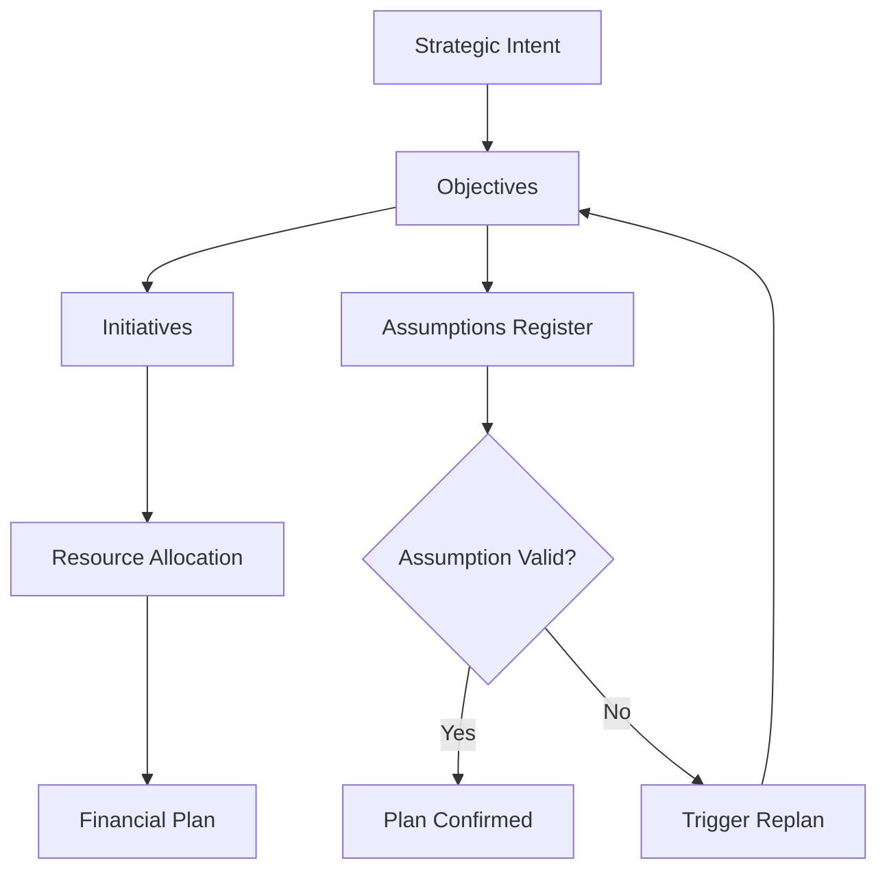

# Volume 04 - Business Planning

| Field | Value |
|---|---|
| Document ID | WORLD-VOL04-035 |
| Title | Business Planning |
| Version | 1.0 |
| Status | Approved |
| Classification | Internal |
| Founder | Mahesh Choudhary |

## Purpose

Business planning is the discipline of translating strategic intent into a coherent, time-bound, and resourced set of commitments. This chapter defines how WORLD treats business planning as a first-class intelligence capability rather than an annual ritual document. It establishes the conceptual model, the data structures, and the reasoning patterns the AI Business Partner uses to help an operator move from ambition to an executable plan.

## Scope

This chapter covers the enterprise-level planning artefact: the integrated plan that binds objectives, initiatives, resources, financial expectations, and assumptions. It does not cover goal decomposition (Chapter 36), scenario modelling (Chapter 37), or the forecasting engines (Chapters 39-42), each of which feeds the plan. It addresses planning as a structured, versioned, continuously re-evaluated object.

## First Principles

A plan is a hypothesis about the future expressed as a set of allocations. Every plan encodes three things: what outcomes are sought, what actions are believed to produce them, and what resources those actions consume. When any of these three drift from reality, the plan loses validity. Traditional planning fails because these elements are captured once, in static documents, and rarely reconciled against actuals. WORLD models a plan as a living graph of linked assumptions, commitments, and measurements so that drift is detectable and correctable.

## Why This Concept Exists

Organisations coordinate distributed effort. Without a shared, explicit plan, effort fragments: teams optimise locally, resources are double-committed, and outcomes cannot be attributed to decisions. Business planning exists to make intent legible and coordination possible. In WORLD it exists so that a single operator, augmented by the AI Business Partner, can hold the coherence that a large planning department traditionally provided.

## Where It Is Used

Business planning is invoked at company inception, at periodic review cycles, when material assumptions change, and whenever a significant resource commitment is proposed. It is the reference object for prioritisation, hiring, budgeting, and go/no-go decisions.

| Planning Horizon | Primary Question | Typical Cadence | Owner |
|---|---|---|---|
| Annual | What will we commit to this year? | Yearly, revised quarterly | Operator |
| Quarterly | What must be true this quarter? | Every 90 days | Operator + AI Partner |
| Rolling | Are our assumptions still valid? | Continuous | AI Partner |

## How WORLD Implements It

WORLD represents the plan as a structured object with explicit links to its inputs and its measured outcomes. The AI Business Partner maintains this object, surfaces assumption drift, and proposes revisions.

## Relationship with the AI Business Partner

The AI Business Partner is the custodian of the plan. It drafts initial plans from stated intent, challenges weak assumptions, keeps the plan reconciled against live signals, and prompts replanning when thresholds are breached. It converts the plan from a static artefact into a conversation the operator can hold at any time.

## Relationship with ERP

An ERP layer (defined in a later volume) will provide the transactional ground truth - actual spend, headcount, and delivery - against which the plan is measured. Conceptually, the plan sets expectations and the ERP records realisations; WORLD reconciles the two continuously. The relationship is bidirectional: plans constrain ERP commitments, and ERP actuals correct plans.

## Relationship with Business Foundation

Business Foundation (Volume 02) supplies the identity, model, and constraints of the business - its purpose, offerings, and operating boundaries. The plan is only valid within that foundation. Objectives must trace to the foundation's stated purpose, and resource limits derive from the foundation's declared capacity.

## Concrete Example

A specialty coffee roaster declares intent to double wholesale revenue in one year. WORLD generates a plan: objective (double wholesale revenue), initiatives (add two regional distributors, expand roasting capacity), resource allocation (one sales hire, one roaster), and an assumptions register (distributor pipeline conversion holds at historical levels; green-bean prices stay within a defined band). When bean prices breach the band mid-year, the AI Business Partner flags the assumption as invalidated and proposes a replan before margin erodes.

## Cross-References

- [Goal Planning](/docs/blueprint/volume-04-business-intelligence-and-decision-science/section-e-planning-and-forecasting/36-goal-planning.md)
- [Scenario Planning](/docs/blueprint/volume-04-business-intelligence-and-decision-science/section-e-planning-and-forecasting/37-scenario-planning.md)
- [Long-Term Planning](/docs/blueprint/volume-04-business-intelligence-and-decision-science/section-e-planning-and-forecasting/43-long-term-planning.md)

## References

- [Volume 01 - Vision and Philosophy](/docs/blueprint/volume-01-vision-and-philosophy/README.md)
- [Document Standards](/docs/governance/document-standards.md)

## Change Log

| Version | Date | Author | Notes |
|---|---|---|---|
| 1.0 | 2026-07-12 | Lead Software Engineer | Initial approved version. |
