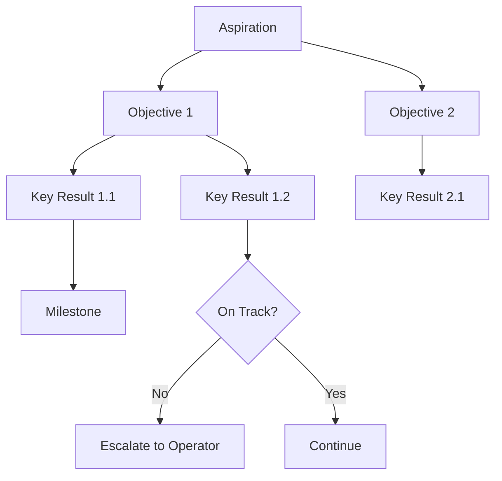

# Volume 04 - Goal Planning

| Field | Value |
|---|---|
| Document ID | WORLD-VOL04-036 |
| Title | Goal Planning |
| Version | 1.0 |
| Status | Approved |
| Classification | Internal |
| Founder | Mahesh Choudhary |

## Purpose

Goal planning is the discipline of decomposing intent into a measurable, hierarchical structure of outcomes. This chapter defines how WORLD represents goals, links them to measurement, and keeps them aligned as circumstances change. It establishes goals as the connective tissue between strategy and daily action.

## Scope

This chapter covers the definition, decomposition, weighting, and tracking of goals. It covers the relationship between goals and their supporting metrics. It does not cover the enclosing business plan (Chapter 35) or the forecasting engines that estimate whether a goal is attainable (Chapters 39-42).

## First Principles

A goal is a desired future state made measurable. For a goal to guide action it must satisfy three properties: it must be observable (we can tell whether we have reached it), it must be attributable (effort can move it), and it must be bounded (it has a time and a target). A goal that lacks any of these cannot direct behaviour. Goal planning is the act of imposing this structure and then keeping the structure honest as reality unfolds.

## Why This Concept Exists

Strategy at the top is abstract; work at the bottom is concrete. Something must bridge them. Goal planning exists to create a traceable chain from purpose to the smallest unit of measurable progress, so that any action can be justified by the goal it serves and any goal can be justified by the intent above it. Without this chain, activity substitutes for progress.

## Where It Is Used

Goals are used to prioritise work, to allocate attention, to evaluate performance, and to decide what to stop doing. They are referenced in every review cycle and in every prioritisation decision.

| Goal Level | Example | Time Horizon | Measured By |
|---|---|---|---|
| Aspiration | Become the regional market leader | Multi-year | Market share |
| Objective | Grow recurring revenue 40% | One year | ARR |
| Key Result | Reach 500 active accounts | Quarter | Active account count |
| Milestone | Launch self-serve onboarding | Weeks | Ship date |

## How WORLD Implements It

WORLD stores goals as a directed tree with explicit parent-child links, target values, weights, and bound metrics. The AI Business Partner maintains alignment scores and flags orphaned or conflicting goals.

## Relationship with the AI Business Partner

The AI Business Partner drafts goal hierarchies from stated intent, checks that every goal is observable, attributable, and bounded, detects goals that conflict or double-count, and reports progress in plain language. It nudges the operator when a goal has drifted from its parent intent or when a key result has stalled.

## Relationship with ERP

A future ERP layer supplies the operational data streams that many key results measure - transactions, deliveries, and headcount. Conceptually, goals define what to watch and the ERP supplies the observations. WORLD binds each measurable goal to the data source that will eventually confirm it.

## Relationship with Business Foundation

Every goal must trace to a purpose declared in Business Foundation (Volume 02). The foundation defines what the business is for; goal planning ensures that every measured target is in service of that declared purpose, preventing goal proliferation that pulls the business off-mission.

## Concrete Example

A boutique fitness studio sets the aspiration to become the most-loved studio in its city. WORLD decomposes this into an objective (grow monthly members from 200 to 350), key results (member retention above a defined threshold, referral rate above a defined threshold), and milestones (launch a referral programme, hire a second instructor). When retention rises but new-member acquisition stalls, the AI Business Partner shows that the aspiration is at risk despite one healthy key result, and recommends reweighting attention toward acquisition.

## Cross-References

- [Business Planning](/docs/blueprint/volume-04-business-intelligence-and-decision-science/section-e-planning-and-forecasting/35-business-planning.md)
- [Scenario Planning](/docs/blueprint/volume-04-business-intelligence-and-decision-science/section-e-planning-and-forecasting/37-scenario-planning.md)
- [Long-Term Planning](/docs/blueprint/volume-04-business-intelligence-and-decision-science/section-e-planning-and-forecasting/43-long-term-planning.md)

## References

- [Volume 01 - Vision and Philosophy](/docs/blueprint/volume-01-vision-and-philosophy/README.md)
- [Document Standards](/docs/governance/document-standards.md)

## Change Log

| Version | Date | Author | Notes |
|---|---|---|---|
| 1.0 | 2026-07-12 | Lead Software Engineer | Initial approved version. |
