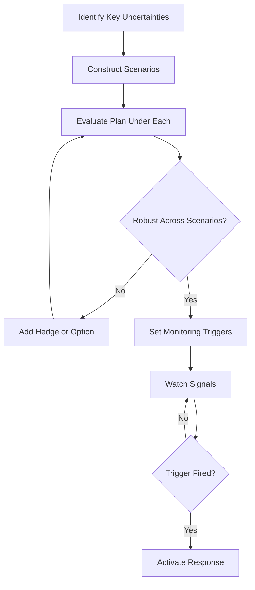

# Volume 04 - Scenario Planning

| Field | Value |
|---|---|
| Document ID | WORLD-VOL04-037 |
| Title | Scenario Planning |
| Version | 1.0 |
| Status | Approved |
| Classification | Internal |
| Founder | Mahesh Choudhary |

## Purpose

Scenario planning is the discipline of preparing for a range of plausible futures rather than betting on a single forecast. This chapter defines how WORLD constructs, compares, and monitors scenarios so that an operator can make decisions that remain sound across uncertainty.

## Scope

This chapter covers the definition of scenarios, the identification of the driving uncertainties behind them, and the decision logic for choosing robust actions. It does not produce the point forecasts themselves (Chapters 39-42); it consumes them as inputs and stress-tests the plan against their variance.

## First Principles

The future is not a single line but a distribution of possibilities. A forecast collapses that distribution into an expectation; a scenario preserves its shape. Scenario planning rests on two ideas: that a small number of uncertainties drive most of the variance in outcomes, and that a good decision is one that performs acceptably across the plausible range, not only at the expected value. The goal is not to predict which future occurs but to remain prepared for whichever does.

## Why This Concept Exists

Plans built on a single forecast are brittle: when reality diverges, the plan breaks and the organisation is caught unprepared. Scenario planning exists to build robustness and optionality into decisions, to pre-commit responses to defined triggers, and to reduce the cost and delay of reacting to surprise. It converts uncertainty from a threat into a managed variable.

## Where It Is Used

Scenario planning is invoked before major, hard-to-reverse commitments, during budgeting, when the external environment is volatile, and whenever a forecast carries wide uncertainty.

| Scenario | Key Assumption | Implication | Pre-Committed Response |
|---|---|---|---|
| Base | Demand grows as forecast | Execute plan as written | Proceed |
| Upside | Demand exceeds forecast | Capacity becomes the constraint | Pre-arrange surge capacity |
| Downside | Demand contracts | Cash runway shortens | Trigger cost-control playbook |
| Shock | Supply disruption | Delivery at risk | Activate alternate suppliers |

## How WORLD Implements It

WORLD identifies the two or three dominant uncertainties, generates a small set of internally consistent scenarios, evaluates the plan under each, and attaches monitored triggers that signal which scenario is unfolding.

## Relationship with the AI Business Partner

The AI Business Partner proposes the driving uncertainties, drafts coherent scenarios, tests the current plan against each, recommends hedges where the plan is fragile, and continuously watches trigger signals. When a trigger fires, it alerts the operator and surfaces the pre-committed response so action is fast rather than improvised.

## Relationship with ERP

A future ERP layer will provide the live operational signals - order flow, inventory, cash - that serve as scenario triggers. Conceptually, scenarios define what to watch for and the ERP provides the observations that confirm which future is materialising.

## Relationship with Business Foundation

Business Foundation (Volume 02) bounds which scenarios are relevant: the business model determines which uncertainties actually threaten the enterprise. Scenario planning draws its risk boundaries and its viable responses from the foundation's declared operating model and constraints.

## Concrete Example

An events company planning a flagship conference faces two dominant uncertainties: ticket demand and venue availability. WORLD builds four scenarios crossing high/low demand with secured/uncertain venue. It finds the plan is fragile in the high-demand, uncertain-venue case, so it recommends an option: hold a refundable secondary venue. It sets triggers on the ticket-sales curve; when early sales exceed the upside threshold, the AI Business Partner recommends confirming the secondary venue before it is lost.

## Cross-References

- [Business Planning](/docs/blueprint/volume-04-business-intelligence-and-decision-science/section-e-planning-and-forecasting/35-business-planning.md)
- [Financial Forecasting](/docs/blueprint/volume-04-business-intelligence-and-decision-science/section-e-planning-and-forecasting/39-financial-forecasting.md)
- [Risk Forecasting](/docs/blueprint/volume-04-business-intelligence-and-decision-science/section-e-planning-and-forecasting/42-risk-forecasting.md)

## References

- [Volume 01 - Vision and Philosophy](/docs/blueprint/volume-01-vision-and-philosophy/README.md)
- [Document Standards](/docs/governance/document-standards.md)

## Change Log

| Version | Date | Author | Notes |
|---|---|---|---|
| 1.0 | 2026-07-12 | Lead Software Engineer | Initial approved version. |
