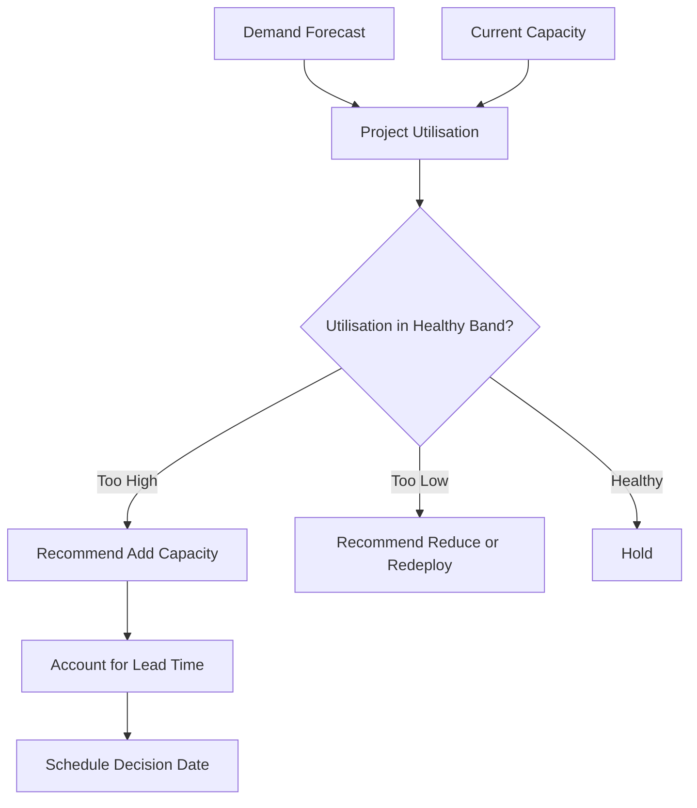

# Volume 04 - Capacity Planning

| Field | Value |
|---|---|
| Document ID | WORLD-VOL04-038 |
| Title | Capacity Planning |
| Version | 1.0 |
| Status | Approved |
| Classification | Internal |
| Founder | Mahesh Choudhary |

## Purpose

Capacity planning is the discipline of matching the organisation's ability to produce and deliver against expected demand over time. This chapter defines how WORLD models capacity, detects bottlenecks and slack, and recommends when to add, hold, or shed capacity.

## Scope

This chapter covers the modelling of productive capacity across people, equipment, and throughput constraints, and the timing of capacity decisions. It relies on demand forecasts (Chapter 40) and resource forecasts (Chapter 41) as inputs. It does not cover the estimation of demand itself.

## First Principles

Every system has a maximum sustainable throughput set by its most constrained resource. Capacity above demand is idle cost; capacity below demand is lost opportunity and degraded service. Because capacity usually changes in discrete, lead-time-bound steps while demand changes continuously, the central problem is timing: committing to capacity changes early enough to be ready, but late enough to avoid stranded cost. Capacity planning is the management of this timing against a bottleneck.

## Why This Concept Exists

Unmanaged capacity produces two chronic failures: overload, which erodes quality and burns out people, and underuse, which wastes money. Capacity planning exists to keep utilisation inside a healthy band, to give lead-time-bound decisions enough runway, and to make the bottleneck explicit so investment targets the constraint rather than the loudest complaint.

## Where It Is Used

Capacity planning is used in hiring decisions, equipment investment, service-level commitments, and in deciding whether to accept new work. It is reviewed whenever demand forecasts shift materially.

| Resource Type | Capacity Measure | Lead Time to Change | Bottleneck Risk |
|---|---|---|---|
| Skilled staff | Billable hours/week | Weeks to months | High |
| Equipment | Units/day | Weeks | Medium |
| Facility | Floor area | Months | Low |
| Software throughput | Transactions/second | Days | Medium |

## How WORLD Implements It

WORLD models each resource's sustainable capacity, overlays the demand forecast, computes projected utilisation, identifies the binding constraint, and recommends capacity actions with their lead times.

## Relationship with the AI Business Partner

The AI Business Partner maintains the capacity model, continuously compares projected utilisation to a healthy band, identifies the current bottleneck, and issues timed recommendations so lead-time-bound decisions are not made too late. It frames capacity trade-offs in terms of service risk versus idle cost so the operator can choose deliberately.

## Relationship with ERP

A future ERP layer will record actual utilisation, output, and resource availability. Conceptually, capacity planning sets the target envelope and the ERP reports realised load against it, letting WORLD recalibrate the capacity model with real throughput data.

## Relationship with Business Foundation

Business Foundation (Volume 02) declares the operating model, service standards, and resource constraints that define what capacity means for this business. Capacity planning enforces those declared standards - for example, a quality-first foundation implies a lower target utilisation band to preserve headroom.

## Concrete Example

A design agency has five designers, each sustainably delivering a set number of project-hours per week. The demand forecast shows signed work rising toward 110% of current capacity in two months. Designer hiring has a six-week lead time. The AI Business Partner flags that utilisation will breach the healthy band, identifies senior-designer hours as the bottleneck, and recommends starting a hire now or declining a specified tier of new work - presenting the idle-cost versus lost-revenue trade-off explicitly.

## Cross-References

- [Demand Forecasting](/docs/blueprint/volume-04-business-intelligence-and-decision-science/section-e-planning-and-forecasting/40-demand-forecasting.md)
- [Resource Forecasting](/docs/blueprint/volume-04-business-intelligence-and-decision-science/section-e-planning-and-forecasting/41-resource-forecasting.md)
- [Business Planning](/docs/blueprint/volume-04-business-intelligence-and-decision-science/section-e-planning-and-forecasting/35-business-planning.md)

## References

- [Volume 01 - Vision and Philosophy](/docs/blueprint/volume-01-vision-and-philosophy/README.md)
- [Document Standards](/docs/governance/document-standards.md)

## Change Log

| Version | Date | Author | Notes |
|---|---|---|---|
| 1.0 | 2026-07-12 | Lead Software Engineer | Initial approved version. |
