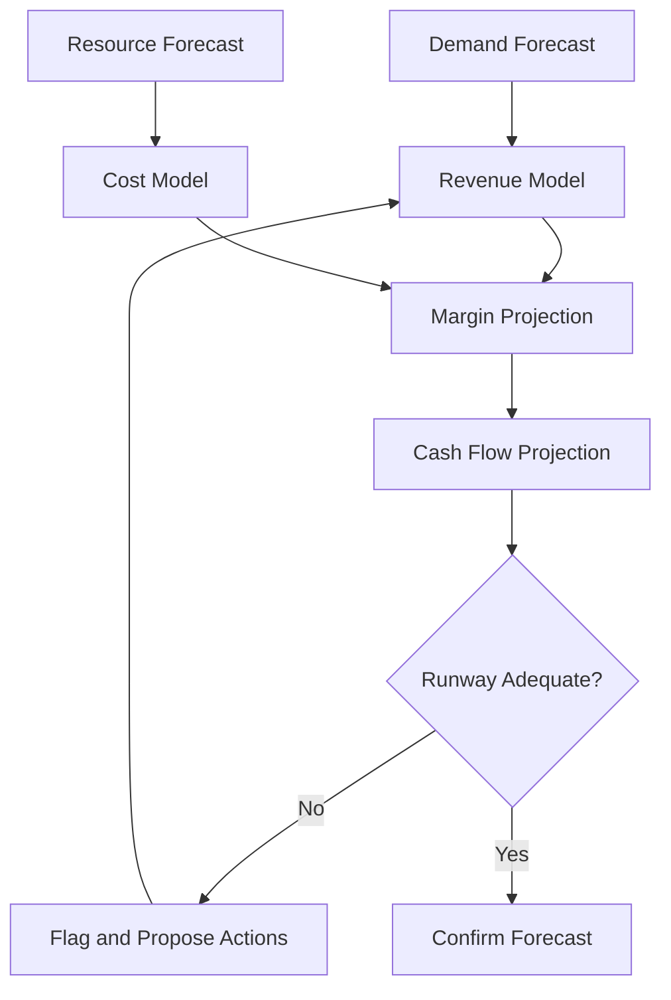

# Volume 04 - Financial Forecasting

| Field | Value |
|---|---|
| Document ID | WORLD-VOL04-039 |
| Title | Financial Forecasting |
| Version | 1.0 |
| Status | Approved |
| Classification | Internal |
| Founder | Mahesh Choudhary |

## Purpose

Financial forecasting is the discipline of projecting the future financial state of the business - revenue, cost, margin, cash, and runway - under stated assumptions. This chapter defines how WORLD builds, explains, and continuously reconciles financial forecasts as decision-support instruments rather than static spreadsheets.

## Scope

This chapter covers the projection of the primary financial statements and cash position. It covers the methods used and how their assumptions are made explicit. It does not cover demand estimation (Chapter 40) or resource cost estimation (Chapter 41), which feed the financial forecast as drivers.

## First Principles

A financial forecast is a chain of arithmetic anchored to a small number of business drivers. Revenue is a function of volume and price; cost is a function of activity and unit cost; cash is the timed net of the two plus financing. The credibility of a forecast rests entirely on the credibility of its drivers and the transparency of the arithmetic linking them. A forecast is therefore not a number but a model whose assumptions can be inspected, challenged, and updated.

## Why This Concept Exists

Money is the constraint that ends businesses. Financial forecasting exists to make the consequences of decisions visible before they are irreversible - to answer whether the business can afford a plan, when cash will run short, and what margin a course of action will yield. It converts operational plans into their financial shadow so trade-offs are quantifiable.

## Where It Is Used

Financial forecasting is used in budgeting, fundraising, pricing, hiring, and any decision with a material cash consequence. It is reviewed continuously against actuals.

| Method | Basis | Best For | Limitation |
|---|---|---|---|
| Driver-based | Volume x price, activity x unit cost | Explaining and stress-testing | Requires reliable drivers |
| Time-series | Historical financial patterns | Stable, mature lines | Blind to structural change |
| Qualitative | Expert and operator judgement | New ventures, few data points | Subject to bias |

WORLD favours driver-based forecasting because its assumptions are inspectable; time-series and qualitative methods supplement it where drivers are thin.

## How WORLD Implements It

WORLD assembles the forecast from explicit drivers, links each line to its assumption, projects the statements and cash curve, and reconciles the projection against actuals as they arrive.

## Relationship with the AI Business Partner

The AI Business Partner constructs the driver-based model, makes every assumption explicit, projects statements and cash, and continuously compares forecast to actuals to detect drift. It explains variances in plain language, warns of runway risk early, and proposes corrective actions rather than merely reporting a shortfall.

## Relationship with ERP

A future ERP layer will hold the ledger of actual financial transactions. Conceptually, the forecast expresses expected financial reality and the ERP records the realised one; WORLD reconciles the two so each period's variance sharpens the next forecast. The forecast should never fabricate results - it projects, and the ERP confirms.

## Relationship with Business Foundation

Business Foundation (Volume 02) defines the revenue model, cost structure, and financial policies of the business. Financial forecasting inherits its driver definitions and its policy constraints - for instance, a foundation that prohibits debt bounds the financing lines available to the cash projection.

## Concrete Example

A subscription software business builds a driver-based forecast: new subscribers per month, average price, churn rate, and per-subscriber servicing cost. The model projects a cash trough four months out as an upfront hiring cost lands before revenue ramps. The AI Business Partner surfaces the trough early and, without inventing figures, presents options - phase the hire, adjust price, or secure a buffer - each shown as its effect on the cash curve.

## Cross-References

- [Demand Forecasting](/docs/blueprint/volume-04-business-intelligence-and-decision-science/section-e-planning-and-forecasting/40-demand-forecasting.md)
- [Resource Forecasting](/docs/blueprint/volume-04-business-intelligence-and-decision-science/section-e-planning-and-forecasting/41-resource-forecasting.md)
- [Scenario Planning](/docs/blueprint/volume-04-business-intelligence-and-decision-science/section-e-planning-and-forecasting/37-scenario-planning.md)

## References

- [Volume 01 - Vision and Philosophy](/docs/blueprint/volume-01-vision-and-philosophy/README.md)
- [Document Standards](/docs/governance/document-standards.md)

## Change Log

| Version | Date | Author | Notes |
|---|---|---|---|
| 1.0 | 2026-07-12 | Lead Software Engineer | Initial approved version. |
