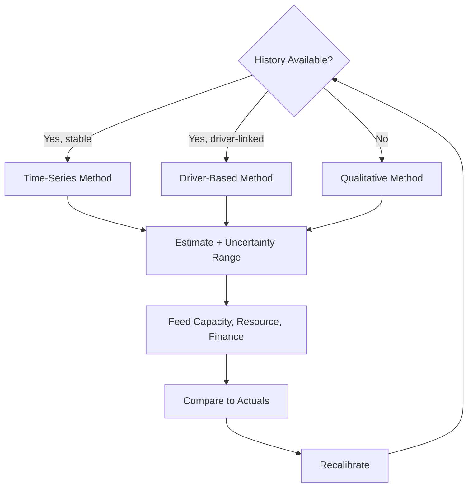

# Volume 04 - Demand Forecasting

| Field | Value |
|---|---|
| Document ID | WORLD-VOL04-040 |
| Title | Demand Forecasting |
| Version | 1.0 |
| Status | Approved |
| Classification | Internal |
| Founder | Mahesh Choudhary |

## Purpose

Demand forecasting is the discipline of estimating future customer demand for the organisation's offerings. This chapter defines how WORLD produces, qualifies, and communicates demand forecasts that drive capacity, resource, and financial planning downstream.

## Scope

This chapter covers the estimation of demand volume and its timing, and the selection of appropriate forecasting methods. It is the upstream driver for capacity planning (Chapter 38), resource forecasting (Chapter 41), and financial forecasting (Chapter 39). It does not translate demand into cost or cash - those are downstream.

## First Principles

Demand is the aggregate of many independent buying decisions, shaped by season, price, promotion, and external conditions. Future demand can be inferred from three sources of signal: the past behaviour of demand itself (time-series), the causal drivers that move it (driver-based), and informed human judgement where data is absent (qualitative). No method predicts the future exactly; every forecast is an estimate with a range. Honest demand forecasting reports both the estimate and the uncertainty around it.

## Why This Concept Exists

Almost every operational commitment - how much to make, staff, or buy - depends on how much will be demanded. Demand forecasting exists to let the business commit resources ahead of demand instead of reacting after it, reducing both stockouts and waste. It is the first link in the planning chain; errors here propagate everywhere downstream.

## Where It Is Used

Demand forecasting feeds inventory, staffing, procurement, and revenue planning. It is refreshed on a regular cadence and whenever a demand-moving event (a promotion, a market shift) occurs.

| Method | When Appropriate | Signal Used | Caution |
|---|---|---|---|
| Time-series | History available, stable pattern | Past demand, seasonality, trend | Misses structural breaks |
| Driver-based | Known causal levers | Price, marketing, external indices | Needs reliable driver data |
| Qualitative | New product, sparse data | Expert and market judgement | Prone to optimism bias |

## How WORLD Implements It

WORLD selects the method suited to the data available, produces an estimate with an explicit uncertainty range, decomposes it into trend and seasonal components where relevant, and updates as new demand signals arrive.

## Relationship with the AI Business Partner

The AI Business Partner chooses the appropriate method for the available data, communicates forecasts as ranges rather than false-precision points, explains the drivers behind a change, and recalibrates as actuals arrive. It guards against optimism bias in qualitative inputs and flags when a structural break has invalidated a historical pattern.

## Relationship with ERP

A future ERP layer will record actual orders and sales - the ground truth of realised demand. Conceptually, demand forecasting predicts and the ERP confirms; each period of actuals feeds back to sharpen the model. The forecast never invents realised figures.

## Relationship with Business Foundation

Business Foundation (Volume 02) defines the offerings, target segments, and markets whose demand is being forecast. Demand forecasting operates within that declared market definition; a change to the offering in the foundation resets the demand history and may force a shift toward qualitative methods.

## Concrete Example

A regional bakery forecasts demand for a seasonal product. With three years of history, WORLD applies a time-series method that separates a rising trend from a strong holiday seasonal peak, and reports the estimate as a range. Because the bakery is also running a first-time promotion, the AI Business Partner overlays a driver-based adjustment for the promotion and widens the uncertainty range accordingly, feeding the result into staffing and ingredient procurement.

## Cross-References

- [Capacity Planning](/docs/blueprint/volume-04-business-intelligence-and-decision-science/section-e-planning-and-forecasting/38-capacity-planning.md)
- [Financial Forecasting](/docs/blueprint/volume-04-business-intelligence-and-decision-science/section-e-planning-and-forecasting/39-financial-forecasting.md)
- [Resource Forecasting](/docs/blueprint/volume-04-business-intelligence-and-decision-science/section-e-planning-and-forecasting/41-resource-forecasting.md)

## References

- [Volume 01 - Vision and Philosophy](/docs/blueprint/volume-01-vision-and-philosophy/README.md)
- [Document Standards](/docs/governance/document-standards.md)

## Change Log

| Version | Date | Author | Notes |
|---|---|---|---|
| 1.0 | 2026-07-12 | Lead Software Engineer | Initial approved version. |
